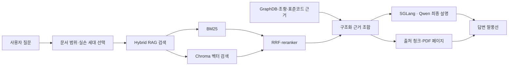
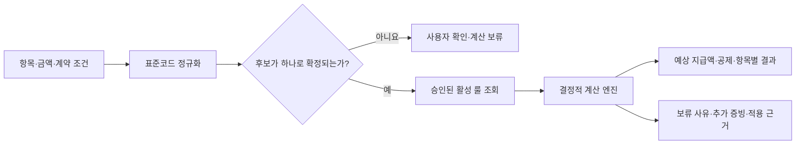
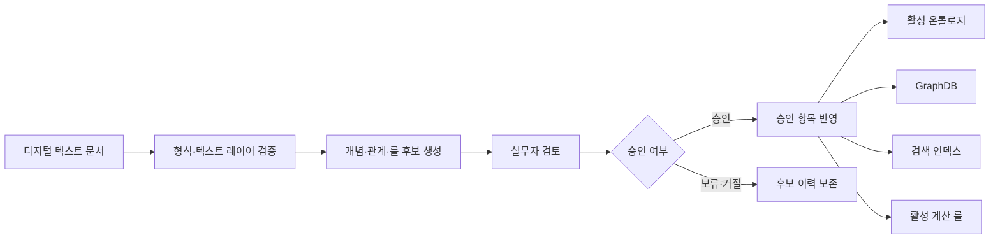

<p align="center">
  
</p>

<h1 align="center">신한EZ손해보험 보상지원 AI 챗봇</h1>

<p align="center">
  약관·실무 문서의 원문 근거와 승인된 업무 규칙을 연결하는<br>
  DGX Spark 기반 온프레미스 보험 보상 업무 지원 시스템
</p>

> 이 저장소는 보험 보상 업무를 주제로 수행한 캡스톤 프로젝트 결과물입니다. 실제 보험금 지급 결정을 대신하지 않으며, 최종 판단에는 적용 약관·계약 정보·증빙 서류와 담당자의 검토가 필요합니다.

## 현재 상태

| 구분 | 기준 |
| --- | --- |
| 안정 릴리스 | `v1.2.b` |
| 프론트엔드 표시 버전 | `1.2.0.b` |
| 최신 `master` | 안정 릴리스 이후 GraphDB 안전 기준 보조 파일 재발 방지 패치 포함 |
| 운영 UI | FastAPI API + 정적 SPA |
| 기준 장비 | NVIDIA DGX Spark, ARM64 Linux |
| 기본 LLM | SGLang · Qwen3 Next 80B Instruct FP8 |
| 표준 운영 방식 | 외부 LLM API에 의존하지 않는 로컬 실행 |

`v1.2.b`는 검증된 안정 기준을 고정한 Git 태그이고, `1.2.0.b`는 앱 화면에 표시되는 제품 버전입니다. 최신 `master`에는 안정 태그 이후 확인된 GraphDB 안전성 패치와 문서 갱신이 추가될 수 있으므로 세 표기를 같은 의미로 사용하지 않습니다.

## 프로젝트가 해결하는 문제

보험 보상 업무에서는 단순히 유사한 문장을 검색하는 것만으로 충분하지 않습니다.

- 약관, 실무가이드, 상담 사례와 표준코드가 여러 문서와 데이터베이스에 분산되어 있습니다.
- 답변의 결론뿐 아니라 어떤 원문과 페이지에서 근거를 찾았는지 확인할 수 있어야 합니다.
- 수술종수, 보상한도, 공제와 지급 조건처럼 민감한 판단을 LLM이 임의로 만들어서는 안 됩니다.
- 신규 문서에서 추출된 개념과 규칙은 자동 반영이 아니라 검토와 승인 절차를 거쳐야 합니다.
- 일반 질의와 보험금 계산 결과가 하나의 대화 맥락 안에서 자연스럽게 연결되어야 합니다.

이 프로젝트는 이러한 요구를 위해 **Hybrid RAG**, **승인 기반 온톨로지·GraphDB**, **결정적 보험금 계산 엔진**과 **로컬 LLM**을 하나의 업무 흐름으로 통합합니다.

## 핵심 기능

### 1. 근거 기반 일반 질의

- 약관, 실무가이드, 표준코드와 상담 자료를 BM25·Chroma·RRF·reranker로 검색합니다.
- 질문 성격에 따라 직접 조회, 조항 상세 검색, GraphDB 보강 경로를 조합합니다.
- 검색된 근거를 바탕으로 선택된 로컬 Qwen 모델이 최종 설명을 생성합니다.
- 근거가 부족하면 확정적인 지급·면책 결론 대신 부족한 조건과 확인할 자료를 표시합니다.

### 2. 출처 청크와 원문 확인

- 답변 아래에서 사용된 문서와 페이지를 확인할 수 있습니다.
- 출처 배지에 마우스를 올리면 검색에 사용된 텍스트 청크를 확인할 수 있습니다.
- 원본 PDF 매핑이 있는 출처는 해당 문서와 인용 페이지로 이동할 수 있습니다.
- 최종 말풍선과 내부 검색 근거를 구분해 사용자가 실제로 읽는 답변 품질을 별도로 평가합니다.

### 3. 승인된 룰 기반 보험금 계산 보조

- 진료 항목의 코드·명칭, 급여 본인부담금, 비급여 금액과 건수를 입력받습니다.
- 표준코드 후보가 여러 개면 임의 선택하지 않고 사용자에게 확인을 요청합니다.
- 실손 세대, 방문 구분과 산정특례 여부를 계산 조건으로 사용합니다.
- 승인된 활성 룰만 결정적 계산 엔진이 실행합니다.
- 자동 계산할 근거가 부족하면 0원으로 숨기지 않고 보류 사유와 필요한 추가 증빙을 표시합니다.

### 4. 대화와 계산 맥락의 연결

- 사용자는 이전 대화 스레드를 다시 열어 질문과 계산 이력을 확인할 수 있습니다.
- 같은 스레드에서 계산 결과를 질문하고, 확인된 조건을 반영해 다시 계산할 수 있습니다.
- 후속 발화의 대상과 조건이 명확하지 않으면 직전 답변을 반복하지 않고 추가 확인 질문을 제시합니다.
- 세션에서 확인한 사실과 전역 운영 지식을 분리해 일회성 대화 내용이 GraphDB 지식으로 승격되지 않도록 합니다.

### 5. 관리자 지식 확장

- 디지털 텍스트 레이어가 있는 신규 문서를 등록할 수 있습니다.
- 시스템은 문서에서 온톨로지와 계산 룰 후보를 생성합니다.
- 관리자는 후보의 원문 근거, 적용 범위, 위험 정보와 기존 지식 충돌 여부를 검토합니다.
- 승인된 항목만 활성 온톨로지·GraphDB·검색 인덱스 또는 RuleRegistry 반영 경로로 이동합니다.
- 스캔본 신규 문서를 위한 자동 OCR 파이프라인은 현재 지식 확장 범위에 포함하지 않습니다.

### 6. GraphDB 핵심 구조 탐색

- 관리자 화면은 전체 그래프를 한 번에 브라우저로 보내지 않고 핵심 노드만 먼저 표시합니다.
- 연결도가 높은 노드, 상위 분류와 주요 개념을 중심으로 메인 구조를 구성합니다.
- 검색하거나 노드를 선택하면 해당 노드로 확대하고 상위 1단계와 제한된 하위 트리를 조회합니다.
- WebGL을 사용할 수 없는 환경에서는 접근 가능한 2D 관계 목록으로 전환합니다.

### 7. 운영 진단과 감사 가능성

- 관리자 진단 화면과 운영 래퍼에서 API, LLM, BM25, Chroma, GraphDB와 표준코드 DB 상태를 점검합니다.
- 후보 검토, 승인, 반영과 계산 과정의 근거를 추적할 수 있도록 감사 정보를 분리합니다.
- 계정, 대화 이력과 운영 로그는 소스 저장소가 아닌 운영 데이터 영역에서 관리합니다.

## 대표 사용 흐름

### 일반 질의



1. 사용자가 질문과 필요한 문서 범위를 선택합니다.
2. Hybrid RAG가 키워드와 의미 검색 결과를 결합합니다.
3. GraphDB, 조항 상세와 표준코드 근거가 필요한 경우 별도 경로로 보강됩니다.
4. Qwen이 제공된 근거 안에서 최종 설명을 생성합니다.
5. 사용자는 최종 답변과 출처 청크·원문 페이지를 함께 검토합니다.

### 보험금 계산



계산 결과는 LLM이 금액을 추측해 생성하지 않습니다. LLM은 입력 해석과 설명을 보조할 수 있지만, 실제 산식과 적용 조건은 승인된 활성 룰과 코드 기반 계산기가 담당합니다.

### 신규 지식 반영



## 시스템 아키텍처

```text
┌──────────────────────────────────────────────────────────────┐
│ FastAPI + Static SPA                                         │
│ 로그인 · 대화 · 보험금 계산 · 관리자 · GraphDB 탐색          │
└───────────────────────────┬──────────────────────────────────┘
                            │
        ┌───────────────────┼────────────────────┐
        │                   │                    │
        ▼                   ▼                    ▼
  세션·질의 분류       Hybrid RAG          보험금 계산 API
  후속 맥락 해석       BM25 + Chroma       코드 정규화
                       RRF + reranker       RuleRegistry
        │                   │               결정적 계산 엔진
        │                   ▼                    │
        │             GraphDB·온톨로지             │
        │             조항·표준코드 근거             │
        │                   │                    │
        └───────────────────┼────────────────────┘
                            ▼
                 SGLang OpenAI-compatible API
                 Qwen3 Next 80B Instruct FP8
                            │
                            ▼
                 최종 답변 · 출처 · 검토 사유
```

### 주요 계층

| 계층 | 역할 |
| --- | --- |
| FastAPI + SPA | 인증, 세션, 스트리밍 답변, 계산, 관리자 기능과 정적 UI 제공 |
| Hybrid RAG | BM25와 벡터 검색을 결합하고 reranker로 근거 순위 조정 |
| GraphDB·온톨로지 | 문서에서 승인된 개념·관계와 구조화된 검토 경로 제공 |
| 표준코드 DB | 진료·수술 항목의 정확한 코드와 명칭 정규화 |
| RuleRegistry | 승인된 계산 규칙과 적용 조건 관리 |
| 결정적 계산 엔진 | 입력값과 활성 룰로 예상 공제·지급액 계산 |
| SGLang | DGX Spark에서 로컬 LLM을 OpenAI-compatible API로 제공 |
| 감사·승인 계층 | 후보 생성, 검토, 승인과 운영 반영 이력 분리 |

## 일반 답변과 계산 결과의 차이

| 구분 | 일반 질의 | 보험금 계산 |
| --- | --- | --- |
| 주된 목적 | 문서 근거를 찾아 이해하기 쉬운 설명 생성 | 입력 조건에 따라 승인된 산식 실행 |
| LLM 역할 | 검색 근거를 이용한 최종 서술 | 입력 해석·설명 보조 |
| 확정 근거 | 출처 청크, GraphDB, 조항·표준코드 근거 | 활성 RuleRegistry, 표준코드와 입력값 |
| 불충분한 경우 | 부족한 조건과 확인 질문 표시 | 계산 보류, 추가 증빙과 사유 표시 |
| 금액 산출 | 수행하지 않음 | 결정적 계산 엔진만 수행 |

## 승인 기반 지식 운영 원칙

이 프로젝트는 [`000_PROJECT_DEVELOPMENT_GUARDRAILS.md`](docs/000_PROJECT_DEVELOPMENT_GUARDRAILS.md)를 최상위 개발 원칙으로 사용합니다.

### Source Grounding

- 답변과 계산 근거는 원문 청크, 표준코드, GraphDB evidence와 승인된 룰에서 가져옵니다.
- 문서 밖의 의학 상식이나 외부 지식을 전역 GraphDB에 자동 추가하지 않습니다.
- 직접 근거가 없는 지급·면책·감액 결론을 코드나 프롬프트에 질문별 예외로 넣지 않습니다.

### 지식 하드코딩 금지

- 보험 개념, 공제율, 한도와 필요서류를 Python 상수나 특정 질문 분기로 확정하지 않습니다.
- 정책 파일, manifest, 온톨로지, GraphDB와 rule table처럼 검토 가능한 데이터 계층을 사용합니다.
- 버그 수정은 한 질문만 통과시키는 문자열 예외보다 동일 유형 전체에 적용되는 계약과 검증으로 해결합니다.

### 승인 전 후보 격리

- 신규 개념·관계·계산 룰은 후보 상태에서 시작합니다.
- LLM enrichment 결과는 후보 설명을 보조할 뿐 자동 승인 근거가 아닙니다.
- 실무자 승인과 반영 작업을 통과한 지식만 운영 답변과 계산에 사용합니다.
- 일반 질의 온톨로지와 보험금 계산 활성 룰은 서로 다른 승인 경계를 유지합니다.

## 기술 구성

| 영역 | 기술 |
| --- | --- |
| 백엔드 | Python, FastAPI, Uvicorn |
| 프론트엔드 | Vanilla JavaScript SPA, esbuild |
| 그래프 시각화 | Three.js, 3d-force-graph |
| 검색 | BM25, Chroma, Reciprocal Rank Fusion, reranker |
| 임베딩 | BGE-M3 |
| 지식 그래프 | SQLite 기반 property graph, 승인형 온톨로지 |
| 계산 | 표준코드 관계형 DB, RuleRegistry, 결정적 계산 엔진 |
| 기본 LLM provider | SGLang |
| 기본 모델 | Qwen3 Next 80B Instruct FP8 |
| 선택 모델 | Qwen3 30B 계열, GPT-OSS-20B 등 설치·검증된 로컬 모델 |
| 테스트 | pytest, Playwright |
| 기준 플랫폼 | NVIDIA DGX Spark ARM64 Linux |

vLLM과 Ollama 연동 코드도 남아 있지만 현재 DGX 표준 기동 경로는 SGLang입니다. 선택 모델은 코드에 이름이 등록된 것만으로 사용 가능하다고 간주하지 않으며, 실제 모델 자산과 endpoint가 준비되고 상태 점검을 통과한 경우에만 UI에 노출합니다.

## 저장소만으로 재현 가능한 범위

이 저장소는 애플리케이션 코드와 공개 가능한 설계·검증 문서를 제공하지만 완전한 운영 데이터 패키지는 아닙니다.

| 항목 | 저장소 포함 여부 | 설명 |
| --- | --- | --- |
| 애플리케이션 소스 | 포함 | FastAPI, SPA, RAG, GraphDB, 계산과 관리자 코드 |
| 공개 설정 예시 | 포함 | [`.env.example`](.env.example), 정책·설정 파일 |
| 단위·통합·E2E 테스트 | 포함 | 외부 의존성은 가능한 범위에서 fixture와 mock으로 격리 |
| 원본 보험 문서 전체 | 미포함 | 저작권·보안·용량 정책에 따라 별도 관리 |
| 운영 BM25·Chroma 인덱스 | 완전본 미포함 | 일부 기준 산출물은 추적되지만 동기화된 Chroma 포함 운영 세트는 별도 필요 |
| 운영 GraphDB·활성 지식 스냅샷 | 완전본 미포함 | 정책·룰 정의와 별개로 승인 이력과 release manifest에 맞는 런타임 스냅샷 필요 |
| 임베딩·reranker·LLM 모델 | 미포함 | DGX의 로컬 모델 저장소에서 관리 |
| `.env`, 비밀값과 계정 | 미포함 | 설치 또는 운영 단계에서 별도 생성 |
| 대화 이력·사용 로그 | 미포함 | 운영 데이터이며 설치 번들과 소스 관리에서 제외 |

따라서 Git 저장소만 내려받아 테스트와 구조 검토는 할 수 있지만, 실제 보험 문서 기반 답변 품질과 전체 관리자 기능을 그대로 재현하려면 다음 자산이 추가로 필요합니다.

- 디지털 텍스트 원문과 canonical chunk
- 서로 동기화된 BM25·Chroma 인덱스
- 승인된 온톨로지·GraphDB·활성 계산 룰
- BGE-M3 임베딩과 reranker 모델
- Qwen 등 로컬 LLM과 SGLang 실행 환경
- 초기 관리자 계정과 운영 환경 설정

표준 앱 기동에는 OpenAI·CLOVA 같은 외부 API가 필요하지 않습니다. 외부 연동을 실험하는 별도 코드가 존재하더라도 기본 오프라인 운영 계약에는 포함되지 않습니다.

## 개발 환경

### 1. 소스와 Python 환경 준비

```bash
git clone https://github.com/koreaben777/insurance-rag-chatbot.git
cd insurance-rag-chatbot

python3 -m venv .venv
source .venv/bin/activate
pip install -r requirements.txt
cp .env.example .env
```

`.env.example`은 DGX 로컬 실행을 위한 공개 기본값만 설명합니다. 실제 비밀값, 계정 정보와 운영 경로는 `.env` 또는 운영 비밀 저장소에서 별도로 관리하고 Git에 커밋하지 않습니다.

### 2. Python 검증

```bash
python -m pytest -q
```

특정 범위만 확인할 때는 관련 테스트 파일을 직접 지정합니다.

```bash
python -m pytest tests/test_safe_baseline.py -q
python -m pytest tests/test_graph_retriever.py -q
```

### 3. 프론트엔드 빌드와 E2E 준비

```bash
npm ci
npm --prefix frontend ci
npm --prefix frontend run build
```

앱과 Playwright 브라우저가 준비된 환경에서는 다음 명령으로 E2E 테스트를 실행합니다.

```bash
npm run test:e2e
```

### 4. 완전한 DGX 환경에서 기동

모델, 인덱스, GraphDB, 표준코드 DB와 계정이 준비된 DGX에서는 운영 래퍼를 사용합니다.

```bash
ops/bin/insurance-rag-status --json
ops/bin/insurance-rag-up
```

기본 앱 주소는 DGX 데스크톱 브라우저 기준 `http://localhost:18080`이고, 기본 SGLang endpoint는 `http://127.0.0.1:30000/v1`입니다. 원격 개발 환경에서는 승인된 SSH 접속과 로컬 터널을 별도로 구성해야 합니다.

[`src/ui/streamlit_app.py`](src/ui/streamlit_app.py)는 과거 검증용 경로입니다. 현재 기능 개발, 운영 검증과 릴리스 기준은 FastAPI + 정적 SPA입니다.

## 저장소 구조

```text
insurance-rag-chatbot/
├── src/
│   ├── api/                 FastAPI, 인증, 세션, 스트리밍·계산 API
│   ├── rag/                 Hybrid RAG와 답변 생성
│   ├── graph/               GraphDB 조회와 구조화 근거
│   ├── ontology/            후보·승인·안전 기준 온톨로지
│   ├── claim_calculation/   표준코드와 보험금 계산
│   └── ui/                  과거 Streamlit 검증 경로
├── frontend/                운영 정적 SPA와 GraphDB 시각화
├── config/                  검색·조항·온톨로지·계산 정책
├── scripts/                 인덱싱, 평가, 사용자·지식 관리 도구
├── ops/                     DGX 기동·상태 점검·모델 전환 래퍼
├── tests/                   단위, API, RAG, Graph, LLM, DGX 회귀 테스트
├── docs/                    설계, 구현, 검증과 운영 문서
├── data/                    로컬 데이터·인덱스 경로(대용량 운영본 별도 관리)
└── reports/                 평가와 실험 산출물
```

## 릴리스 상태와 알려진 제한

### 릴리스 기준

- `v1.2.b`: Qwen 기반 최종 답변 경로와 GraphDB 읽기 안전성을 고정한 안정 태그
- `1.2.0.b`: 프론트엔드에 표시되는 버전
- 최신 `master`: 안정 태그 이후 GraphDB 안전 기준 생성 과정에서 SQLite 보조 파일이 재발하지 않도록 하는 후속 패치 포함

안정 태그를 사용하는 배포와 최신 `master`를 사용하는 개발·운영 검증은 목적이 다릅니다. 운영 반영 전에는 해당 commit, 모델 ID, 인덱스와 GraphDB manifest를 함께 기록해야 합니다.

### 알려진 제한

- 원문, 인덱스와 모델이 없으면 저장소만으로 실제 답변 품질을 재현할 수 없습니다.
- LLM 최종 서술은 같은 근거에서도 표현이 달라질 수 있으므로 출처와 최종 말풍선을 함께 평가해야 합니다.
- GraphDB 시각화는 브라우저와 LLM이 DGX 자원을 공유하므로 서버 측 노드·관계 상한과 단계적 로딩을 사용합니다.
- 신규 스캔 PDF는 관리자 지식 확장에서 자동 OCR하지 않습니다.
- 선택 모델은 설치와 실제 endpoint 상태가 확인된 경우에만 사용할 수 있습니다.
- 신규 DGX를 이용한 최종 오프라인 설치 인수시험은 별도 실기 환경이 있어야 수행할 수 있습니다.
- 계산 결과는 예상 검토값이며 계약별 최종 지급 결론이 아닙니다.

## 주요 문서

수백 개의 개발 기록 중 현재 구조와 운영 원칙을 이해하는 데 필요한 문서를 선별했습니다.

### 프로젝트 원칙과 구조

- [000. 프로젝트 개발 원칙](docs/000_PROJECT_DEVELOPMENT_GUARDRAILS.md)
- [현재 앱 아키텍처 보고서](docs/154_PROJECT_ARCHITECTURE_CURRENT_STATUS_REPORT.md)
- [프로젝트 DB 빌드 설명](docs/204_PROJECT_DB_BUILD_EXPLANATION.md)
- [전체 DB 구조 다이어그램](docs/205_FULL_DB_STRUCTURE_DIAGRAMS.md)

### 사용자·운영 기능

- [실무자 전체 운영 오류 대응 매뉴얼](docs/266_PRACTITIONER_OPERATIONS_TROUBLESHOOTING_MANUAL.md)
- [관리자 GraphDB 3D 시각화 구현 보고서](docs/268_ADMIN_GRAPHDB_3D_VISUALIZATION_REPORT.md)
- [DGX 데모 시나리오 가이드](docs/264_DGX_DEMO_SCENARIO_GUIDE.md)

### 최신 안정화와 지식 운영

- [일반 질의 온톨로지 후보 준비 보고서](docs/280_V1_2_0_GENERAL_QUERY_ONTOLOGY_CANDIDATE_PREPARATION_REPORT.md)
- [온톨로지 재빌드 구현 보고서](docs/281_V1_2_0_ONTOLOGY_REBUILD_IMPLEMENTATION_REPORT.md)
- [v1.2.0.b Qwen 우선 응답 핫픽스](docs/282_V1_2_0_B_QWEN_ALWAYS_HOTFIX_REPORT.md)
- [v1.2.0.b GraphDB 읽기 핫픽스](docs/283_V1_2_0_B_GRAPH_READ_HOTFIX_REPORT.md)

일부 과거 문서는 Streamlit, 외부 LLM 또는 이전 모델 운영을 기준으로 작성되었습니다. 현재 구현을 판단할 때는 코드, `000` 원칙과 최신 번호의 검증 보고서를 우선합니다.

## 보안과 데이터 원칙

- 원본 보험 문서, 사용자 계정, 대화 이력, 감사 로그와 비밀값을 임의로 Git에 커밋하지 않습니다.
- 운영 데이터와 설치 번들에는 사용자 계정과 대화 이력을 포함하지 않습니다.
- 관리자 계정은 설치 또는 초기 운영 설정 단계에서 생성합니다.
- 근거 문서와 계산 결과에는 민감 정보가 포함될 수 있으므로 승인된 내부 환경에서만 사용합니다.
- 외부 네트워크나 cloud LLM 사용은 표준 로컬 운영 계약과 분리해 검토합니다.

## 사용 및 라이선스 고지

이 저장소에는 별도의 오픈소스 라이선스 파일이 없습니다. 저장소가 공개되어 있다는 사실만으로 소스의 복제·수정·재배포 권한이 부여되는 것은 아니므로 사용 또는 배포가 필요하면 저장소 소유자에게 별도로 확인해야 합니다.

회사명, 제품명과 로고에 관한 권리는 각 권리자에게 있습니다. 이 프로젝트의 답변과 계산 결과는 교육·연구 및 업무 보조 목적으로만 사용해야 하며 실제 보험계약 해석, 보험금 지급 또는 법률·의학적 판단을 대체하지 않습니다.
