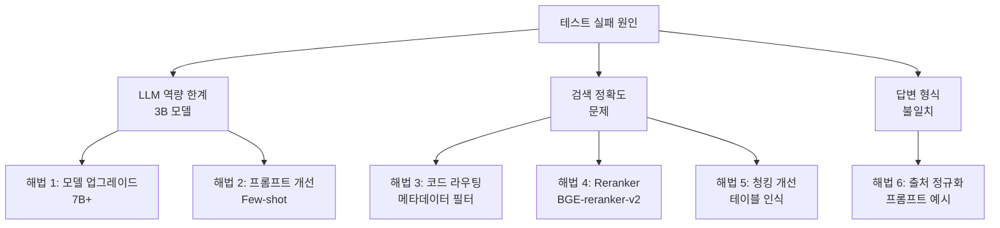

# RAG 챗봇 개선 계획서 — Alpha v1 테스트 기반

> **작성일:** 2026-04-30
> **기반:** [06_STREAMLIT_TEST_RESULT_v1.md](file:///Users/june_kim/Documents/Claude/Projects/보험%20문서%20RAG%20챗봇/docs/06_STREAMLIT_TEST_RESULT_v1.md)
> **목표:** 테스트에서 발견된 5개 핵심 문제를 해결하여 답변 정확도 40% → 80%+ 달성

---

## 1. 문제-해법 매핑



---

## 2. 해법 상세

### 해법 1: LLM 모델 업그레이드 (P0)

**문제:** qwen2.5:3b-instruct가 컨텍스트 내 정보를 인식하지 못함 (Q2, Q4)

**현재 상태:**
- 모델: qwen2.5:3b-instruct
- 컨텍스트 윈도우: 8192 토큰 (num_ctx)
- 한국어 표/규정 문서에서의 정확도 낮음

**개선 방안:**

| 후보 모델 | 파라미터 | VRAM | 한국어 성능 | 비고 |
|-----------|---------|------|------------|------|
| qwen2.5:7b-instruct | 7B | ~5GB | 좋음 | 기존 아키텍처 호환 |
| exaone3.5:7.8b-instruct | 7.8B | ~5.5GB | 매우 좋음 | LG AI Research, 한국어 특화 |
| qwen2.5:14b-instruct | 14B | ~10GB | 매우 좋음 | M4 Mac 32GB 기준 가능 |
| gemma3:12b | 12B | ~8GB | 좋음 | Google, 다국어 |

**권장:** `exaone3.5:7.8b-instruct` 또는 `qwen2.5:7b-instruct`
- M4 Mac 환경에서 Metal 가속으로 충분히 동작
- 한국어 규정 문서 이해도가 크게 향상될 것으로 예상

**구현:**
```bash
# 모델 다운로드
ollama pull exaone3.5:7.8b-instruct

# .env 수정
OLLAMA_MODEL=exaone3.5:7.8b-instruct
```

**예상 효과:** Q2(N39.3), Q4(3대비급여) 답변 정확도 개선. 컨텍스트 내 코드/항목 인식 능력 향상.

---

### 해법 2: 프롬프트 엔지니어링 개선 (P0)

**문제:** LLM이 컨텍스트 내에 정답이 있음에도 "확인되지 않습니다"로 답변 (Q2)

**현재 프롬프트 문제점:**
1. 코드(N39.3, AA157 등) 검색 힌트가 없음
2. 표 데이터 해석 지침이 없음
3. Few-shot 예시가 없어 답변 형식이 불안정

**개선안 — 시스템 프롬프트 개정:**

```python
SYSTEM_PROMPT = """당신은 보험사 직원의 질문에 답하는 전문 어시스턴트입니다.

참고 문서에는 건강보험 고시(심평원), 실손의료보험 약관, 보상가이드북이 포함됩니다.

## 핵심 규칙
1. 반드시 제공된 컨텍스트 안의 정보만 사용하세요.
2. 컨텍스트에 답이 없으면 "제공된 문서에서 확인되지 않습니다."라고 답하세요.
3. 추측하거나 외부 지식을 사용하지 마세요.
4. 코드(예: AA157, N39.3, Q2333)가 질문에 포함되면 컨텍스트에서 해당 코드를 정확히 찾아 답하세요.
5. 표 형태의 데이터에서 분류번호, 코드, 분류, 점수가 같은 행에 나열된 경우 해당 행의 정보를 함께 답하세요.
6. 보상 여부를 묻는 질문은 해당 진단코드가 "보상하지 않는 사항"에 포함되어 있는지 확인하고 명확히 "보상 불가" 또는 "보상 가능"으로 답하세요.

## 답변 형식
- 답변 마지막에 반드시 출처를 기재하세요.
- 형식: [출처: 문서명, 조문/절, p.페이지]
- 예시: [출처: 심평원, 제1편 제2부 제1장 기본진료료, p.101]

## 예시
질문: AA157은 어떤 기관의 초진 진찰료이며 점수는 얼마인가요?
답변: AA157은 상급종합병원의 초진 진찰료이며 점수는 255.79점입니다.
[출처: 심평원, 제1편 제2부 제1장 기본진료료, p.101]

질문: N39.3 진단이 실손의료비 약관에서 보상가능한지 알려줘.
답변: N39.3(요실금)은 실손의료보험 약관에서 보상하지 않는 사항으로 명시되어 있습니다.
- 급여 실손의료비: 보상 불가 (제4조 ②항 5호)
- 비급여 실손의료비: 보상 불가 (제4조 ②항 6호)
[출처: 약관, 제4조(보상하지 않는 사항), p.38, p.80]"""
```

**핵심 변경 사항:**
1. **코드 검색 지침 추가** (규칙 4): 코드가 포함된 질문에서 정확 매칭 유도
2. **표 데이터 해석 지침** (규칙 5): 표 행 단위 매칭 유도
3. **보상 판단 지침** (규칙 6): "보상하지 않는 사항" 섹션 탐색 유도
4. **Few-shot 예시 2개** 추가: 답변 형식과 추론 패턴 시연

---

### 해법 3: 코드 라우팅 — 메타데이터 필터 검색 (P1)

**문제:** 코드(Q2333) 질의 시 코드 인덱스 테이블이 원문보다 높은 검색 순위 (Q3)

**현재 흐름:**
```
질문 → BM25 + Dense → RRF → Top-K → LLM
```

**개선 흐름:**
```
질문 → 코드 패턴 감지?
  ├─ Yes → ChromaDB 메타데이터 필터(codes 필드) + BM25 → RRF → Top-K → LLM
  └─ No  → (기존 흐름)
```

**구현 — `src/rag/pipeline.py` 수정:**

```python
import re

CODE_PATTERN = re.compile(r'\b[A-Z]{1,3}\d{2,5}\b|\b\d{5}\b|'
                          r'\b[A-Z]\d{2}(?:\.\d{1,2})?\b')

def _extract_query_codes(question: str) -> list[str]:
    """질문에서 의료 코드 패턴을 추출."""
    return CODE_PATTERN.findall(question)

class RagPipeline:
    def answer(self, question: str, temperature: float = 0.2) -> RagAnswer:
        query_codes = _extract_query_codes(question)

        query_embedding = self.embedder.embed_query(question)

        if query_codes:
            # 코드 매칭 청크 우선 검색
            code_hits = self.vector_store.query_with_filter(
                query_embedding,
                filter_codes=query_codes,
                top_k=self.top_k_dense // 2
            )
            general_hits = self.vector_store.query(
                query_embedding,
                top_k=self.top_k_dense // 2
            )
            dense_hits = code_hits + general_hits
        else:
            dense_hits = self.vector_store.query(query_embedding, self.top_k_dense)

        bm25_hits = self.bm25.query(question, self.top_k_bm25)
        fused_hits = rrf_fuse(dense_hits, bm25_hits, ...)
        # ...
```

**VectorStore 확장 — `query_with_filter` 메서드:**
```python
def query_with_filter(self, query_embedding, filter_codes: list[str], top_k: int) -> list[Hit]:
    """codes 메타데이터에 특정 코드가 포함된 청크만 검색."""
    where_filter = {
        "$or": [{"codes": {"$contains": code}} for code in filter_codes]
    }
    result = self.collection.query(
        query_embeddings=...,
        n_results=top_k,
        where=where_filter,
        include=["documents", "metadatas", "distances"],
    )
    # ...
```

**예상 효과:** Q3(식도조루술)에서 Q2333 코드가 포함된 p.531 청크가 우선 검색됨.

---

### 해법 4: Reranker 도입 (P1)

**문제:** 검색된 Top-8 내 정답 청크의 순위가 낮아 LLM이 주목하지 못함

**방안:** BGE-reranker-v2-m3 (다국어 크로스인코더 reranker)

**구현 흐름:**
```
BM25(12) + Dense(12) → RRF(16~20) → Reranker(Top-8) → LLM
```

```python
# src/retrieval/reranker.py
from sentence_transformers import CrossEncoder

class Reranker:
    def __init__(self, model_name: str = "BAAI/bge-reranker-v2-m3"):
        self.model = CrossEncoder(model_name, max_length=512)

    def rerank(self, question: str, hits: list[Hit], top_k: int) -> list[Hit]:
        pairs = [(question, hit.document) for hit in hits]
        scores = self.model.predict(pairs)
        ranked = sorted(zip(hits, scores), key=lambda x: x[1], reverse=True)
        return [hit for hit, _ in ranked[:top_k]]
```

**파이프라인 통합:**
```python
fused_hits = rrf_fuse(dense_hits, bm25_hits, top_k=16)  # RRF 풀을 넓게
reranked_hits = self.reranker.rerank(question, fused_hits, top_k=self.top_k_final)
```

**예상 효과:** 검색 정확도 60% → 80%+ 향상. 특히 표 데이터와 본문이 혼재된 경우 본문 청크의 순위 상승.

---

### 해법 5: 청킹 개선 — 테이블 구조 인식 (P2)

**문제:** 코드 인덱스 테이블(p.442)에서 "자320 R3200"이 분리되어 있어 "식도조루술"과 매칭 안됨

**개선 방안:**
1. **테이블 감지:** 연속된 코드 패턴(3개 이상)이 포함된 청크는 "코드 테이블" 타입으로 마킹
2. **테이블 청크 헤더 보강:** 코드 테이블 청크에 소속 장/절 제목을 프리픽스로 추가

```python
# chunker.py 수정
def _make_chunk(...):
    codes = _extract_codes(text)
    is_code_table = len(codes) >= 5  # 코드 5개 이상이면 테이블로 간주
    metadata["is_code_table"] = is_code_table
    # ...
```

**검색 시 활용:** 코드 질의 시 `is_code_table=False`인 청크를 우선 검색 (원문 청크 우선)

---

### 해법 6: 출처 인용 형식 정규화 (P2)

**문제:** "컨텍스트 5" 형태로 인용하는 경우 발생 (Q2)

**개선:**
- 프롬프트에 "컨텍스트 번호가 아닌 문서명으로 인용" 지침 추가 (해법 2에 통합)
- `build_user_prompt()`에서 각 컨텍스트의 레이블을 문서명 중심으로 변경

```python
# 현재
f"[컨텍스트 {index}] {label}"

# 개선
f"[컨텍스트 {index}: {doc_short}] {label}"
```

---

## 3. 구현 로드맵

### M8 — LLM 업그레이드 & 프롬프트 개선 (해법 1+2+6)

**범위:**
- [ ] `.env`에 `OLLAMA_MODEL` 변경 (exaone3.5:7.8b 또는 qwen2.5:7b)
- [ ] `src/llm/prompt.py` 시스템 프롬프트 개정 (코드 검색 지침, 표 해석 지침, Few-shot 예시)
- [ ] `src/llm/ollama_client.py`의 `num_ctx` 기본값 8192 → 16384 확장
- [ ] 컨텍스트 레이블에 `doc_short` 추가
- [ ] smoke_qa 5문항 재테스트 → 결과 문서화

**예상 소요:** 0.5일
**예상 효과:** 정답률 40% → 60~70%

### M9 — 코드 라우팅 & Reranker (해법 3+4)

**범위:**
- [ ] `src/rag/pipeline.py`에 코드 패턴 감지 + 메타데이터 필터 분기 추가
- [ ] `src/retrieval/vector_store.py`에 `query_with_filter` 메서드 추가
- [ ] `src/retrieval/reranker.py` 신규 작성 (BGE-reranker-v2-m3)
- [ ] 파이프라인에 reranker 통합 (RRF 풀 확대 → rerank → Top-K)
- [ ] smoke_qa 15문항 전체 재평가

**예상 소요:** 1일
**예상 효과:** 정답률 60~70% → 80%+

### M10 — 청킹 개선 & 종합 평가 (해법 5 + 전체 재인덱싱)

**범위:**
- [ ] 테이블 청크 마킹 로직 추가
- [ ] 전체 재인덱싱 (`scripts/ingest.py --stage all`)
- [ ] 보상가이드북 추가 인덱싱 (입수 시)
- [ ] 최종 평가 + 테스트 보고서 v2 작성

**예상 소요:** 1일
**예상 효과:** 정답률 80%+ → 90%+ (코드 조회 정확도 특히 개선)

---

## 4. 성공 지표

| 지표 | 현재 (v1) | M8 목표 | M9 목표 | M10 목표 |
|------|-----------|---------|---------|----------|
| 전체 정답률 | 40% | 60% | 80% | 90%+ |
| Retrieval Recall@8 | 60% | 70% | 85% | 90%+ |
| 코드 조회 정확도 | 50% | 75% | 90% | 95%+ |
| 출처 형식 일관성 | 60% | 90% | 95% | 95%+ |
| 보상 판단 정확도 | 0% | 75% | 90% | 90%+ |

---

## 5. 리스크 및 완화

| 리스크 | 완화 |
|--------|------|
| 7B 모델 응답 지연 증가 (30초→60초?) | M4 Mac Metal 가속, num_ctx 조정. 사용자에게 로딩 UX 제공 |
| Reranker 추가 지연 (~2초) | CrossEncoder 배치 처리, 필요시 ONNX 최적화 |
| 코드 필터링이 부정확한 코드 추출 시 역효과 | 코드 필터 결과 + 일반 검색 결과를 병합하여 안전망 |
| Few-shot 예시가 오히려 답변을 틀에 가둠 | 다양한 유형의 예시 포함, 지나치게 많은 예시 지양 (2~3개) |

---

*이 계획서는 [06_STREAMLIT_TEST_RESULT_v1.md](file:///Users/june_kim/Documents/Claude/Projects/보험%20문서%20RAG%20챗봇/docs/06_STREAMLIT_TEST_RESULT_v1.md)의 분석 결과를 기반으로 작성되었습니다.*
