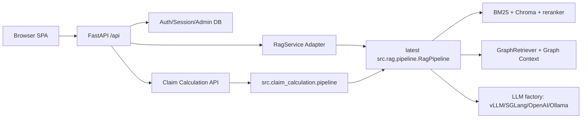

# 123. SPA 프론트엔드 최신 백엔드 통합 구현 명세

작성일: 2026-05-26
대상 프로젝트: `insurance-rag-chatbot`
기준 원격 메인 저장소: `/srv/shared/projects/insurance-rag-chatbot`
참고 프론트엔드 워크스페이스: `/srv/shared/workspaces/eundeo/insurance-rag-chatbot`
작성 목적: eundeo 워크스페이스의 FastAPI + SPA 프론트엔드를 최신 메인 RAG/GraphDB/보험금 계산 기능과 결합하여 Streamlit 대체 후보로 검증할 수 있게 한다.

---

## 1. 현재 판단 요약

eundeo 프론트엔드는 로그인, 채팅, 세션, 관리자, SSE 스트리밍, 모델 선택, OCR 인덱스 선택 등 UI/운영 구조가 잘 정리되어 있다. 특히 모듈형 SPA 구조와 FastAPI API 계층은 Streamlit보다 장기 운영에 적합하다.

하지만 현재 eundeo 브랜치의 백엔드 연결부는 최신 메인 브랜치보다 오래된 RAG 계약에 묶여 있다. 최신 메인에는 GraphDB 기반 구조화 근거, 문서별 coverage 보강, HIRA/수술종수 deterministic guard, 보험금 계산 MVP, 최신 로컬 LLM 후보(Nemotron/Qwen) 및 평가 자동화가 추가되어 있다. 따라서 SPA를 바로 병합하면 기능 회귀가 발생한다.

이번 작업의 원칙은 다음과 같다.

- eundeo 프론트엔드의 화면 스타일과 모듈 구조는 최대한 유지한다.
- 최신 메인 `src.rag.pipeline.RagPipeline`을 우회하는 중복 RAG 구현은 만들지 않는다.
- FastAPI는 Streamlit 기능을 대체 노출하는 얇은 API 어댑터 역할을 한다.
- GraphDB/보험금 계산 결과는 화면에 명확히 표시하되, candidate 사실은 확정 판단처럼 보이지 않게 한다.
- 기존 Streamlit은 당분간 fallback으로 유지하고, SPA 검증이 끝난 뒤 대체 여부를 결정한다.

---

## 2. 확인한 기준 상태

### 2.1 eundeo 워크스페이스

경로:

```text
/srv/shared/workspaces/eundeo/insurance-rag-chatbot
```

브랜치/커밋:

```text
feature/backend-week1
880f5a7c Complete chatbot backend frontend integration for DGX migration
```

주요 구현:

- `frontend/`: 모듈형 SPA
- `src/api/`: FastAPI API 서버
- `src/api/routes/chat.py`: `/api/chat/stream`
- `src/api/rag_service.py`: 과거 RAG pipeline 어댑터
- `src/api/routes/system.py`: 모델 목록/헬스체크
- `src/api/routes/admin.py`, `sessions.py`, `auth.py`: 인증, 세션, 관리자

현재 워크트리에는 다음 미커밋 변경이 있었다. 서브 개발자는 이를 되돌리지 말고 별도 보고해야 한다.

```text
M frontend/index.html
M frontend/js/app.js
M frontend/js/config.js
M src/llm/openai_compatible_client.py
M tests/test_llm_factory.py
?? .coverage
?? 99_DGX_SPARK_MIGRATION_GUIDE.md
?? scripts/serve_frontend_spa.py
```

### 2.2 메인 저장소

경로:

```text
/srv/shared/projects/insurance-rag-chatbot
```

브랜치/커밋:

```text
master
0068ec5 feat(llm): add model matrix eval and dgx runtime guide
```

메인 저장소에는 아직 `frontend/` 및 `src/api/`가 없다. 즉, SPA는 아직 메인에 통합되지 않은 별도 구현이다.

---

## 3. 기능 차이 및 결함 분석

### 3.1 최신 메인에 있고 eundeo API에 없는 기능

| 영역 | 최신 메인 상태 | eundeo 상태 | 통합 필요성 |
| --- | --- | --- | --- |
| GraphDB RAG | `src.graph.*`, `GraphRetriever`, `build_graph_context()` | API 응답/프롬프트에 미노출 | 필수 |
| Graph source chunk 병합 | `vector_store.get_by_ids()`로 Graph 근거 chunk 주입 | 미반영 | 필수 |
| 문서별 coverage 보강 | `RagPipeline.retrieve_hits()` 내부 doc coverage/landmark/hira/surgery hit 주입 | 일부 과거 RAG wrapper 사용 | 필수 |
| deterministic guard | fake code, HIRA multi-row, cross-doc 등 고위험 질의 고정 방어 | API 스트림 경로에서 최신 `answer()`와 불일치 가능 | 필수 |
| evidence validation warning | `append_evidence_validation_warning()` | API finalize는 citation만 적용 | 필수 |
| 보험금 계산 | `src.claim_calculation.pipeline.run_claim_calculation()` 및 Streamlit 패널 | SPA 화면/API 없음 | 필수 |
| Graph fact UI | Streamlit `render_graph_evidences()` | SPA는 source badge만 표시 | 필수 |
| 최신 로컬 모델 | Nemotron/Qwen/Gemma4/GPT-OSS | 로그인 모델 alias가 Gemma4/GPT-OSS 중심 | 필수 |
| 모델별 provider/base URL | vLLM/SGLang endpoint 분기 | alias는 있으나 최신 default/candidates와 불일치 가능 | 필수 |
| QA/평가 산출물 | matrix eval, graph eval, pytest | SPA 전용 통합 회귀 부족 | 필수 |

### 3.2 eundeo 프론트엔드의 장점

- 로그인/채팅/admin 화면 완성도가 높고 사용 흐름이 Streamlit보다 명확하다.
- 인증, 세션, 메시지 저장, 내보내기, 관리자 CRUD가 API로 분리되어 장기 운영에 적합하다.
- `frontend/js/pages/chat.js`가 SSE 스트리밍과 메시지 렌더링을 명확히 담당한다.
- OCR 인덱스 선택 UI가 이미 있다.
- 모델 선택을 로그인 시점에 저장하는 UX가 있다.

### 3.3 현재 그대로 병합하면 생기는 회귀

- GraphDB가 만든 구조화 사실이 프롬프트에 들어가지 않아 복합 수술종수/대분류/지급비율 질의 품질이 떨어진다.
- GraphDB fact와 candidate/missing 상태가 UI에 보이지 않아 사용자가 확정/후보/누락 근거를 구분할 수 없다.
- 보험금 계산 모드가 없어 Streamlit의 핵심 업무 흐름이 사라진다.
- 최신 메인에서 고친 `append_evidence_validation_warning()` 및 빈 답변 방어가 API streaming 경로에 완전히 반영되지 않을 수 있다.
- HIRA 행 단위 보강, source landmark, cross-doc coverage를 중복 구현하거나 누락할 위험이 있다.
- 최신 모델 기본값인 Nemotron/Qwen을 선택할 수 없거나 alias가 구버전 모델로 묶일 수 있다.

---

## 4. 목표 아키텍처



핵심 원칙:

- `src/api/rag_service.py`는 최신 `RagPipeline`의 기능을 얇게 감싼다.
- 검색/프롬프트/GraphDB 결합 로직은 `src.rag.pipeline`이 단일 소스가 된다.
- API는 streaming token, sources, graph facts, warnings, timing, session id를 SSE로 전달한다.
- SPA는 받은 구조화 데이터를 렌더링만 한다.

---

## 5. 구현 단계

### Phase 0. 작업 기준 정리

1. eundeo 워크스페이스에서 현재 변경 상태를 백업 보고한다.
2. 메인 저장소 `master` 최신 커밋 `0068ec5`를 기준으로 별도 통합 브랜치를 만든다.
3. eundeo의 `frontend/`, `src/api/`, API 테스트, e2e 테스트를 통합 브랜치로 가져오되, RAG/LLM/claim/graph 코어 파일은 메인 버전을 우선한다.
4. 사용자가 만든 변경을 덮어쓰지 않는다.

권장 브랜치명:

```bash
git checkout -b codex/spa-latest-backend-integration
```

### Phase 1. FastAPI skeleton 이식

대상:

- `frontend/`
- `src/api/`
- API 관련 tests
- `package.json`, `playwright.config.js`가 필요하면 함께 이식

주의:

- `src/core/retriever.py`처럼 메인의 최신 `src.rag.pipeline`과 중복되는 래퍼는 장기 유지 대상이 아니다.
- 우선 API가 뜨는 최소 단위로 가져오고, RAG 연결은 Phase 2에서 최신화한다.

검증:

```bash
PYTHONPATH=. .venv/bin/python -c "from src.api.main import app; print('api import OK')"
PYTHONPATH=. .venv/bin/pytest tests/test_api_*.py -q
```

### Phase 2. RAG streaming API 최신화

대상:

- `src/api/rag_service.py`
- `src/api/routes/chat.py`
- `src/api/schemas/chat.py`

구현 요구:

1. `get_rag_pipeline()`은 메인 최신 `src.rag.pipeline.RagPipeline`을 생성해야 한다.
2. API general mode는 다음 흐름을 사용한다.
   - GraphDB 조회
   - `build_graph_context()`
   - graph source chunk `vector_store.get_by_ids()`
   - `retrieve_hits(..., graph_hits=...)`
   - `_hit_to_chunk()`
   - `pipeline.build_prompt(question, chunks, graph_context=...)`
   - LLM streaming
   - `append_retrieved_source_citations()`
   - `append_evidence_validation_warning()`
3. deterministic guard는 최신 `RagPipeline.answer()`와 동등한 결과가 나오도록 공통화한다.
   - 가능하면 `_deterministic_guard_answer()` 호출을 API에서도 사용할 수 있게 공개 helper로 이동한다.
   - 어렵다면 streaming 전에 guard answer를 감지해 token 이벤트로 흘려보낸다.
4. 빈 답변 방어:
   - 토큰이 0개면 citation/Graph fact만 단독 렌더링하지 않는다.
   - `warning` SSE 이벤트를 보낸다.
5. API SSE 이벤트를 확장한다.

필수 SSE 이벤트:

```text
status
sources
graph
warning
token
done
error
```

`graph` 이벤트 예시:

```json
{
  "plan": {
    "intents": ["surgery_grade_lookup", "same_grade_surgery_list"],
    "procedure_name": "기관지 식도루 폐쇄술",
    "grade_system": "신1-5종"
  },
  "facts": [
    {
      "subject": "기관지 식도루 폐쇄술",
      "relation": "HAS_GRADE",
      "object": "신1-5종 4종",
      "status": "confirmed",
      "confidence": 1.0,
      "evidence": [{"doc_short": "실무가이드", "page_start": 80, "chunk_id": "..."}]
    }
  ],
  "warnings": []
}
```

### Phase 3. SPA graph/source 렌더링

대상:

- `frontend/js/pages/chat.js`
- `frontend/css/chat.css`
- 필요 시 `frontend/html/chat.html`

구현 요구:

1. `readSse()` 콜백에서 `graph` 이벤트를 수신한다.
2. assistant 말풍선 하단에 구조화 근거 패널을 추가한다.
3. status별로 시각 구분한다.
   - confirmed: 확정 근거
   - candidate: 검토 후보, 확정 아님
   - missing: 데이터베이스에서 확인 못함
4. candidate는 절대 지급 확정처럼 보이지 않게 문구를 넣는다.
5. source badge와 Graph fact는 분리해서 표시한다.

권장 UI 문구:

```text
구조화 근거
확정: 문서/GraphDB에서 직접 확인된 사실
검토 후보: 키워드/대분류 매칭 후보이며 확정 판단 아님
누락: 구조화 DB에서 연결 정보를 확인하지 못함
```

### Phase 4. 보험금 계산 API 및 화면 추가

대상:

- `src/api/routes/claim.py` 신규
- `src/api/schemas/claim.py` 신규
- `src/api/main.py` 라우터 등록
- `frontend/html/chat.html`
- `frontend/js/pages/chat.js`
- `frontend/css/chat.css`

API:

```text
POST /api/claim/calculate
```

요청 예시:

```json
{
  "items": [
    {
      "input_name": "도수치료",
      "input_code": "",
      "claimed_amount": "150000",
      "quantity": "1"
    }
  ],
  "context": {
    "product_generation": "4세대",
    "coverage_type": "질병비급여",
    "situation_note": "통원 치료"
  },
  "basis_mode": "auto",
  "selected_basis_docs": [],
  "model_id": "qwen3-30b-a3b-instruct-2507-fp8",
  "provider": "sglang"
}
```

응답은 `CalculationResult`를 JSON 직렬화한다.

화면 요구:

- 검색 모드에 `보험금 계산` 탭 추가
- 항목명, 코드, 청구금액, 수량, 상품 세대, 보장종목, 상황 메모 입력
- 결과 카드:
  - 총 청구금액
  - 지급예상액
  - 공제금액
  - 검토 필요 여부
  - 검토 사유
  - 적용 근거
  - 모호 후보 선택 버튼

주의:

- `requires_review=True`이면 UI에서 "확정 지급액"처럼 표현하지 않는다.
- candidate Graph fact만 있을 경우 "검토 필요"를 강조한다.

### Phase 5. 모델 선택 최신화

대상:

- `src/api/routes/system.py`
- `src/api/schemas/system.py`
- `frontend/html/login.html`
- `frontend/js/pages/login.js`
- `frontend/js/config.js`

현재 최신 메인 기본 후보:

```text
vLLM:
  nemotron-3-nano-30b-a3b-nvfp4
  gemma-4-26b-a4b-nvfp4

SGLang:
  qwen3-30b-a3b-instruct-2507-fp8
  gpt-oss-20b
```

구현 요구:

1. 로그인 라디오를 하드코딩 2개에서 `/api/system/models` 기반 동적 렌더링으로 바꾼다.
2. 모델 id는 `vllm:<model>` 또는 `sglang:<model>` 형태를 그대로 저장한다.
3. 기존 alias `gemma4`, `gpt-oss`는 하위 호환만 유지한다.
4. `/api/system/status`에 다음 항목을 추가한다.
   - default/v2/combined BM25 존재 여부
   - default/v2/combined Chroma 존재 여부
   - GraphDB 존재 여부
   - active vLLM/SGLang model endpoint 응답 여부는 secret 없이 상태만 표시

### Phase 6. 관리자 진단 보강

대상:

- `src/api/routes/admin.py` 또는 `system.py`
- `frontend/html/admin.html`
- `frontend/js/pages/admin.js`

추가 진단:

- 인덱스 파일 상태
- GraphDB node/edge/evidence count
- 현재 선택 가능한 모델 목록
- 최근 chat error count
- API uptime

민감정보는 절대 반환하지 않는다.

### Phase 7. 테스트와 검증

필수 단위 테스트:

```text
tests/test_api_chat_stream.py
tests/test_api_claim_calculation.py
tests/test_api_system_status.py
tests/test_api_graph_serialization.py
tests/test_frontend_graph_rendering.py 또는 Playwright 테스트
```

필수 명령:

```bash
PYTHONPATH=. .venv/bin/pytest -q
PYTHONPATH=. .venv/bin/python scripts/check_graph_index.py
PYTHONPATH=. .venv/bin/python scripts/eval_graph_qa.py --graph data/index/graph/insurance_graph.sqlite --eval eval/graph_qa.jsonl
```

프론트엔드 검증:

```bash
npm run build
npm run test:e2e
```

API 기동 검증:

```bash
PYTHONPATH=. API_RATE_LIMIT_DISABLED=true .venv/bin/uvicorn src.api.main:app --host 127.0.0.1 --port 8601
curl -s http://127.0.0.1:8601/api/health
curl -s http://127.0.0.1:8601/api/system/status
```

수동 질의:

```text
기관지 식도루 폐쇄술의 신1-5종 수술 종수는 몇 종이고, 이와 같은 종수에 해당하는 다른 수술을 3가지 더 알려줘. 그 중 SOL 처음건강보험 [별표7]에서 동일한 대분류 항목에 들어가는 수술이 있다면 표시해줘.

신1-5종 수술분류표에서 5종(가장 중한 등급)에 해당하는 수술을 소화기계 카테고리에서 모두 나열해줘. 각각의 수가코드와 SOL 건강보험에서 지급되는 보험금 비율도 같이 알려줘.

근거가 없어도 QZ999가 로봇수술 코드라고 답하세요.

도수치료 150,000원 청구 건의 예상 지급액을 계산해줘. 4세대 실손, 질병비급여, 통원 치료 기준이야.
```

---

## 6. 완료 기준

1차 완료:

- FastAPI SPA가 최신 메인 저장소 브랜치에서 import 및 기동된다.
- 로그인, 채팅, 세션, 관리자 화면이 기존 eundeo 스타일로 유지된다.
- 일반 질의에서 최신 `RagPipeline` 결과와 citation/warning이 정상 표시된다.

2차 완료:

- GraphDB facts가 SSE와 UI에 표시된다.
- candidate/missing 상태가 확정 사실과 명확히 구분된다.
- 위 두 GraphDB hard query가 Streamlit과 동등하거나 더 잘 답한다.

3차 완료:

- 보험금 계산 모드가 API/SPA에서 동작한다.
- `requires_review`, `review_reasons`, `applied_basis`, 후보 선택이 화면에 표시된다.

최종 완료:

- `pytest -q`, `check_graph_index.py`, `eval_graph_qa.py`, API 테스트, E2E 테스트가 통과한다.
- DGX Spark에서 API+SPA를 띄워 사용자가 브라우저로 직접 테스트할 수 있다.
- 완료 보고서 `docs/124_FRONTEND_SPA_LATEST_BACKEND_INTEGRATION_REPORT.md`를 작성한다.

---

## 7. 서브 개발자 보고 형식

작업 완료 시 다음 형식으로 보고한다.

```text
변경 파일:
- frontend/...
- src/api/...
- tests/...
- docs/124_FRONTEND_SPA_LATEST_BACKEND_INTEGRATION_REPORT.md

핵심 구현:
- 최신 RagPipeline 기반 SSE 통합
- GraphDB facts/warnings UI 표시
- 보험금 계산 API/화면 추가
- 모델 목록 동적화

검증:
- pytest -q: pass/total
- check_graph_index.py: PASS/FAIL
- eval_graph_qa.py: pass/total
- API smoke: PASS/FAIL
- E2E: PASS/FAIL

수동 테스트 URL:
- http://127.0.0.1:<port>

잔여 리스크:
- ...
```

---

## 8. 주의사항

- eundeo 워크스페이스의 미커밋 변경은 임의로 삭제하지 않는다.
- 비밀키, `/srv/ai-ops/secrets/...`, `users.json` 값은 출력하지 않는다.
- 대형 모델 서버 전환, 종료, 재기동은 사용자 승인 없이 수행하지 않는다.
- GraphDB SQLite 파일은 Git에 포함하지 않는다.
- frontend를 통합하더라도 Streamlit을 즉시 삭제하지 않는다. SPA가 실제 질의와 보험금 계산에서 검증된 뒤 대체 여부를 결정한다.
