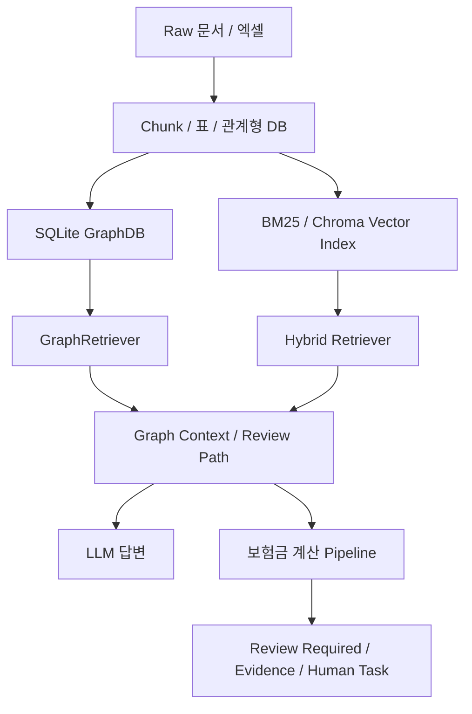

# 144. 보상 업무 관점 GraphRAG / 약관 Ontology 개선 브레인스토밍 보고서

작성일: 2026-05-28
대상 프로젝트: `insurance-rag-chatbot`
검토 관점: 보험회사 보상 업무 담당자, 약관 ontology 구축

## 1. 검토 목적

현재 GraphRAG는 `수술/수가/별표` 중심 구조에서 출발해, 최근 재빌드 이후 `PolicyClause`, `CaseExample`, `DiagnosisCode`, `ComplicationConcept`, `EvidenceRequirement`, `ReviewAction`까지 포함하는 문서 기반 보상 판단 그래프로 확장되었다.

이 보고서는 보상 담당자가 실제 업무에서 앱을 쓸 때:

1. 현재 구조가 어떤 실무 가치를 제공하는지
2. 약관 ontology 관점에서 아직 부족한 축이 무엇인지
3. 어떤 추가 기능/기술을 적용하면 실무 품질이 크게 올라가는지
4. 어떤 순서로 구현하는 것이 현실적인지

를 정리한다.

## 2. 현재 GraphRAG 아키텍처 요약

현재 구조는 크게 세 층이다.

현재 GraphDB의 핵심 노드:

- `SurgeryProcedure`
- `SurgeryGrade`
- `MedicalFeeCode`
- `PolicyBenefitRule`
- `CoverageItem`
- `NonpayStandardCode`
- `PolicyClause`
- `CaseExample`
- `DiagnosisCode`
- `ComplicationConcept`
- `EvidenceRequirement`
- `ReviewAction`

현재 운영 SQLite 기준으로 새 판단 노드와 review path edge는 실제 반영되어 있다.

- `PolicyClause`: `3,995`
- `CaseExample`: `1,138`
- `DiagnosisCode`: `695`
- `RELATES_TO_DIAGNOSIS`: `1,881`
- `HAS_DECISION`: `1,088`
- `HAS_REVIEW_ACTION`: `1,589`

즉 현재 시스템은 이미 단순 검색 RAG가 아니라, **문서 근거 기반 검토 경로를 함께 만드는 GraphRAG** 단계에 진입했다.

## 3. 보상 담당자 관점에서 현재 구조의 실무 가치

### 3.1 확정/후보/누락 근거 구분

보상 업무에서는 “답변이 그럴듯한가”보다 “어떤 근거가 확정이고 어떤 근거가 검토 후보인가”가 중요하다.

현재 구조는 Graph fact와 review path를 통해 다음을 구분할 수 있다.

- 확정 근거
- 검토 후보
- 구조화 DB 누락
- 추가 증빙 필요
- Human review 필요

이 방향은 보상 실무와 잘 맞는다.

### 3.2 수술/수가/약관 별표 연결

현재 GraphDB는 다음 질문에 강하다.

- 특정 수술의 종수
- 같은 종수의 다른 수술
- 수술과 HIRA 수가코드 연결
- 자사 SOL [별표7] 지급비율 후보
- 수가코드가 없는 경우 missing 처리

보상 담당자에게는 “수술명-종수-수가코드-약관 별표”를 한 번에 보는 것 자체가 실무 효율을 높인다.

### 3.3 합병증/후유증/부작용의 review trigger

현재 GraphRAG는 질병-합병증 의학 인과를 만들지는 않는다. 대신 질의나 청구 입력에 `합병증`, `후유증`, `부작용`이 명시될 때 관련 조항과 증빙 요건을 찾는다.

이 방식은 보험 실무에 적합하다.

- 의학적 인과는 시스템이 단정하지 않음
- 사용자가 주장한 상황을 약관 조항과 대조
- 부족한 증빙은 review action으로 노출

## 4. 현재 구조의 주요 한계

### 4.1 조항 단위가 아직 거칠다

`PolicyReviewExtractor`는 processed chunk 기반 heuristic으로 조항을 만든다. 따라서 실제 약관의 조, 항, 호, 단서, 별표 행을 정밀하게 분리하지 못할 수 있다.

문제:

- 한 chunk 안에 coverage와 exclusion이 함께 있으면 polarity가 섞일 수 있음
- `HAS_DECISION`이 조항 전체에 붙어 실제 단서 범위보다 넓어질 수 있음
- review path가 너무 많은 조항을 끌어올 수 있음

실무 영향:

- 보상 담당자가 “왜 이 조항이 나왔지?”라고 느낄 수 있음
- 면책/보상 가능 문구가 과하게 강해질 수 있음

### 4.2 약관 ontology의 핵심 축이 아직 평면적이다

현재는 `PolicyClause`와 `CoverageItem`은 있지만, 약관을 실무 판단 단위로 분해한 ontology는 아직 부족하다.

보상 담당자에게 필요한 축:

- 담보/특약
- 지급사유
- 보상하지 않는 손해
- 한도
- 공제
- 대기기간
- 면책기간
- 감액기간
- 통원/입원/처방 구분
- 세대별 적용 규칙
- 필요 서류
- 최종 심사 조치

현재 일부는 표현되지만, 명시적 rule node로 충분히 분리되어 있지는 않다.

### 4.3 보상 판단 precedence가 부족하다

약관에는 우선순위가 있다.

예:

- 면책 조항은 일반 지급사유보다 우선
- 특별약관은 보통약관보다 특정 상황에서 우선
- 세대별 약관은 일반 실손 설명보다 우선
- 별표/정의 조항은 계산식보다 우선

현재 GraphDB는 관계를 만들지만, 이런 **조항 우선순위/충돌 해결 규칙**은 아직 충분히 구조화되어 있지 않다.

### 4.4 증빙 completeness가 약하다

현재 `EvidenceRequirement`와 `ReviewAction`은 생겼지만, 실제 보상 담당자가 원하는 것은 다음이다.

- 현재 입력에서 어떤 서류가 있음
- 어떤 서류가 없음
- 누락 서류 때문에 어떤 판단을 보류해야 함
- 다음으로 고객/병원에 요청할 문서가 무엇인지

즉 단순히 “진단서 필요”를 표시하는 것을 넘어, **증빙 체크리스트와 판단 차단 조건**이 필요하다.

### 4.5 계산 규칙과 약관 ontology의 연결이 더 필요하다

현재 보험금 계산 파이프라인은 세대별 공제/한도와 Graph review path를 결합한다. 다만 계산 규칙 자체가 별도의 graph rule로 충분히 표현되어 있지는 않다.

실무적으로는 다음이 필요하다.

- 계산식의 출처 조항
- 적용된 공제 규칙
- 적용된 한도
- 면책 override 사유
- 계산 보류 사유
- 동일 청구 내 항목별 규칙 충돌

## 5. 추가 적용 가능한 핵심 기능

### 5.1 Clause-level parser 고도화

목표:

PDF chunk를 그대로 조항으로 쓰지 않고, 약관의 `조/항/호/단서/별표 행` 단위로 분해한다.

추가 노드 후보:

- `ClauseParagraph`
- `ClauseItem`
- `ClauseProviso`
- `AppendixRow`

추가 edge 후보:

- `HAS_PARAGRAPH`
- `HAS_ITEM`
- `HAS_PROVISO`
- `OVERRIDES`
- `EXCEPT_WHEN`

실무 효과:

- “보상한다”와 “다만 보상하지 않는다”를 분리 가능
- 면책/단서 범위를 더 정확히 표시
- LLM 답변이 조항 전체를 과잉 일반화하는 문제 감소

우선순위:

- 높음

### 5.2 약관 Decision Rule ontology

목표:

`PolicyClause`에서 판단 규칙을 별도 rule node로 분리한다.

추가 노드 후보:

- `CoverageTriggerRule`
- `ExclusionRule`
- `LimitRule`
- `DeductibleRule`
- `WaitingPeriodRule`
- `ReductionRule`
- `EvidenceGateRule`

추가 edge 후보:

- `DERIVED_FROM_CLAUSE`
- `APPLIES_TO_COVERAGE`
- `EXCLUDES_COVERAGE`
- `LIMITS_PAYMENT`
- `DEDUCTS_BY`
- `BLOCKS_DECISION_UNTIL`

실무 효과:

- 보상 가능/면책/한도/공제를 서로 다른 rule로 추적 가능
- 계산 파이프라인이 “왜 이 금액인지”를 조항 단위로 설명 가능
- 면책이 일반 계산식을 덮어쓰는 구조를 명시 가능

우선순위:

- 매우 높음

### 5.3 Precedence / conflict resolver

목표:

여러 조항이 동시에 검색될 때 어떤 조항이 우선인지 결정한다.

필요 기능:

- `confirmed exclusion > confirmed coverage > candidate coverage`
- `specific rider clause > general clause`
- `current policy generation > common clause`
- `direct diagnosis/code match > broad topic match`
- `source priority: 약관 > 별표 > 사례집 > 실무가이드 > 심평원`

추가 노드/edge 후보:

- `PrecedenceRule`
- `HAS_PRECEDENCE_OVER`
- `SOURCE_PRIORITY`
- `CONFLICTS_WITH`

실무 효과:

- 보상 담당자가 가장 먼저 봐야 할 조항이 위에 뜸
- review path가 길어져도 결론 후보가 정리됨
- LLM이 부차 근거를 주근거처럼 쓰는 위험 감소

우선순위:

- 매우 높음

### 5.4 Evidence completeness checker

목표:

현재 입력/첨부 상태와 약관상 필요 증빙을 비교한다.

추가 노드 후보:

- `ClaimEvidenceDocument`
- `EvidenceChecklist`
- `EvidenceMissingReason`

추가 edge 후보:

- `SATISFIES_EVIDENCE`
- `MISSING_EVIDENCE`
- `REQUIRES_FOR_DECISION`

UI 기능:

- “현재 확인된 서류”
- “추가 요청 서류”
- “서류 미비로 보류되는 판단”
- “사람 심사 필요 사유”

실무 효과:

- 답변이 아니라 업무 처리가 빨라짐
- 고객/병원에 요청할 다음 action이 명확해짐

우선순위:

- 매우 높음

### 5.5 Claim case session graph

목표:

사용자 질의와 보험금 계산 입력을 임시 그래프로 구성한다.

현재 구현은 `session_assertions` 수준이다. 이를 더 명확히 확장한다.

추가 런타임 노드 후보:

- `ClaimCase`
- `ClaimItem`
- `ClaimDiagnosis`
- `ClaimProcedure`
- `ClaimFeeCode`
- `SubmittedEvidence`
- `RequestedCoverage`

영구 저장 여부:

- v1은 메모리 객체
- 운영 단계에서는 심사 로그/감사 목적에 한해 별도 case DB 저장 검토

실무 효과:

- 한 건의 청구 안에서 진단/시술/증빙/계산/판단을 묶어 추적 가능
- “이 답변이 어떤 입력을 근거로 나왔는지” 감사 가능

우선순위:

- 높음

### 5.6 약관 버전/상품/특약 hierarchy

목표:

보상 담당자는 상품과 특약을 먼저 확인한다. 현재 구조는 이 축이 아직 충분히 강하지 않다.

추가 노드 후보:

- `InsuranceProduct`
- `Rider`
- `CoveragePlan`
- `PolicyVersion`
- `EffectiveDateRange`

추가 edge 후보:

- `HAS_RIDER`
- `HAS_COVERAGE_PLAN`
- `VALID_DURING`
- `SUPERSEDES`
- `APPLIES_TO_PRODUCT`

실무 효과:

- “이 고객 상품/특약에 해당 조항이 실제 적용되는가”를 분리 가능
- 최신 약관/구약관 혼선 감소
- 세대별 실손 판단 안정화

우선순위:

- 높음

### 5.7 약관 용어 ontology

목표:

약관의 정의 조항을 ontology로 만든다.

추가 노드 후보:

- `PolicyTerm`
- `TermDefinition`
- `Synonym`

추가 edge 후보:

- `DEFINES_TERM`
- `HAS_SYNONYM`
- `USES_TERM`

예:

- `입원`
- `통원`
- `상해`
- `질병`
- `3대비급여`
- `보상대상의료비`
- `공제금액`
- `보험가입금액`

실무 효과:

- 같은 용어가 상품/세대별로 다르게 쓰일 때 추적 가능
- 답변의 정의 출처를 명확히 표시

우선순위:

- 중간 이상

### 5.8 심사 action workflow

목표:

GraphRAG 결과를 단순 답변이 아니라 보상 담당자의 다음 업무 action으로 전환한다.

추가 노드 후보:

- `ReviewTask`
- `TaskPriority`
- `EscalationReason`
- `HumanReviewQueue`

추가 상태:

- `auto_payable_candidate`
- `auto_denial_candidate`
- `needs_evidence`
- `needs_medical_review`
- `needs_policy_review`
- `needs_fraud_or_overuse_review`

실무 효과:

- 챗봇이 답변 생성기에서 보상 업무 보조 도구로 발전
- 사람 심사 위임 사유가 표준화됨

우선순위:

- 중간 이상

### 5.9 Claim decision audit trail

목표:

최종 답변/계산 결과가 어떤 근거와 규칙으로 만들어졌는지 남긴다.

추가 노드 후보:

- `DecisionRecord`
- `AppliedRule`
- `RejectedRule`
- `DecisionRationale`

추가 edge 후보:

- `USED_RULE`
- `REJECTED_RULE`
- `USED_EVIDENCE`
- `OVERRIDDEN_BY`

실무 효과:

- 사후 민원/분쟁/감사 대응 가능
- “왜 이 답이 나왔는지” 재현 가능

우선순위:

- 중간

### 5.10 Ontology validation / constraints

목표:

그래프가 잘못 만들어지는 것을 빌드 단계에서 잡는다.

기술 후보:

- SQLite constraint check script
- SHACL 유사 검증 규칙 자체 구현
- graph invariant test
- edge polarity consistency check

검증 예:

- `ExclusionRule`은 반드시 `PolicyClause` 근거가 있어야 함
- `HAS_DECISION=면책`이면 `decision_polarity=exclusion`이어야 함
- `DiagnosisCode`는 반드시 문서 근거가 있어야 함
- `candidate` 관계는 계산 확정 근거로 쓰면 안 됨

실무 효과:

- 잘못된 ontology 연결이 운영 답변에 섞이는 것을 사전 차단
- 재빌드 품질을 정량 관리

우선순위:

- 매우 높음

## 6. 추가 적용 가능한 기술

### 6.1 Deterministic rule engine

현재 계산 파이프라인은 이미 deterministic sandbox와 공제 규칙을 일부 사용한다. 다음 단계는 GraphDB에서 추출한 rule node를 계산 엔진과 직접 연결하는 것이다.

적용 방식:

- `ExclusionRule`, `LimitRule`, `DeductibleRule`을 graph에서 조회
- rule priority로 충돌 해결
- 계산 결과에 `applied_rules`와 `blocked_rules` 표시

추천 이유:

- 보상 계산은 LLM 생성보다 deterministic rule이 맞다
- LLM은 설명/요약 담당으로 제한하는 것이 안전하다

### 6.2 Clause parser + table row parser

현재 chunk heuristic을 보완하려면 약관 문단과 별표 행을 더 잘 나눠야 한다.

적용 방식:

- PDF text chunk에서 `제n조`, `①`, `1.`, `가.`, `다만` 기준으로 clause segment 생성
- 별표/표는 row-level parser 사용
- 각 segment에 page, section, row id, clause path 부여

추천 이유:

- ontology 품질은 LLM보다 parsing 품질에 크게 좌우된다
- 보상 담당자가 신뢰하려면 조항 단위가 정확해야 한다

### 6.3 Graph reranker

현재 review path는 생성되지만 relevance ranking이 부족하다.

적용 방식:

- question/session assertion과 clause의 overlap 점수
- source priority
- direct code match 여부
- exact topic/condition match
- decision polarity
- evidence completeness

추천 이유:

- 너무 많은 조항이 나오면 실무자는 쓰기 어렵다
- 상위 3개 검토 경로가 정확해야 한다

### 6.4 LLM-assisted extraction with strict verifier

LLM을 extractor로 바로 쓰는 것은 위험하지만, 보조 후보 생성에는 쓸 수 있다.

안전한 방식:

1. deterministic parser가 clause segment 생성
2. LLM이 후보 label 제안
3. rule verifier가 허용된 canonical set과 근거 span 안에서만 승인
4. 검증 실패 후보는 discard

추천 이유:

- 약관 문구가 다양해 heuristic만으로는 한계가 있음
- 다만 최종 graph write는 deterministic verifier가 통제해야 함

### 6.5 Ontology authoring / review UI

보상 실무자가 graph edge를 검토/수정할 수 있는 UI가 필요하다.

기능:

- 조항별 추출 label 확인
- 잘못된 topic/decision/condition 제거
- 누락된 evidence requirement 추가
- candidate edge 승인/반려
- 변경 이력 저장

추천 이유:

- 약관 ontology는 완전 자동화보다 human-in-the-loop가 현실적
- 보상 담당자의 지식이 데이터 품질을 직접 높임

### 6.6 Evaluation harness for claims workflow

현재 평가는 QA 중심이다. 보상 실무형 평가는 별도 필요하다.

평가 케이스:

- 면책 우선순위
- 증빙 부족
- 세대별 공제/한도
- 특약 가입 여부 불명확
- 합병증 주장
- 진단코드 직접 근거 있음/없음
- 사례집은 참고, 약관은 우선 근거

평가 출력:

- correct review path
- correct blocking reason
- correct evidence request
- no over-assertion
- no hallucinated coverage

추천 이유:

- 일반 QA pass rate보다 보상 실무 품질을 더 정확히 측정함

## 7. 우선순위별 구현 로드맵

### 7.1 1순위: 안전성과 신뢰도

가장 먼저 해야 할 것:

1. `PolicyReviewExtractor` precision 개선
2. `HAS_DECISION`, `APPLIES_WHEN`, `HAS_TOPIC` 과포함 감소
3. graph invariant test 추가
4. review path reranking 추가
5. `confirmed/candidate/review_required/missing` 상태별 UI 문구 정리

이 단계의 목표:

- 잘못된 조항이 상위에 나오는 문제 감소
- 면책/보상 가능 과잉 단정 방지
- 보상 담당자가 신뢰할 수 있는 검토 경로 제공

### 7.2 2순위: 약관 ontology 구조화

다음으로 해야 할 것:

1. `CoverageTriggerRule`
2. `ExclusionRule`
3. `LimitRule`
4. `DeductibleRule`
5. `EvidenceGateRule`
6. `PrecedenceRule`

이 단계의 목표:

- 약관 조항을 단순 텍스트 노드가 아니라 실무 판단 rule로 변환
- 계산 파이프라인과 직접 연결

### 7.3 3순위: 업무 흐름 통합

그 다음 해야 할 것:

1. evidence completeness checker
2. claim case session graph
3. review task generation
4. audit trail
5. ontology authoring UI

이 단계의 목표:

- 앱을 답변 도구에서 보상 담당자의 업무 보조 도구로 확장
- 심사 위임/서류 요청/판단 보류를 표준화

## 8. 구현 시 지켜야 할 원칙

### 8.1 외부 의학 ontology는 기본 금지

현재 프로젝트 철학과 맞는 것은:

- 문서에서 직접 읽히는 보험/약관/수가/증빙 관계
- 사용자/증빙이 주장한 사실을 세션 그래프로 반영

맞지 않는 것은:

- 질병 -> 합병증 일반 인과
- 질병 -> 시술 적응증 일반 지식
- 문서 밖 의학 상식 기반 coverage 판단

### 8.2 LLM은 최종 판단자가 아니라 보조자

LLM이 해도 되는 것:

- 요약
- 사용자 설명
- 후보 label 제안
- 문서 비교 초안

LLM이 하면 안 되는 것:

- 면책/지급 확정
- 계산식 임의 생성
- 문서에 없는 약관 관계 생성
- candidate를 confirmed로 승격

### 8.3 GraphDB는 “근거와 상태”를 함께 저장해야 한다

모든 중요한 edge는 다음을 가져야 한다.

- source evidence
- confidence
- status
- source priority
- extraction method
- build version

보상 업무에서는 관계의 존재보다 **그 관계를 믿어도 되는지**가 더 중요하다.

## 9. 추천 다음 작업 명세

바로 이어서 구현하기 좋은 다음 작업은 아래다.

### 9.1 Review Path Ranking Spec

목표:

- 현재 생성되는 review path를 보상 담당자 관점으로 정렬
- 너무 넓게 잡힌 clause를 하위로 내림
- 직접 진단코드/조건/증빙 매칭을 상위로 올림

핵심 파일:

- `src/graph/retriever.py`
- `src/graph/query_planner.py`
- `tests/test_graph_review_path_retriever.py`

### 9.2 Policy Rule Ontology Spec

목표:

- `PolicyClause`에서 판단 규칙 노드 분리
- `ExclusionRule`, `LimitRule`, `DeductibleRule`, `EvidenceGateRule` 도입
- 보험금 계산 pipeline과 rule provenance 연결

핵심 파일:

- `src/graph/schema.py`
- `src/graph/extractors.py`
- `src/claim_calculation/pipeline.py`

### 9.3 Evidence Completeness Spec

목표:

- 입력/첨부 증빙과 약관상 필요 증빙 비교
- 누락 서류와 판단 보류 사유를 표준화

핵심 파일:

- `src/claim_calculation/models.py`
- `src/claim_calculation/pipeline.py`
- `src/api/rag_service.py`
- UI 렌더링 계층

## 10. 결론

현재 GraphRAG는 보험 보상 업무 관점에서 의미 있는 방향으로 발전했다. 특히 수술/수가/별표 연결에 더해, 약관 조항과 사례집, 진단코드, 합병증 판단 개념, 증빙 요구, review action을 실제 GraphDB에 반영한 점은 중요하다.

다만 보상 담당자가 실무에서 안정적으로 쓰려면 다음 단계는 더 많은 노드 수가 아니라 **판단 규칙의 정밀화**다.

핵심 개선 방향은 세 가지다.

1. `PolicyClause`를 더 작은 조항/항/단서/별표 행 단위로 분해한다.
2. `ExclusionRule`, `LimitRule`, `DeductibleRule`, `EvidenceGateRule`, `PrecedenceRule` 같은 약관 rule ontology를 만든다.
3. review path를 보상 담당자가 실제로 볼 순서대로 ranking하고, 필요한 증빙/심사 조치를 업무 action으로 만든다.

이 방향을 따르면 앱은 단순한 “약관 검색 챗봇”이 아니라, **약관 근거를 추적하고 보상 판단을 보조하는 실무형 ontology 기반 보상 지원 도구**로 발전할 수 있다.
