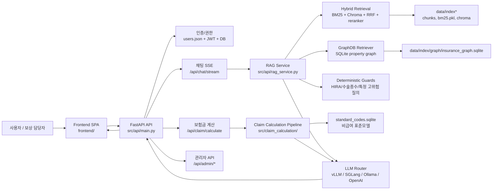

# 154. 프로젝트 개발 현황 및 아키텍처 보고서

작성일: 2026-05-29  
대상 프로젝트: `insurance-rag-chatbot`

## 1. 보고 목적

이 문서는 현재 코드베이스 기준으로 프로젝트가 어떤 기능까지 구현되어 있고, 웹앱/API/RAG/GraphDB/보험금 계산이 어떤 구조로 연결되는지 빠르게 이해하기 위한 아키텍처 요약 보고서다.

긴 서술보다 **구성요소, 데이터 흐름, 핵심 파일, 남은 위험**을 중심으로 정리한다.

> 기준: 로컬 저장소 `/Users/june_kim/Documents/Claude/Projects/보험 문서 RAG 챗봇`의 현재 코드와 기존 현황 문서 검토 결과. DGX Spark의 실행 중 프로세스 상태는 이 문서 작성 과정에서 별도 변경하지 않았다.

---

## 2. 현재 개발 상태 한 줄 요약

현재 프로젝트는 단순 RAG 챗봇을 넘어, **FastAPI 기반 사내형 웹앱 + 하이브리드 검색 + GraphRAG + 보험금 계산 + 관리자 진단 기능**까지 통합된 상태다.

다만 운영 품질은 아직 다음 요소에 좌우된다.

- DGX Spark에서 어떤 LLM 서버가 실제로 떠 있는지
- `chunks.jsonl`, BM25, Chroma 인덱스가 서로 동기화되어 있는지
- GraphDB evidence와 VectorStore chunk id가 현재 인덱스와 맞는지
- 보험금 계산에서 세대별 약관 기준과 평가셋 기대값이 일치하는지

---

## 3. 전체 아키텍처



---

## 4. 실행 계층

### 4.1 메인 웹앱

현재 주 실행 경로는 FastAPI가 프론트엔드 정적 파일과 API를 함께 제공하는 구조다.

| 계층 | 역할 | 주요 파일 |
|---|---|---|
| API 앱 | FastAPI 생성, 라우터 등록, SPA fallback, CORS, 예외 처리 | `src/api/main.py` |
| 프론트엔드 | 로그인, 채팅, 보험금 계산, 관리자 화면 | `frontend/` |
| DB 초기화 | SQLite 앱 DB 초기화 | `src/api/db.py` |
| 인증/권한 | 사용자 파일, JWT, 권한 검사 | `src/auth/users.py`, `src/api/deps.py` |

기존 Streamlit UI도 일부 남아 있으나, 현재 통합 웹앱의 중심은 `uvicorn src.api.main:app`으로 실행하는 SPA/API 구조다.

### 4.2 API 라우터

| API | 기능 |
|---|---|
| `/api/auth/*` | 로그인, refresh, 사용자 인증 |
| `/api/chat/stream` | 일반 RAG 질의 SSE 스트리밍 |
| `/api/chat/quickcode` | 퀵 코드 검색 |
| `/api/chat/formal` | 약관 정형 검색 |
| `/api/claim/calculate` | 보험금 계산 |
| `/api/sessions/*` | 대화 세션 저장/조회 |
| `/api/admin/*` | 감사 로그, 통계, 시스템 상태, 검색 진단, 사용자 관리 |
| `/api/system/*` | 시스템/모델 관련 보조 정보 |

---

## 5. 프론트엔드 구조

프론트엔드는 빌드 도구 없이 정적 HTML/CSS/JS로 구성된 SPA다.

| 영역 | 주요 파일 | 설명 |
|---|---|---|
| 앱 진입 | `frontend/index.html`, `frontend/js/app.js` | 로그인/채팅/관리자 페이지 전환 |
| 로그인 | `frontend/html/login.html`, `frontend/js/pages/login.js` | 계정 입력, 사용 가능 LLM 선택 |
| 채팅 | `frontend/html/chat.html`, `frontend/js/pages/chat.js` | 검색 모드, OCR 인덱스, SSE 수신, 답변/근거 렌더링 |
| 관리자 | `frontend/html/admin.html`, `frontend/js/pages/admin.js` | 통계, 시스템 상태, 검색 진단, 사용자 관리 |
| API 유틸 | `frontend/js/api.js`, `frontend/js/utils.js` | fetch wrapper, SSE parser, 렌더링 보조 |

최근 구조상 로그인 화면의 모델 선택지는 서버의 `/models` 응답과 설정값을 이용해 **실제 사용 가능한 모델만 노출**하는 방향으로 개선되어 있다.

---

## 6. RAG 검색 계층

### 6.1 인덱스 모드

`src/retrieval/index_mode.py`는 3개 인덱스 모드를 관리한다.

| 모드 | 목적 | 주요 경로 |
|---|---|---|
| `default` | 기본 운영 인덱스. 약관/HIRA/일반 질의 중심 | `data/index/` |
| `v2_only` | 수동 보정 OCR 중심. 실무가이드/상담사례집 계열 | `data/index_v2_manual/` |
| `v1_v2_combined` | 원본+보정본 OCR 통합. 원문/보정본 비교 | `data/index_v1_v2_combined/` |

요청에서 `default`를 선택하더라도 질문 내용이 실무가이드, 수술종수, 장해, 상담사례집, OCR 비교 성격이면 effective index mode가 자동 보정될 수 있다.

### 6.2 검색 파이프라인

주요 파일:

- `src/api/rag_service.py`
- `src/rag/pipeline.py`
- `src/retrieval/bm25.py`
- `src/retrieval/vector_store.py`
- `src/retrieval/reranker.py`

흐름:

1. 질문과 대화 이력 수신
2. 인덱스 모드 결정
3. BM25 키워드 검색
4. Chroma/BGE-M3 벡터 검색
5. RRF 후보 융합
6. reranker 재정렬
7. GraphDB 구조화 근거 병합
8. deterministic guard 적용 가능 여부 확인
9. 프롬프트 생성
10. LLM 스트리밍 응답
11. 출처, Graph 근거, 경고, 감사 로그 저장

### 6.3 검색 안정성 포인트

검색 품질은 모델보다 인덱스 정합성에 크게 의존한다.

필수 동기화 대상:

- `chunks.jsonl`
- `bm25.pkl`
- Chroma `chroma.sqlite3`
- GraphDB evidence `chunk_id`
- 원본 PDF/페이지 metadata

따라서 신규 문서나 OCR 산출물을 반영한 뒤에는 `scripts/check_cloud_index.py`, `scripts/check_graph_index.py`로 동기화 상태를 확인해야 한다.

---

## 7. GraphRAG / GraphDB 구조

### 7.1 현재 GraphDB의 역할

현재 GraphDB는 단순 수술종수 테이블이 아니라 **문서 기반 보상 판단 그래프**로 확장되어 있다.

주요 목적:

- 수술명 -> 수술종수 -> 수가코드 -> 별표/지급비율 후보 연결
- 비급여 표준모델과 실손 보장 항목 연결
- 약관 조항, 사례집, 판단 조건, 증빙 요구, 검토 조치 연결
- 합병증/후유증/미용 목적/건강보험 미적용 같은 판단 개념을 review path로 구성

### 7.2 스키마

주요 파일:

- `src/graph/schema.py`
- `src/graph/store.py`
- `src/graph/retriever.py`
- `src/graph/query_planner.py`
- `src/graph/extractors.py`

핵심 노드:

| 구분 | NodeType |
|---|---|
| 문서/표 | `Document`, `DocumentSection`, `Table`, `TableRow` |
| 수술/수가 | `SurgeryProcedure`, `SurgeryGrade`, `SurgeryCategory`, `MedicalFeeCode` |
| 약관/보장 | `PolicyProduct`, `PolicyAppendix`, `PolicyBenefitRule`, `CoverageItem` |
| 판단 그래프 | `PolicyClause`, `CaseExample`, `ClaimCondition`, `DecisionConcept`, `EvidenceRequirement`, `DiagnosisCode`, `ComplicationConcept`, `ReviewAction` |
| 맥락 | `PolicyGeneration`, `VisitContext`, `FacilityContext` |

핵심 엣지:

| EdgeType | 의미 |
|---|---|
| `HAS_GRADE` | 수술명과 수술종수 연결 |
| `HAS_MEDICAL_FEE_CODE` | 수술명과 HIRA 수가코드 연결 |
| `POLICY_COVERS_PROCEDURE` | 약관 별표와 수술명 후보 연결 |
| `PAYS_BY_RATIO` | 약관 지급비율 후보 |
| `APPLIES_WHEN` | 조항 적용 조건 |
| `HAS_DECISION` | 보상 가능/면책/조건부/추가심사 등 판단 |
| `REQUIRES_EVIDENCE` | 필요한 증빙 |
| `HAS_REVIEW_ACTION` | 담당자 검토 조치 |

### 7.3 중요한 설계 원칙

GraphDB는 의학 일반지식 그래프가 아니다.

전역 DB에 넣지 않는 것:

- 질병 -> 합병증 인과
- 질병 -> 시술 적응증
- 임상 상식 기반 치료 관계
- 외부 KCD/SNOMED ontology

대신 질문이나 청구 입력에 명시된 사실은 세션 단위 assertion으로 다룬다.

예:

```text
질문: 당뇨 진단 후 망막 레이저 수술을 받았고 합병증 특약 보상이 되나요?
```

허용:

- `당뇨`, `망막 레이저`, `합병증 특약`을 질문에서 주장된 사실로 기록
- 합병증 관련 약관 조항, 증빙 요건, review action 조회

금지:

- 전역 그래프에 `당뇨 -> 망막병증` 인과 edge 생성
- 의학적으로 당연하다는 방식의 자동 확정 판단

---

## 8. 보험금 계산 계층

주요 파일:

- `src/api/routes/claim.py`
- `src/claim_calculation/models.py`
- `src/claim_calculation/pipeline.py`
- `src/claim_calculation/standard_matcher.py`
- `src/claim_calculation/deductible_rules.py`
- `src/claim_calculation/code_sandbox.py`

### 8.1 처리 흐름

1. UI에서 청구 항목, 금액, 수량, 세대, 방문 구분, 진단코드, 상황 메모 입력
2. 비급여 표준모델 DB 매칭
3. 복수 후보면 계산 확정 보류
4. 면책/보상제외 의견이면 지급예상액 0원 우선
5. 4세대/5세대, 통원/입원, 항목 분류에 따라 공제/한도 계산
6. GraphDB review path 조회
7. RAG 근거 문서 첨부
8. 결과 payload에 지급액, 공제액, 검토 사유, 필요 증빙, review action 반환

### 8.2 현재 개선된 안전장치

| 상황 | 현재 처리 |
|---|---|
| 면책/보상제외 표준코드 | LLM 계산식보다 우선하여 지급액 0원 |
| 도수치료 등 복수 표준코드 후보 | 임의 첫 후보 계산 금지, 사용자 코드 선택 요구 |
| 5세대 비급여/3대비급여 | 중증/비중증/특약 여부 검토 경고 |
| 건강보험 미적용 | 특례 계산 및 적용 사유 확인 요구 |
| 합병증 주장 | 지급액 변경이 아니라 review path 및 심사 필요로 반영 |

---

## 9. LLM 서빙 구조

주요 파일:

- `src/llm/factory.py`
- `src/llm/openai_compatible_client.py`
- `src/llm/ollama_client.py`
- `src/config.py`

지원 경로:

| Provider | 용도 |
|---|---|
| `vllm` | DGX Spark 대형 로컬 모델. Gemma/Nemotron 계열 |
| `sglang` | DGX Spark 대형 로컬 모델. GPT-OSS/Qwen 계열 |
| `ollama` | 저부하 로컬 fallback |
| `openai` | API 설정이 있을 때 클라우드 모델 |

현재 모델 선택은 단순 하드코딩 목록이 아니라, OpenAI-compatible endpoint의 `/models` 결과를 조회해 실제 서빙 중인 모델을 필터링하는 구조로 개선되어 있다.

---

## 10. 관리자/운영 기능

주요 파일:

- `src/api/routes/admin.py`
- `frontend/js/pages/admin.js`
- `frontend/js/modules/admin.js`

관리자 페이지는 정적 목업이 아니라 실제 API와 연결되어 있다.

| 탭 | API | 내용 |
|---|---|---|
| 통계 | `/api/admin/stats` | 질문 수, 응답 수, 평균 응답시간, 모델/사용자/모드 분포 |
| 시스템 상태 | `/api/admin/system-summary` | 인덱스 존재 여부, GraphDB/표준코드 DB, LLM 설정, 임베딩 설정 |
| 검색 진단 | `/api/admin/rag-diagnostics/latest` | 최근 일반 질의의 BM25, dense, RRF, final, LLM 단계 진단 |
| 사용자 관리 | `/api/admin/users` 등 | 사용자 추가/수정/비밀번호 초기화/중복 검사 |
| 감사 로그 | `/api/admin/logs` | 로그인, 질의, 계산 등 audit trail |

---

## 11. 데이터와 빌드 산출물

| 범주 | 경로/파일 | 설명 |
|---|---|---|
| 원천 문서 | `raw/`, `data/raw/` 계열 | PDF, 약관, OCR 대상 문서 |
| 청크 | `data/index/chunks.jsonl` 등 | RAG 검색 기본 단위 |
| BM25 | `data/index*/bm25.pkl` | 키워드 검색 인덱스 |
| Chroma | `data/index*/chroma/` | 벡터 검색 인덱스 |
| GraphDB | `data/index/graph/insurance_graph.sqlite` | 구조화 보상 판단 그래프 |
| 표준코드 DB | `data/index/relational/standard_codes.sqlite` | 비급여 표준모델/표준코드 |
| 평가셋 | `eval/` | Graph/RAG/Stage2 평가 JSONL |
| 보고서 | `docs/`, `reports/` | 설계, 구현, 평가, 비교 결과 |

주요 스크립트:

| 스크립트 | 목적 |
|---|---|
| `scripts/ingest.py` | 문서 ingest/index 작업 |
| `scripts/build_cloud_index.py` | 클라우드/배포용 인덱스 빌드 |
| `scripts/build_graph_index.py` | GraphDB 재빌드 |
| `scripts/build_relational_db.py` | 표준코드 관계형 DB 빌드 |
| `scripts/build_table_index.py` | 표 기반 검색 보조 인덱스 |
| `scripts/check_cloud_index.py` | chunks/BM25/Chroma 정합성 점검 |
| `scripts/check_graph_index.py` | GraphDB 무결성 점검 |
| `scripts/eval_graph_review_paths.py` | review path 평가 |
| `scripts/stage2_direct_model_eval.py` | 앱 API 기반 모델 평가 |

---

## 12. 핵심 사용자 흐름

### 12.1 일반 질의

```text
로그인
-> 모델 선택
-> 질문 입력
-> 인덱스 모드 결정
-> BM25/Chroma/RRF/reranker 검색
-> GraphDB 구조화 근거 병합
-> LLM 스트리밍
-> 출처/Graph 근거/경고 표시
-> 세션 및 감사 로그 저장
```

### 12.2 보험금 계산

```text
계산 탭 선택
-> 실손 세대/방문 구분/항목/금액 입력
-> 표준코드 매칭
-> 세대별 공제/한도 계산
-> Graph review path 조회
-> 필요 증빙/검토 조치 표시
-> 감사 로그 저장
```

### 12.3 관리자 점검

```text
관리자 로그인
-> 통계 확인
-> 시스템 상태에서 인덱스/DB/LLM 노출 상태 확인
-> 검색 진단에서 최근 질의의 검색 단계 확인
-> 사용자 관리 및 감사 로그 확인
```

---

## 13. 현재 강점

| 영역 | 강점 |
|---|---|
| 앱 통합 | 로그인, 채팅, 계산, 관리자 기능이 하나의 FastAPI/SPA로 연결됨 |
| 검색 | BM25 + Chroma + RRF + reranker의 하이브리드 구조 |
| 인덱스 모드 | 기본/보정본/통합 OCR 인덱스를 질문 유형별로 선택 가능 |
| GraphRAG | 수술/수가/별표를 넘어 약관 조항과 review path까지 확장 |
| 계산 안전장치 | 면책 우선, 복수 후보 보류, 5세대 검토 경고 등 실무형 방어 로직 |
| 운영 진단 | 관리자 페이지에서 실제 통계, 시스템 상태, 검색 진단 확인 가능 |
| 평가 체계 | Graph/RAG/Stage2 모델 비교용 스크립트와 보고서 체계가 존재 |

---

## 14. 남은 위험과 관리 포인트

| 위험 | 의미 | 관리 방법 |
|---|---|---|
| 인덱스 불일치 | chunks/BM25/Chroma 중 하나만 갱신되면 검색 품질 저하 | `check_cloud_index.py`로 세 저장소 동기화 확인 |
| Graph evidence drift | GraphDB의 chunk id가 현재 VectorStore와 다를 수 있음 | Graph rebuild 후 `check_graph_index.py`, UI 경고 확인 |
| LLM 서버 불일치 | UI에서 선택한 모델과 실제 endpoint 모델이 다르면 404/empty output 발생 | `/models` 기반 필터링, DGX 모델 전환 후 앱 재기동/새로고침 |
| 계산 기준 분쟁 | 4/5세대, 통원 한도, 비급여 분류 기준이 평가셋과 다를 수 있음 | 약관 근거 기준으로 평가셋 기대값 정규화 |
| Graph 과잉해석 | 질병-합병증 인과를 외부 지식처럼 확정할 위험 | 세션 assertion과 전역 GraphDB를 분리 유지 |
| 관리자 통계 범위 | 검색 진단은 최근 일반 질의 중심 | 퀵코드/정형/계산 진단까지 확장 가능 |

---

## 15. 신규 개발자가 먼저 볼 파일

| 목적 | 파일 |
|---|---|
| 앱 진입점 | `src/api/main.py` |
| 채팅 API | `src/api/routes/chat.py` |
| RAG 서비스 연결 | `src/api/rag_service.py` |
| RAG 파이프라인 | `src/rag/pipeline.py` |
| 인덱스 모드 | `src/retrieval/index_mode.py` |
| Graph 스키마 | `src/graph/schema.py` |
| Graph 조회 | `src/graph/retriever.py` |
| 보험금 계산 | `src/claim_calculation/pipeline.py` |
| LLM 라우팅 | `src/llm/factory.py` |
| 관리자 API | `src/api/routes/admin.py` |
| 채팅 UI | `frontend/js/pages/chat.js` |
| 관리자 UI | `frontend/js/pages/admin.js` |

---

## 16. 운영 전 최소 점검 체크리스트

```bash
git status --short
python -m py_compile src/api/main.py
python scripts/check_cloud_index.py
python scripts/check_graph_index.py
pytest -q
```

DGX 실행 전에는 추가로 확인한다.

```bash
curl -s http://127.0.0.1:30001/v1/models
curl -s http://127.0.0.1:30000/v1/models
```

앱 실행 후에는 관리자 페이지에서 다음을 확인한다.

- 시스템 상태: BM25/Chroma/GraphDB/표준코드 DB 존재 여부
- 검색 진단: 최근 일반 질의의 BM25/dense/RRF/final 단계
- 통계: 실제 질의와 응답이 감사 로그에 적재되는지

---

## 17. 결론

현재 프로젝트는 RAG 검색 앱의 기본 골격을 넘어, 보험 보상 업무에 맞춘 다음 계층까지 구현되어 있다.

- 문서 기반 검색
- OCR 보정 인덱스
- GraphDB 기반 구조화 근거
- 실손 세대별 보험금 계산
- 면책/모호성/증빙 부족 방어 로직
- 관리자 진단 및 감사 로그

다음 개선의 핵심은 새 기능을 무리하게 늘리는 것보다, **인덱스-GraphDB-계산 기준-평가셋의 정합성을 유지하면서 실무 QA 케이스를 늘리는 것**이다.
