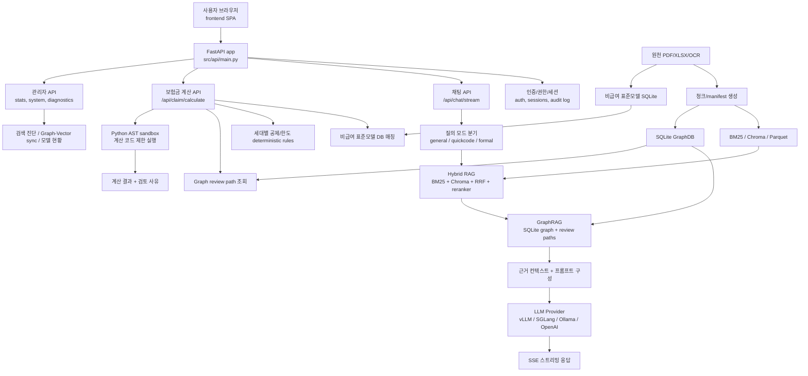

# 166. Current App Architecture Baseline Before Ontology Stage 2

작성일: 2026-06-01  
기준 프로젝트: `insurance-rag-chatbot`  
기준 위치: DGX Spark `/srv/shared/projects/insurance-rag-chatbot`  
기준 커밋: `6806ab7 feat(graph): canonical manifest chunk sync refactor`  
작성 목적: GraphDB ontology 2차 확장 적용 전에, 현재 버전 앱이 어떤 계층과 데이터 흐름으로 동작하는지 이해하기 쉽게 정리한다.

---

## 1. 한 줄 요약

현재 앱은 **FastAPI 기반 보험 보상지원 SPA**이며, 일반 RAG 검색, GraphRAG 구조화 근거, 보험금 계산 sandbox, 관리자 진단, 모델/provider 선택 기능이 하나의 백엔드에서 연결되어 있다.

핵심 구조는 다음과 같다.

```text
사용자 SPA
  -> FastAPI API
  -> 인증/세션/권한/감사로그
  -> RAG 검색 또는 보험금 계산
  -> GraphDB review path 병합
  -> 로컬/클라우드 LLM
  -> 스트리밍 답변 + 출처 + 구조화 근거 + 검토 경고
```

현재 GraphDB는 의학 인과 지식 그래프가 아니라, **문서에서 확인 가능한 수술/수가/별표/약관/판단 개념/review path를 구조화한 문서 판단 그래프**로 운영된다.

---

## 2. 전체 아키텍처



---

## 3. 런타임 계층

### 3.1 Frontend SPA

현재 실사용 UI는 `frontend/` 정적 SPA다.

주요 화면:

- 로그인 화면
- 일반 챗봇 화면
- 일반 질의 / 퀵 코드 검색 / 약관 정형 검색 / 보험금 계산 탭
- OCR 인덱스 선택 라디오 버튼
- 관리자 페이지
  - 통계
  - 시스템 상태
  - 검색 진단
  - Graph-Vector sync 진단
  - 사용자 관리

중요한 점:

- 현재 기준 주 UI는 Streamlit이 아니라 FastAPI가 서빙하는 SPA다.
- Streamlit은 과거/보조 테스트 경로로 볼 수 있고, 최신 앱 검증은 `/login`, `/chat`, `/admin` 기준으로 보는 것이 맞다.

### 3.2 FastAPI Backend

백엔드 진입점은 `src/api/main.py`다.

주요 역할:

- FastAPI 앱 생성
- API DB 초기화
- CORS, request id, static cache middleware 설정
- API router 등록
- `frontend/` 정적 파일 서빙
- SPA route fallback 처리

등록 router:

| Router | Prefix | 역할 |
| --- | --- | --- |
| `system` | `/api/system` | 모델 목록, 기본 상태 등 시스템 조회 |
| `auth` | `/api/auth` | 로그인, 토큰 갱신, 로그아웃 |
| `chat` | `/api/chat` | SSE 기반 챗봇 질의 |
| `claim` | `/api/claim` | 보험금 계산 |
| `sessions` | `/api/sessions` | 대화 세션 및 메시지 |
| `admin` | `/api/admin` | 관리자 통계, 진단, 사용자 관리 |

### 3.3 인증, 세션, 감사로그

현재 앱은 단순 데모 UI가 아니라 로그인 기반 업무 앱 구조를 가진다.

주요 구성:

- 사용자 저장소: `users.json`
- API DB: SQLite 기반 `insurance_chat.db`
- 세션/메시지 저장: SQLAlchemy async 모델
- 권한 검사: `require_permission`, `require_admin`
- 감사 로그: `AuditLog`
- 채팅 로그: `ChatMessage`
- 주요 이벤트: 로그인, 일반 질의, 보험금 계산, 관리자 조회

이 구조 덕분에 관리자 통계와 검색 진단은 실제 사용자 질의 로그를 기반으로 집계할 수 있다.

---

## 4. 일반 질의 처리 흐름

일반 질의의 핵심 endpoint는 `/api/chat/stream`이다.

처리 순서:

1. 사용자가 질문, top-k, 온도, 모델, 인덱스 모드, 질의 모드를 보낸다.
2. 백엔드는 로그인 사용자와 권한을 확인한다.
3. 대화 세션을 확인하거나 새로 만든다.
4. 모델 alias를 실제 provider/model로 변환한다.
5. 인덱스 모드를 확정한다.
6. 질의 모드에 따라 검색 경로를 선택한다.
7. 검색 근거와 GraphDB 근거를 조립한다.
8. 프롬프트를 생성한다.
9. LLM 응답을 SSE로 스트리밍한다.
10. 최종 답변, 출처, Graph payload, 경고, 진단 정보를 저장한다.

### 4.1 모델 alias

현재 API에서 대표 alias는 다음처럼 처리된다.

| Alias | Provider | Model |
| --- | --- | --- |
| `gemma4` | `vllm` | `gemma-4-26b-a4b-nvfp4` |
| `nemotron` | `vllm` | `nemotron-3-nano-30b-a3b-nvfp4` |
| `gpt-oss` | `sglang` | `gpt-oss-20b` |
| `qwen3` | `sglang` | `qwen3-30b-a3b-instruct-2507-fp8` |

로그인 화면과 시스템 API는 실제 endpoint의 `/models` 응답을 조회해 **현재 서버에서 떠 있는 모델만 선택 가능하게 필터링**한다.

### 4.2 질의 모드

| Mode | 역할 |
| --- | --- |
| `general` | 일반 자연어 RAG 질의 |
| `quickcode` | 코드/수가/수술명 중심 빠른 검색 |
| `formal` | 약관 정형 검색 |
| `claim_calculation` | 별도 `/api/claim/calculate`에서 처리 |

일반 질의는 `src/api/rag_service.py`의 `prepare_retrieved_context()`가 중심이다.

---

## 5. 인덱스 모드와 검색 계층

현재 앱은 3개 인덱스 모드를 지원한다.

| Index mode | 의미 | BM25 | Chroma |
| --- | --- | --- | --- |
| `default` | 기본 운영 인덱스 | `data/index/bm25.pkl` | `data/index/chroma` |
| `v2_only` | OCR 보정본 전용 | `data/index_v2_manual/bm25.pkl` | `data/index_v2_manual/chroma` |
| `v1_v2_combined` | 원본 OCR + 보정본 OCR 통합 | `data/index_v1_v2_combined/bm25.pkl` | `data/index_v1_v2_combined/chroma` |

`src/retrieval/index_mode.py`는 명시 선택이 없을 때 질문 키워드를 보고 자동 라우팅한다.

예:

- 실무가이드, 수술종수, 신1-5종, 장해, 상담사례집 등은 `v2_only`가 우선된다.
- 원본/보정본 비교를 묻는 질문은 `v1_v2_combined`로 보낸다.
- 그 외 약관/HIRA 일반 질문은 `default`가 기본이다.

검색 구성:

- BM25: 키워드/코드 패턴 검색
- Chroma: embedding 기반 의미 검색
- RRF: BM25와 벡터 검색 결과 결합
- reranker: 후보 재정렬
- doc/page/source metadata: 출처 표시에 사용

---

## 6. Canonical Chunk Manifest와 Graph-Vector Sync

최근 기준의 중요한 변화는 `canonical manifest` 도입이다.

이전 문제:

- GraphDB evidence가 들고 있는 `chunk_id`와 Chroma에 저장된 chunk id가 서로 다른 경우가 있었다.
- 특히 `v2_only`, `v1_v2_combined`, GraphDB가 같은 문서/페이지를 서로 다른 이름으로 부르면 Graph 근거는 찾았는데 VectorStore 원문 chunk를 못 찾는 경고가 발생했다.

현재 구조:

- canonical manifest가 문서/페이지/청크의 공통 참조 기준을 제공한다.
- GraphDB evidence에는 `canonical_chunk_id`가 포함된다.
- RAG 서비스는 Graph evidence에서 `source_chunk_refs`를 먼저 사용하고, 실패 시 기존 `source_chunk_ids`와 doc/page fallback을 사용한다.
- 관리자 API는 GraphDB evidence와 Chroma 인덱스 사이의 sync 상태를 샘플링해 진단한다.

목표:

```text
GraphDB가 말하는 근거
  == VectorStore가 찾아오는 원문 chunk
  == UI에 표시되는 출처 문서/페이지
```

---

## 7. GraphRAG 계층

현재 GraphDB는 SQLite 기반이다.

핵심 파일:

- `src/graph/schema.py`
- `src/graph/build.py`
- `src/graph/retriever.py`
- `src/graph/query_planner.py`
- `src/graph/vector_sync.py`

### 7.1 현재 NodeType

주요 노드는 다음 범주로 나뉜다.

문서 구조:

- `Document`
- `DocumentSection`
- `Table`
- `TableRow`

수술/수가/별표:

- `SurgeryProcedure`
- `SurgeryGrade`
- `SurgeryCategory`
- `MedicalFeeCode`
- `PolicyProduct`
- `PolicyAppendix`
- `PolicyBenefitRule`
- `CoverageItem`
- `NonpayStandardCode`

문서 판단 그래프:

- `PolicyClause`
- `CaseExample`
- `ClaimCondition`
- `DecisionConcept`
- `EvidenceRequirement`
- `DiagnosisCode`
- `ComplicationConcept`
- `PolicyGeneration`
- `VisitContext`
- `FacilityContext`
- `ReviewAction`

### 7.2 현재 EdgeType

대표 관계:

- `HAS_GRADE`
- `HAS_CATEGORY`
- `HAS_MEDICAL_FEE_CODE`
- `POLICY_COVERS_PROCEDURE`
- `PAYS_BY_RATIO`
- `HAS_TOPIC`
- `APPLIES_WHEN`
- `HAS_DECISION`
- `REQUIRES_EVIDENCE`
- `RELATES_TO_DIAGNOSIS`
- `RELATES_TO_COMPLICATION`
- `APPLIES_TO_GENERATION`
- `APPLIES_TO_VISIT`
- `APPLIES_TO_FACILITY`
- `HAS_REVIEW_ACTION`
- `SIMILAR_CASE_FOR`

중요한 제한:

- `CAUSES`, `LEADS_TO`, `COMPLICATES_TO`, `TREATED_BY` 같은 의학 인과 edge는 만들지 않는다.
- 질병과 합병증의 일반 의학 지식은 전역 GraphDB에 넣지 않는다.
- 질의나 청구 입력에 명시된 사실은 세션 주장으로만 다룬다.

### 7.3 Review Path

GraphRAG는 단순히 “관련 노드 목록”만 주는 것이 아니라, 검토 경로를 구성한다.

예:

```text
질문에서 주장된 사실:
- 합병증 치료
- 도수치료
- 5세대 실손
- 통원

문서에서 확인된 근거:
- 3대비급여 정의
- 5세대 통원 공제/한도
- 증빙 필요 조항

추가 확인 필요:
- 세부내역서
- 진단서
- 특약 가입 여부
```

현재 UI에는 구조화 근거, 확정 근거, 검토 후보, 처리 경고가 함께 표시된다.

---

## 8. 보험금 계산 아키텍처

보험금 계산은 일반 RAG 답변과 별도 경로로 동작한다.

핵심 endpoint:

```text
POST /api/claim/calculate
```

핵심 모듈:

- `src/claim_calculation/models.py`
- `src/claim_calculation/pipeline.py`
- `src/claim_calculation/standard_matcher.py`
- `src/claim_calculation/deductible_rules.py`
- `src/claim_calculation/code_sandbox.py`
- `src/claim_calculation/planner.py`

### 8.1 처리 순서

1. 사용자가 청구 항목, 금액, 수량, 세대, 방문 구분, 진단코드, 상황 메모를 입력한다.
2. 비급여 표준모델 SQLite에서 항목명/코드를 매칭한다.
3. 후보가 여러 개면 임의 계산하지 않고 코드 선택을 요구한다.
4. 면책/보상제외 의견이 있으면 지급액 0원으로 강제한다.
5. 4세대/5세대, 급여/비급여/3대비급여, 입원/통원 기준으로 공제와 한도를 계산한다.
6. GraphDB review path를 조회해 추가 증빙과 검토 조치를 붙인다.
7. 필요 시 LLM planner가 계산 계획을 만들 수 있지만, 계산 실행은 제한된 Python AST sandbox에서 수행된다.
8. 최종 payload에는 지급예상액, 공제금액, 항목별 계산, 검토 사유, 선택 후보, 적용 근거가 포함된다.

### 8.2 결정론 guardrail

계산 정확도에서 중요한 보호 장치는 다음이다.

- 면책/보상제외는 LLM 계산보다 DB 의견이 우선한다.
- 복수 표준코드 후보는 자동 확정하지 않는다.
- 세대별 공제/한도는 `deductible_rules` 기반 deterministic rule로 계산한다.
- LLM이 계산 코드를 만들더라도 sandbox에서 허용 문법만 실행한다.
- 실행 실패나 비정상 결과는 review/보류로 처리한다.

즉, 현재 보험금 계산은 “LLM이 말로 그럴듯하게 답하는 구조”가 아니라, **구조화 DB + 결정론 규칙 + 제한 실행 + 검토 경고**를 결합한 구조다.

---

## 9. LLM Provider 계층

LLM 생성은 `src/llm/factory.py`에서 provider별로 분기한다.

지원 provider:

| Provider | 용도 |
| --- | --- |
| `vllm` | DGX 로컬 vLLM 대형 모델 |
| `sglang` | DGX 로컬 SGLang 대형 모델 |
| `ollama` | 저부하 로컬 fallback |
| `openai` | 클라우드 모델, offline mode가 아니고 API key가 있을 때만 |

중요 동작:

- vLLM/SGLang은 OpenAI-compatible `/v1` endpoint를 사용한다.
- UI 후보는 설정 파일 후보와 로컬 staged 모델만으로 끝나지 않고, 실제 endpoint의 `/models` 응답을 조회해 활성 모델만 노출한다.
- SGLang에서 문제 있는 모델은 disabled 목록으로 차단할 수 있다.
- OpenAI는 `OFFLINE_MODE=true` 또는 API key 미설정 시 사용하지 않는다.

---

## 10. 관리자 기능

관리자 API는 현재 단순 placeholder가 아니라 실제 backend와 연결되어 있다.

주요 endpoint:

| Endpoint | 역할 |
| --- | --- |
| `/api/admin/stats` | 감사로그/메시지 기반 사용 통계 |
| `/api/admin/system-summary` | 인덱스, GraphDB, 모델, embedding 상태 요약 |
| `/api/admin/rag-diagnostics/latest` | 최근 일반 질의의 RAG 진단 |
| `/api/admin/graph-vector-sync` | Graph evidence와 Chroma chunk sync 샘플 진단 |
| `/api/admin/users` | 사용자 목록/추가/수정 |
| `/api/admin/logs` | 감사 로그 조회 |

관리자 화면에서 확인 가능한 것:

- 어떤 모델이 현재 선택 가능한지
- BM25/Chroma/GraphDB/비급여 DB 파일이 존재하는지
- 최근 질의가 어떤 검색 근거를 사용했는지
- GraphDB evidence가 VectorStore에서 직접 hit되는지 또는 fallback에 의존하는지

---

## 11. 데이터 구축 파이프라인

원천 데이터는 PDF와 XLSX다.

주요 원천:

- 심평원 고시 PDF
- 실손 약관 PDF
- 자사 SOL 건강보험 약관 PDF
- 자사 SOL 운전자보험 약관 PDF
- 표준약관 PDF
- 실무가이드 OCR 문서
- 상담사례집 OCR 문서
- 비급여 표준모델 XLSX

구축 산출물:

| 산출물 | 역할 |
| --- | --- |
| chunks JSONL/Parquet | RAG 검색의 원문 단위 |
| BM25 index | 키워드/코드 검색 |
| Chroma index | 의미 검색 |
| canonical manifest | index/GraphDB 공통 chunk 참조 기준 |
| SQLite GraphDB | 구조화 관계와 review path |
| standard_codes.sqlite | 비급여 표준모델 매칭 |

GraphDB build는 `src/graph/build.py`에서 여러 extractor를 실행한다.

현재 주요 extractor:

- 수술종수 extractor
- 약관 별표 extractor
- HIRA code extractor
- 비급여 표준모델 extractor
- 실손 보장 extractor
- policy review extractor

---

## 12. 현재 버전의 강점

1. **질의 UI, 검색, GraphDB, 계산, 관리자 진단이 하나의 앱으로 연결됨**

   단순 실험 스크립트가 아니라 로그인/세션/감사로그가 붙은 업무형 SPA 구조다.

2. **문서 기반 구조화 근거를 일반 RAG 답변에 병합**

   수술종수, HIRA 코드, 약관 별표, 판단 개념, 증빙 요구를 답변 근거로 함께 보여준다.

3. **보험금 계산에서 LLM 의존도를 낮춤**

   금액 계산은 결정론 규칙과 sandbox 실행으로 보호하고, LLM은 보조 계획 또는 설명 계층에 머문다.

4. **인덱스 모드가 분리되어 OCR 보정본과 통합본을 테스트 가능**

   `default`, `v2_only`, `v1_v2_combined`를 UI와 평가 스크립트에서 비교할 수 있다.

5. **Graph-Vector sync 진단이 가능**

   GraphDB가 가리키는 근거가 실제 Chroma chunk로 찾아지는지 관리자 화면에서 확인할 수 있다.

---

## 13. 현재 버전의 경계와 주의점

1. **GraphDB는 외부 의학 ontology가 아니다**

   당뇨가 망막병증을 유발한다는 식의 일반 의학 인과 관계는 전역 그래프에 없다. 그런 내용은 질문/청구 입력에서 주장된 사실로만 다룬다.

2. **review path는 확정 보상 판정이 아니다**

   합병증, 미용 목적, 건강보험 미적용, 상급병실료 차액 등은 자동 확정보다 증빙 요구와 심사 경로 안내가 우선이다.

3. **검색 품질은 여전히 인덱스와 청킹에 좌우된다**

   canonical manifest가 도입되었지만, 모든 Graph evidence가 항상 source chunk direct hit로 끝나는 것은 아니다. 일부는 doc/page fallback에 의존할 수 있다.

4. **모델 선택은 서버 기동 상태와 일치해야 한다**

   UI는 현재 떠 있는 모델만 보여주도록 개선되어 있지만, DGX에서 vLLM/SGLang 서버가 실제로 어떤 모델을 서빙 중인지가 최종 기준이다.

5. **보험금 계산은 예상 계산이다**

   표준코드 모호성, 증빙 부족, 특약 가입 여부, 과다청구/과다시술 판단은 Human Task 또는 추가 심사로 넘겨야 한다.

---

## 14. Ontology 2차 확장 전 기준선

현재 ontology 1차 확장으로 이미 들어간 축:

- 합병증/후유증/부작용 등 `ComplicationConcept`
- 미용 목적, 건강보험 미적용 등 `ClaimCondition`
- 보상 가능, 면책, 증빙 필요 등 `DecisionConcept`
- 진단서, 세부내역서 등 `EvidenceRequirement`
- 세대, 입원/통원, 의료기관 context
- review action

2차 확장에서 보강하려는 축:

- `ExclusionReason`
- `BenefitLimit`
- `DeductibleRule`
- `RequiredDocument`
- `CoordinationRule`
- `RenewalOrGenerationRule`

이 확장은 현재 구조를 대체하지 않고 다음 지점에 붙는 것이 자연스럽다.

```text
PolicyClause
  -> ClaimCondition / DecisionConcept / EvidenceRequirement
  -> Stage 2 policy rule nodes
  -> GraphReviewPath
  -> RAG 답변 및 보험금 계산 review payload
```

즉, 2차 확장의 목적은 LLM에게 더 많은 자유 추론을 주는 것이 아니라, **현재 review path가 더 명확한 면책 사유, 한도, 공제, 서류, 중복보상, 세대 전환 규칙을 구조화해서 보여주게 만드는 것**이다.

---

## 15. 운영자가 이해해야 할 실제 요청 흐름

### 일반 질문

```text
질문 입력
-> index mode 결정
-> BM25/Chroma 검색
-> GraphDB 구조화 근거 조회
-> 근거 병합
-> LLM 답변 생성
-> 출처/Graph/review warning 저장 및 표시
```

### 수술종수/HIRA 질문

```text
수술명/코드 질문
-> GraphDB 수술/수가 관계 조회
-> 필요 시 HIRA 표 chunk fallback
-> 관련 문서 chunk 병합
-> LLM 답변
-> 구조화 근거와 참고 문서 표시
```

### 보험금 계산

```text
청구 항목/금액/세대/방문 입력
-> 비급여 표준모델 매칭
-> 모호성/면책 guard
-> 세대별 공제/한도 deterministic 계산
-> Graph review path 조회
-> 계산 결과 + 검토 사유 + 요구 서류 표시
```

### 관리자 진단

```text
사용 로그/최근 질의/인덱스 파일/모델 endpoint/Graph sync 샘플 조회
-> 현재 앱이 왜 특정 답변을 했는지 운영자가 추적
```

---

## 16. 검증 관점 체크리스트

Ontology 2차 확장 전후로 아래 항목을 비교하면 된다.

- 일반 질의가 기존처럼 응답하는가
- `default`, `v2_only`, `v1_v2_combined` 인덱스 선택이 깨지지 않는가
- Graph review path가 기존 수술/HIRA/별표 근거를 방해하지 않는가
- 보험금 계산에서 면책/모호성/세대별 공제 guard가 유지되는가
- 관리자 Graph-Vector sync 진단 결과가 악화되지 않는가
- 새 노드가 외부 의학 지식을 임의로 생성하지 않는가
- UI가 새 review action, required document, limit/deductible rule을 과단정 없이 표시하는가

권장 검증 명령:

```bash
pytest -q
python scripts/eval_graph_review_paths.py
python scripts/check_graph_vector_sync.py --index-mode default
python scripts/check_graph_vector_sync.py --index-mode v2_only
python scripts/check_graph_vector_sync.py --index-mode v1_v2_combined
```

문서만 변경한 경우에는 최소한 다음을 확인한다.

```bash
git diff --check -- docs/166_CURRENT_APP_ARCHITECTURE_BASELINE_BEFORE_ONTOLOGY_STAGE2.md
```

---

## 17. 결론

현재 버전의 앱은 다음 세 가지 축으로 이해하는 것이 가장 정확하다.

1. **문서 검색 앱**

   BM25/Chroma/RRF/reranker로 약관과 OCR 문서를 찾아 답변한다.

2. **문서 판단 그래프 앱**

   GraphDB가 수술종수, 수가코드, 약관 별표, 판단 개념, 증빙 요구를 구조화 근거로 제공한다.

3. **보상 계산 보조 앱**

   비급여 표준모델 DB와 세대별 공제 규칙을 사용해 예상 보험금을 계산하되, 모호하거나 증빙이 필요한 경우 review-oriented 결과를 낸다.

따라서 ontology 2차 확장은 이 구조 위에서 **면책 사유, 보장 한도, 공제 규칙, 필수 서류, 중복보상 조정, 세대 전환 규칙을 더 명확한 정책 노드로 분해하는 작업**으로 진행하는 것이 맞다.
