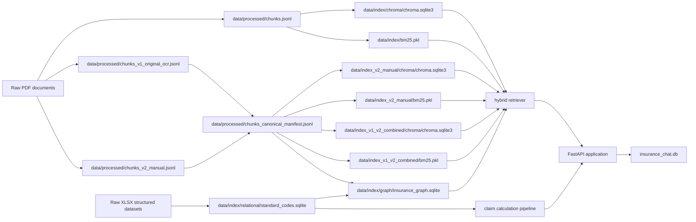
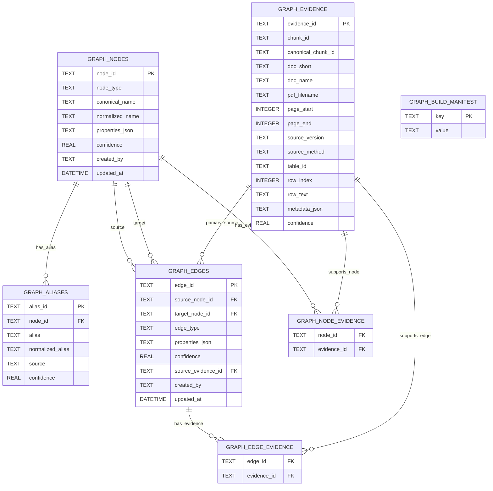
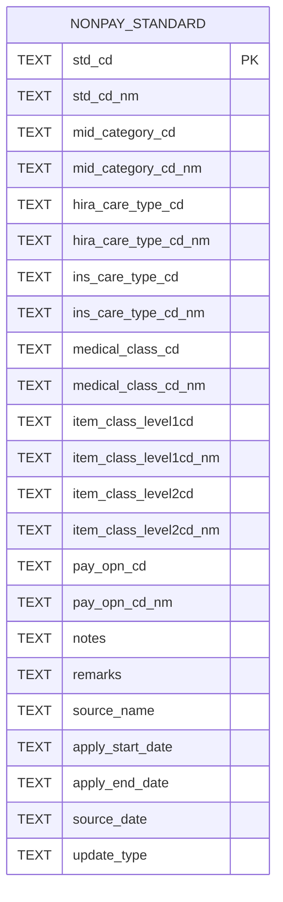
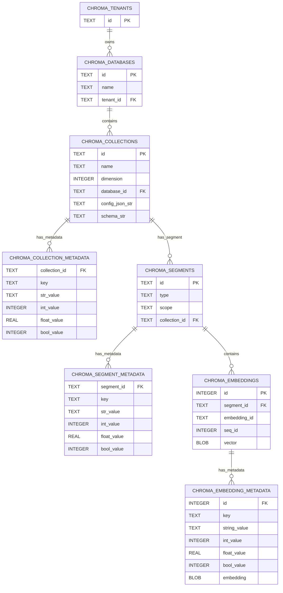
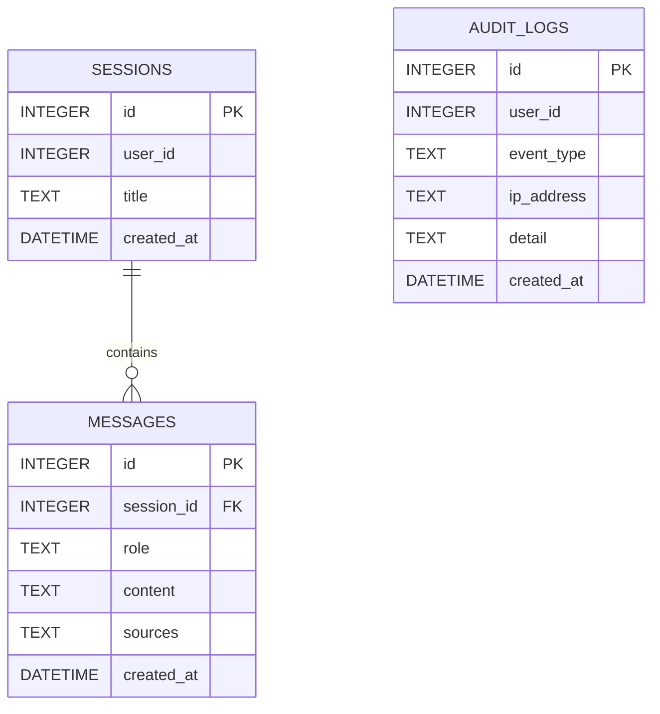
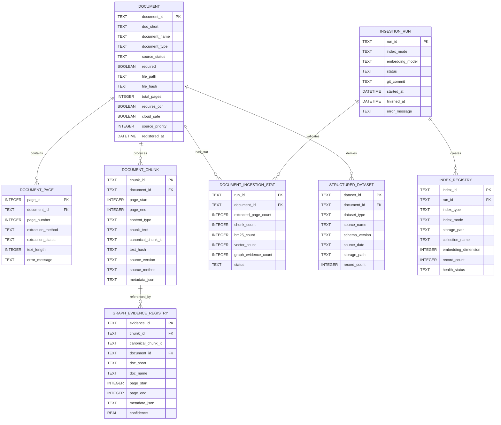

# 204. Project DB Build Explanation

## 1. DB 구축 관점

이 프로젝트의 DB는 하나의 통합 RDB로 구성되어 있지 않다. 보험 문서 RAG 챗봇은 데이터의 성격에 따라 저장소를 분리한다.

| 구분 | 저장 위치 | 역할 |
|---|---|---|
| 문서 청크 원천 | `data/processed/*.jsonl` | 약관, 사례집, 실무가이드, 심평원 문서를 검색 가능한 청크로 저장 |
| 벡터 검색 인덱스 | `data/index*/chroma/chroma.sqlite3` | Chroma 기반 semantic retrieval |
| 키워드 검색 인덱스 | `data/index*/bm25.pkl` | BM25 기반 keyword retrieval |
| 구조화 GraphRAG | `data/index/graph/insurance_graph.sqlite` | 보험 ontology, 약관 조항, 판단 개념, 수가코드, evidence path 저장 |
| 비급여표준모델 | `data/index/relational/standard_codes.sqlite` | EDI/비급여표준모델 기반 보험금 계산 판단 |
| 앱 런타임 DB | `insurance_chat.db` | 대화 세션, 메시지, 감사 로그 저장 |

현재 DB 구성은 `docs/205_FULL_DB_STRUCTURE_DIAGRAMS.md`의 Mermaid 다이어그램을 기준으로 설명할 수 있다.

## 2. 전체 데이터 흐름

Raw PDF와 XLSX는 직접 하나의 SQL 테이블에 모두 적재되지 않는다. PDF는 텍스트/표/OCR 보정 과정을 거쳐 청크 JSONL로 저장되고, 같은 청크가 Chroma, BM25, GraphDB evidence에 각각 다른 목적의 인덱스로 반영된다.

## 3. 문서 청크 DB화 전략

문서 원문은 다음 단계를 거쳐 데이터화된다.

1. Raw PDF 또는 OCR 보정본을 문서별로 읽는다.
2. 문서명, 페이지, 조항, 표, 코드 정보를 metadata로 유지하며 청크를 만든다.
3. 기본 운영 청크와 OCR 보정본 청크를 별도 JSONL로 저장한다.
4. GraphDB와 VectorStore가 같은 근거를 참조할 수 있도록 canonical chunk manifest를 만든다.
5. 각 청크는 Chroma/BM25/GraphDB evidence에서 다른 형태로 재사용된다.

핵심 산출물은 다음과 같다.

| 파일 | 역할 |
|---|---|
| `data/processed/chunks.jsonl` | 기본 운영 인덱스용 청크 |
| `data/processed/chunks_v1_original_ocr.jsonl` | OCR 원본 포함 청크 |
| `data/processed/chunks_v2_manual.jsonl` | 보정본 OCR 중심 청크 |
| `data/processed/chunks_v1_v2_combined.jsonl` | 원본+보정본 통합 청크 |
| `data/processed/chunks_canonical_manifest.jsonl` | GraphDB와 VectorStore 간 근거 ID 동기화 기준 |

## 4. GraphDB 구축

GraphDB는 보험 약관 ontology와 구조화 근거 검색을 담당한다. 실제 파일은 `data/index/graph/insurance_graph.sqlite`다.

GraphDB의 핵심 구조는 다음과 같다.

| 테이블 | 의미 |
|---|---|
| `graph_nodes` | 보험 개념, 수가코드, 약관 조항, 판단 개념, 사례, 수술명 등 |
| `graph_aliases` | 사용자 질의와 노드를 연결하기 위한 별칭/정규화 문자열 |
| `graph_edges` | 노드 간 관계. 예: `HAS_TOPIC`, `APPLIES_WHEN`, `HAS_DECISION`, `REQUIRES_EVIDENCE` |
| `graph_evidence` | 문서명, 페이지, 청크 ID, row text 등 근거 위치 |
| `graph_node_evidence` | 노드와 근거의 연결 |
| `graph_edge_evidence` | 엣지와 근거의 연결 |
| `graph_build_manifest` | GraphDB 빌드 기준, source mode, canonical manifest 등 |

## 5. 비급여표준모델 DB 구축

비급여표준모델 XLSX는 `data/index/relational/standard_codes.sqlite`의 `nonpay_standard` 테이블로 적재된다. 이 DB는 보험금 계산에서 급여/비급여 산정, 면책, 부책, 추가확인 여부를 판단하는 핵심 기준이다.

주요 활용 필드는 다음과 같다.

| 필드 | 활용 |
|---|---|
| `std_cd`, `std_cd_nm` | 청구 항목 코드/명칭 매칭 |
| `ins_care_type_cd_nm` | 보험상 급여/비급여/특약 비급여 등 분류 |
| `pay_opn_cd_nm` | 면책, 부책, 추가확인 등 지급 판단 |
| `apply_start_date`, `apply_end_date` | 적용 기간 판단 |
| `notes`, `remarks` | 예외/추가확인 사유 표시 |

## 6. Chroma/BM25 검색 인덱스 구축

Chroma는 semantic retrieval을, BM25는 keyword retrieval을 담당한다. 두 검색 결과는 RRF/Dynamic RRF와 reranker를 거쳐 최종 근거 후보로 병합된다.

현재 운영 인덱스는 다음 세 가지다.

| 인덱스 | 용도 |
|---|---|
| `data/index` | 기본 운영 인덱스 |
| `data/index_v2_manual` | 보정본 OCR만 사용 |
| `data/index_v1_v2_combined` | 원본+보정본 OCR 통합 |

## 7. 앱 런타임 DB 구축

`insurance_chat.db`는 검색 지식 DB가 아니라 앱 사용 기록과 감사 로그를 저장한다.

| 테이블 | 역할 |
|---|---|
| `sessions` | 사용자 대화 세션 |
| `messages` | 사용자/AI 메시지와 출처 payload |
| `audit_logs` | 질의 이벤트, 모델, 경고 코드, 운영 진단 로그 |

## 8. 향후 통합 Ingestion Registry 설계안

현재 운영 DB에는 아래 테이블이 실제로 존재하지 않는다. 다만 문서 적재 이력, 인덱스 빌드 이력, 데이터셋 상태를 한 곳에서 관리하려면 아래 구조를 별도 registry DB로 도입할 수 있다.

이 설계안은 현재 DB 구축 방식의 대체물이 아니라 운영 진단과 재빌드 이력 관리를 강화하기 위한 보조 registry로 보는 것이 맞다.
