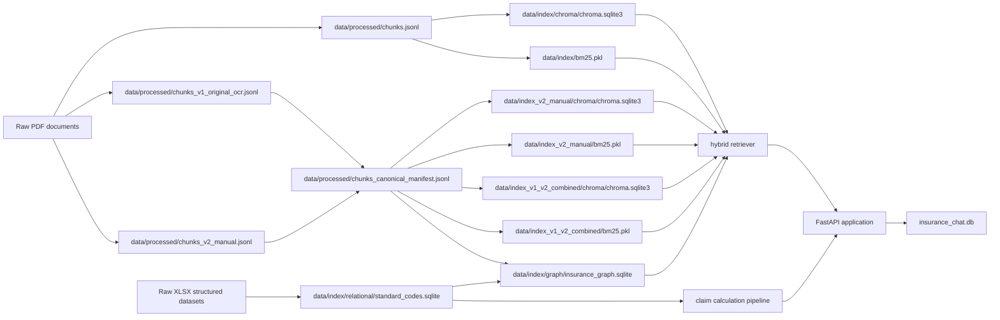
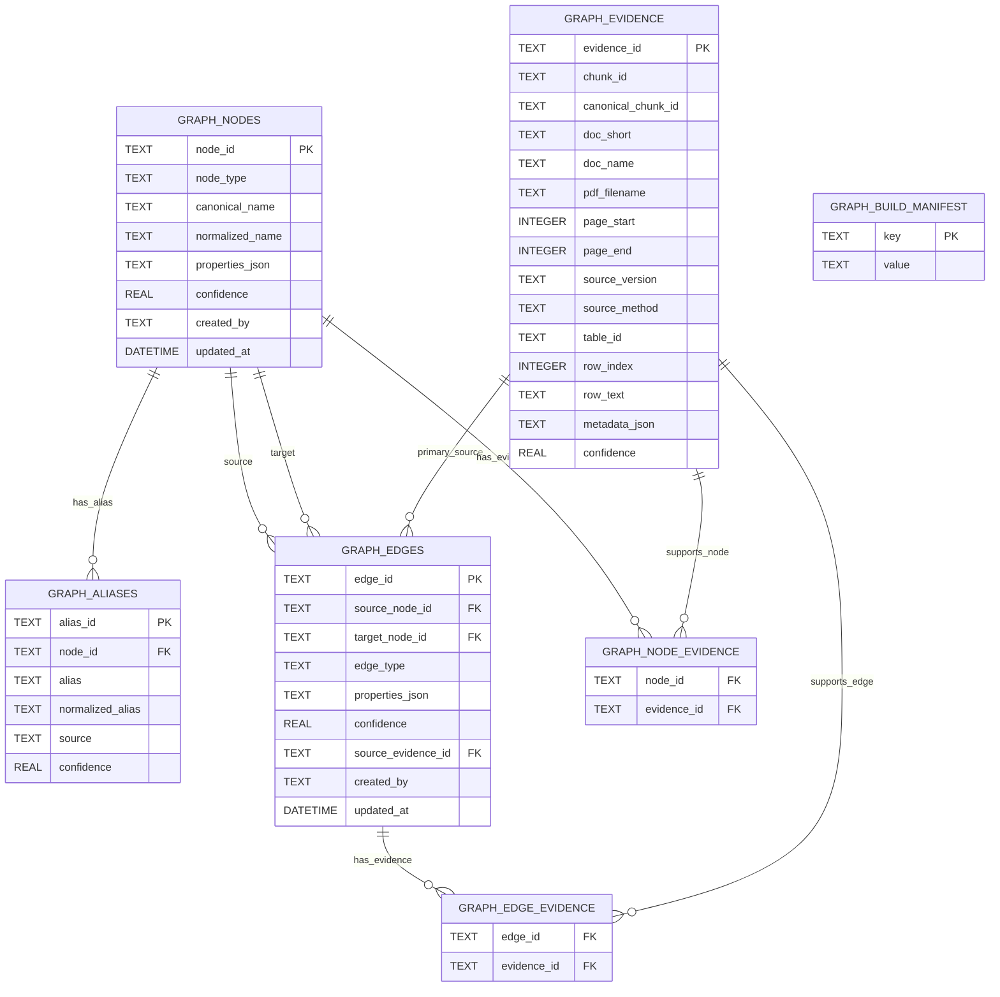
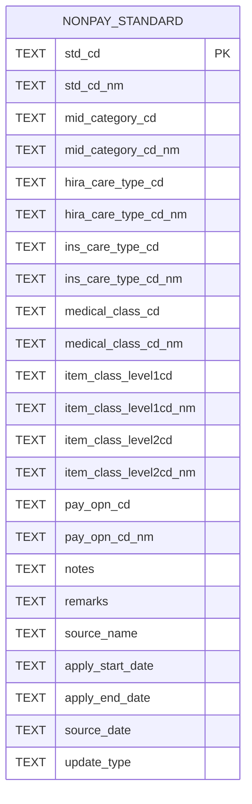
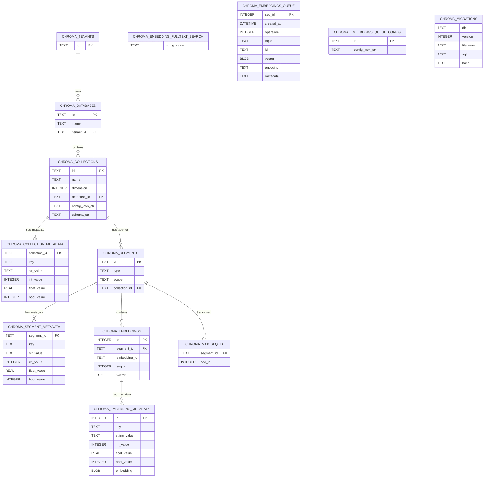
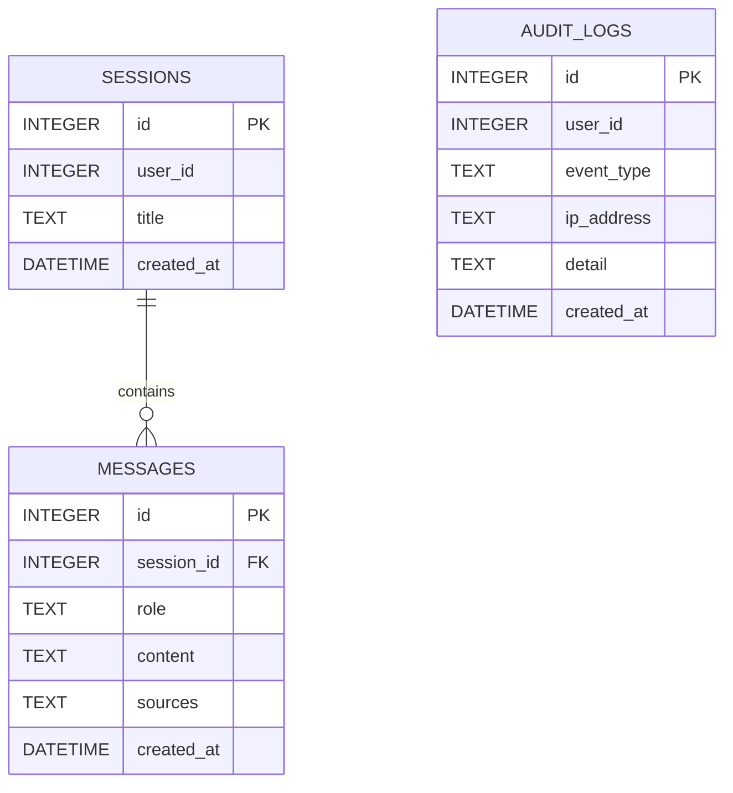
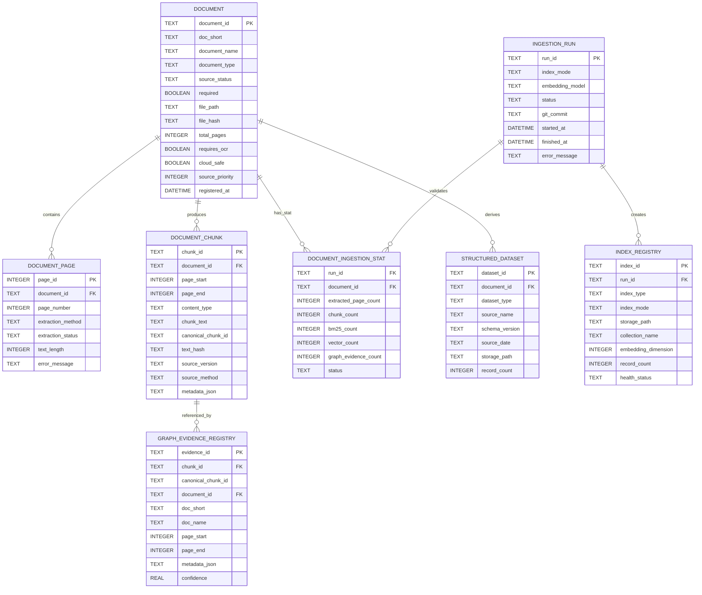
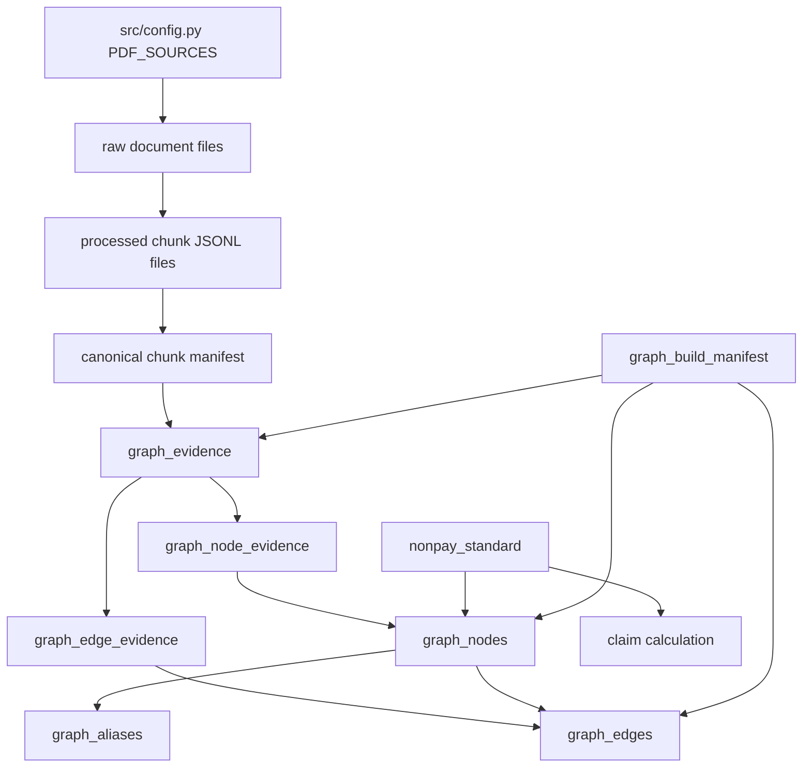

```mermaid
flowchart LR
  RAW_PDF["Raw PDF documents"] --> CHUNKS_DEFAULT["data/processed/chunks.jsonl"]
  RAW_PDF --> CHUNKS_V1["data/processed/chunks_v1_original_ocr.jsonl"]
  RAW_PDF --> CHUNKS_V2["data/processed/chunks_v2_manual.jsonl"]
  CHUNKS_V1 --> CANONICAL["data/processed/chunks_canonical_manifest.jsonl"]
  CHUNKS_V2 --> CANONICAL
  CHUNKS_DEFAULT --> CHROMA_DEFAULT["data/index/chroma/chroma.sqlite3"]
  CHUNKS_DEFAULT --> BM25_DEFAULT["data/index/bm25.pkl"]
  CANONICAL --> CHROMA_V2["data/index_v2_manual/chroma/chroma.sqlite3"]
  CANONICAL --> BM25_V2["data/index_v2_manual/bm25.pkl"]
  CANONICAL --> CHROMA_COMBINED["data/index_v1_v2_combined/chroma/chroma.sqlite3"]
  CANONICAL --> BM25_COMBINED["data/index_v1_v2_combined/bm25.pkl"]
  CANONICAL --> GRAPH_DB["data/index/graph/insurance_graph.sqlite"]
  RAW_XLSX["Raw XLSX structured datasets"] --> STANDARD_DB["data/index/relational/standard_codes.sqlite"]
  STANDARD_DB --> GRAPH_DB
  STANDARD_DB --> CLAIM_CALC["claim calculation pipeline"]
  CHROMA_DEFAULT --> RETRIEVER["hybrid retriever"]
  BM25_DEFAULT --> RETRIEVER
  CHROMA_V2 --> RETRIEVER
  BM25_V2 --> RETRIEVER
  CHROMA_COMBINED --> RETRIEVER
  BM25_COMBINED --> RETRIEVER
  GRAPH_DB --> RETRIEVER
  RETRIEVER --> API["FastAPI application"]
  CLAIM_CALC --> API
  API --> CHAT_DB["insurance_chat.db"]
```

```mermaid
erDiagram
  GRAPH_NODES {
    TEXT node_id PK
    TEXT node_type
    TEXT canonical_name
    TEXT normalized_name
    TEXT properties_json
    REAL confidence
    TEXT created_by
    DATETIME updated_at
  }

  GRAPH_ALIASES {
    TEXT alias_id PK
    TEXT node_id FK
    TEXT alias
    TEXT normalized_alias
    TEXT source
    REAL confidence
  }

  GRAPH_EDGES {
    TEXT edge_id PK
    TEXT source_node_id FK
    TEXT target_node_id FK
    TEXT edge_type
    TEXT properties_json
    REAL confidence
    TEXT source_evidence_id FK
    TEXT created_by
    DATETIME updated_at
  }

  GRAPH_EVIDENCE {
    TEXT evidence_id PK
    TEXT chunk_id
    TEXT canonical_chunk_id
    TEXT doc_short
    TEXT doc_name
    TEXT pdf_filename
    INTEGER page_start
    INTEGER page_end
    TEXT source_version
    TEXT source_method
    TEXT table_id
    INTEGER row_index
    TEXT row_text
    TEXT metadata_json
    REAL confidence
  }

  GRAPH_NODE_EVIDENCE {
    TEXT node_id FK
    TEXT evidence_id FK
  }

  GRAPH_EDGE_EVIDENCE {
    TEXT edge_id FK
    TEXT evidence_id FK
  }

  GRAPH_BUILD_MANIFEST {
    TEXT key PK
    TEXT value
  }

  GRAPH_NODES ||--o{ GRAPH_ALIASES : has_alias
  GRAPH_NODES ||--o{ GRAPH_EDGES : source
  GRAPH_NODES ||--o{ GRAPH_EDGES : target
  GRAPH_EVIDENCE ||--o{ GRAPH_EDGES : primary_source
  GRAPH_NODES ||--o{ GRAPH_NODE_EVIDENCE : has_evidence
  GRAPH_EVIDENCE ||--o{ GRAPH_NODE_EVIDENCE : supports_node
  GRAPH_EDGES ||--o{ GRAPH_EDGE_EVIDENCE : has_evidence
  GRAPH_EVIDENCE ||--o{ GRAPH_EDGE_EVIDENCE : supports_edge
```

```mermaid
erDiagram
  NONPAY_STANDARD {
    TEXT std_cd PK
    TEXT std_cd_nm
    TEXT mid_category_cd
    TEXT mid_category_cd_nm
    TEXT hira_care_type_cd
    TEXT hira_care_type_cd_nm
    TEXT ins_care_type_cd
    TEXT ins_care_type_cd_nm
    TEXT medical_class_cd
    TEXT medical_class_cd_nm
    TEXT item_class_level1cd
    TEXT item_class_level1cd_nm
    TEXT item_class_level2cd
    TEXT item_class_level2cd_nm
    TEXT pay_opn_cd
    TEXT pay_opn_cd_nm
    TEXT notes
    TEXT remarks
    TEXT source_name
    TEXT apply_start_date
    TEXT apply_end_date
    TEXT source_date
    TEXT update_type
  }
```

```mermaid
erDiagram
  CHROMA_DATABASES {
    TEXT id PK
    TEXT name
    TEXT tenant_id FK
  }

  CHROMA_TENANTS {
    TEXT id PK
  }

  CHROMA_COLLECTIONS {
    TEXT id PK
    TEXT name
    INTEGER dimension
    TEXT database_id FK
    TEXT config_json_str
    TEXT schema_str
  }

  CHROMA_COLLECTION_METADATA {
    TEXT collection_id FK
    TEXT key
    TEXT str_value
    INTEGER int_value
    REAL float_value
    INTEGER bool_value
  }

  CHROMA_SEGMENTS {
    TEXT id PK
    TEXT type
    TEXT scope
    TEXT collection_id FK
  }

  CHROMA_SEGMENT_METADATA {
    TEXT segment_id FK
    TEXT key
    TEXT str_value
    INTEGER int_value
    REAL float_value
    INTEGER bool_value
  }

  CHROMA_EMBEDDINGS {
    INTEGER id PK
    TEXT segment_id FK
    TEXT embedding_id
    INTEGER seq_id
    BLOB vector
  }

  CHROMA_EMBEDDING_METADATA {
    INTEGER id FK
    TEXT key
    TEXT string_value
    INTEGER int_value
    REAL float_value
    INTEGER bool_value
    BLOB embedding
  }

  CHROMA_EMBEDDING_FULLTEXT_SEARCH {
    TEXT string_value
  }

  CHROMA_MAX_SEQ_ID {
    TEXT segment_id PK
    INTEGER seq_id
  }

  CHROMA_EMBEDDINGS_QUEUE {
    INTEGER seq_id PK
    DATETIME created_at
    INTEGER operation
    TEXT topic
    TEXT id
    BLOB vector
    TEXT encoding
    TEXT metadata
  }

  CHROMA_EMBEDDINGS_QUEUE_CONFIG {
    TEXT id PK
    TEXT config_json_str
  }

  CHROMA_MIGRATIONS {
    TEXT dir
    INTEGER version
    TEXT filename
    TEXT sql
    TEXT hash
  }

  CHROMA_TENANTS ||--o{ CHROMA_DATABASES : owns
  CHROMA_DATABASES ||--o{ CHROMA_COLLECTIONS : contains
  CHROMA_COLLECTIONS ||--o{ CHROMA_COLLECTION_METADATA : has_metadata
  CHROMA_COLLECTIONS ||--o{ CHROMA_SEGMENTS : has_segment
  CHROMA_SEGMENTS ||--o{ CHROMA_SEGMENT_METADATA : has_metadata
  CHROMA_SEGMENTS ||--o{ CHROMA_EMBEDDINGS : contains
  CHROMA_EMBEDDINGS ||--o{ CHROMA_EMBEDDING_METADATA : has_metadata
  CHROMA_SEGMENTS ||--o{ CHROMA_MAX_SEQ_ID : tracks_seq
```

```mermaid
erDiagram
  SESSIONS {
    INTEGER id PK
    INTEGER user_id
    TEXT title
    DATETIME created_at
  }

  MESSAGES {
    INTEGER id PK
    INTEGER session_id FK
    TEXT role
    TEXT content
    TEXT sources
    DATETIME created_at
  }

  AUDIT_LOGS {
    INTEGER id PK
    INTEGER user_id
    TEXT event_type
    TEXT ip_address
    TEXT detail
    DATETIME created_at
  }

  SESSIONS ||--o{ MESSAGES : contains
```

```mermaid
erDiagram
  DOCUMENT {
    TEXT document_id PK
    TEXT doc_short
    TEXT document_name
    TEXT document_type
    TEXT source_status
    BOOLEAN required
    TEXT file_path
    TEXT file_hash
    INTEGER total_pages
    BOOLEAN requires_ocr
    BOOLEAN cloud_safe
    INTEGER source_priority
    DATETIME registered_at
  }

  DOCUMENT_PAGE {
    INTEGER page_id PK
    TEXT document_id FK
    INTEGER page_number
    TEXT extraction_method
    TEXT extraction_status
    INTEGER text_length
    TEXT error_message
  }

  DOCUMENT_CHUNK {
    TEXT chunk_id PK
    TEXT document_id FK
    INTEGER page_start
    INTEGER page_end
    TEXT content_type
    TEXT chunk_text
    TEXT canonical_chunk_id
    TEXT text_hash
    TEXT source_version
    TEXT source_method
    TEXT metadata_json
  }

  INGESTION_RUN {
    TEXT run_id PK
    TEXT index_mode
    TEXT embedding_model
    TEXT status
    TEXT git_commit
    DATETIME started_at
    DATETIME finished_at
    TEXT error_message
  }

  DOCUMENT_INGESTION_STAT {
    TEXT run_id FK
    TEXT document_id FK
    INTEGER extracted_page_count
    INTEGER chunk_count
    INTEGER bm25_count
    INTEGER vector_count
    INTEGER graph_evidence_count
    TEXT status
  }

  STRUCTURED_DATASET {
    TEXT dataset_id PK
    TEXT document_id FK
    TEXT dataset_type
    TEXT source_name
    TEXT schema_version
    TEXT source_date
    TEXT storage_path
    INTEGER record_count
  }

  GRAPH_EVIDENCE_REGISTRY {
    TEXT evidence_id PK
    TEXT chunk_id FK
    TEXT canonical_chunk_id
    TEXT document_id FK
    TEXT doc_short
    TEXT doc_name
    INTEGER page_start
    INTEGER page_end
    TEXT metadata_json
    REAL confidence
  }

  INDEX_REGISTRY {
    TEXT index_id PK
    TEXT run_id FK
    TEXT index_type
    TEXT index_mode
    TEXT storage_path
    TEXT collection_name
    INTEGER embedding_dimension
    INTEGER record_count
    TEXT health_status
  }

  DOCUMENT ||--o{ DOCUMENT_PAGE : contains
  DOCUMENT ||--o{ DOCUMENT_CHUNK : produces
  DOCUMENT ||--o{ DOCUMENT_INGESTION_STAT : has_stat
  DOCUMENT ||--o{ STRUCTURED_DATASET : derives
  DOCUMENT_CHUNK ||--o{ GRAPH_EVIDENCE_REGISTRY : referenced_by
  INGESTION_RUN ||--o{ DOCUMENT_INGESTION_STAT : validates
  INGESTION_RUN ||--o{ INDEX_REGISTRY : creates
```

```mermaid
flowchart TD
  PDF_SOURCES["src/config.py PDF_SOURCES"] --> RAW_DOCUMENTS["raw document files"]
  RAW_DOCUMENTS --> PROCESSED_CHUNKS["processed chunk JSONL files"]
  PROCESSED_CHUNKS --> CANONICAL_CHUNK_MANIFEST["canonical chunk manifest"]
  CANONICAL_CHUNK_MANIFEST --> GRAPH_EVIDENCE["graph_evidence"]
  GRAPH_EVIDENCE --> GRAPH_NODE_EVIDENCE["graph_node_evidence"]
  GRAPH_EVIDENCE --> GRAPH_EDGE_EVIDENCE["graph_edge_evidence"]
  GRAPH_NODE_EVIDENCE --> GRAPH_NODES["graph_nodes"]
  GRAPH_EDGE_EVIDENCE --> GRAPH_EDGES["graph_edges"]
  GRAPH_NODES --> GRAPH_ALIASES["graph_aliases"]
  GRAPH_NODES --> GRAPH_EDGES
  NONPAY_STANDARD["nonpay_standard"] --> GRAPH_NODES
  NONPAY_STANDARD --> CLAIM_CALCULATION["claim calculation"]
  GRAPH_BUILD_MANIFEST["graph_build_manifest"] --> GRAPH_NODES
  GRAPH_BUILD_MANIFEST --> GRAPH_EDGES
  GRAPH_BUILD_MANIFEST --> GRAPH_EVIDENCE
```
