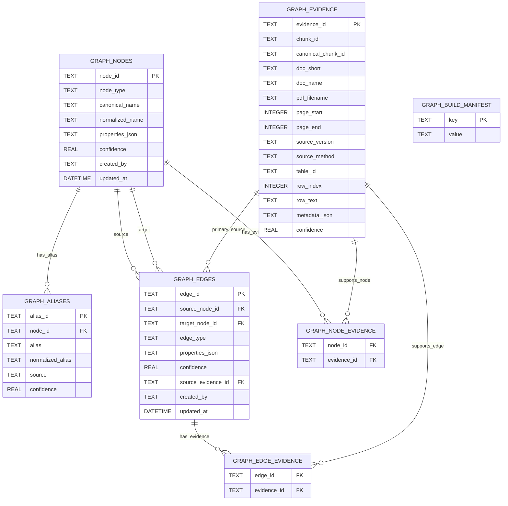
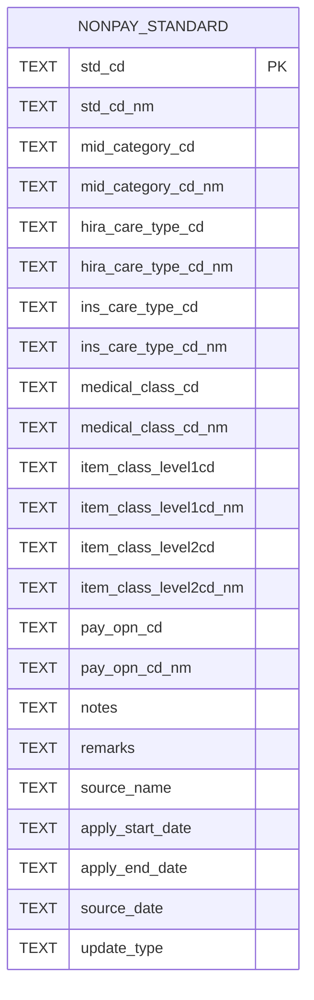
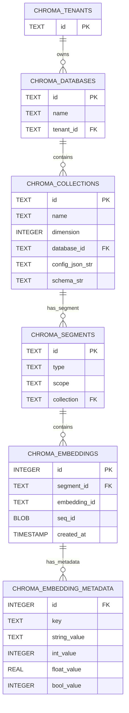
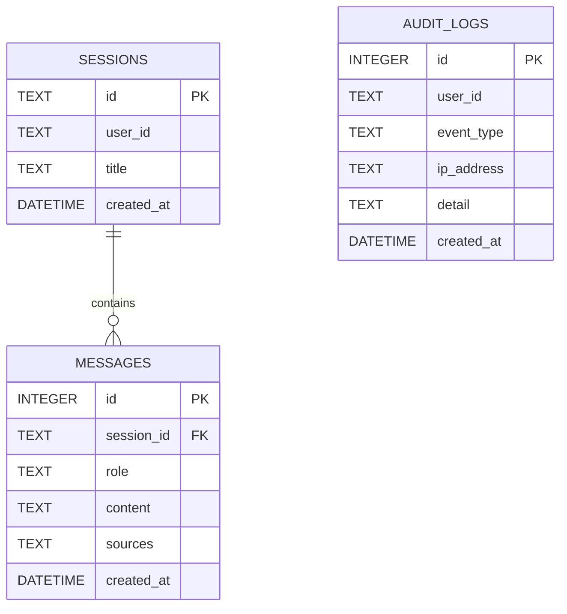
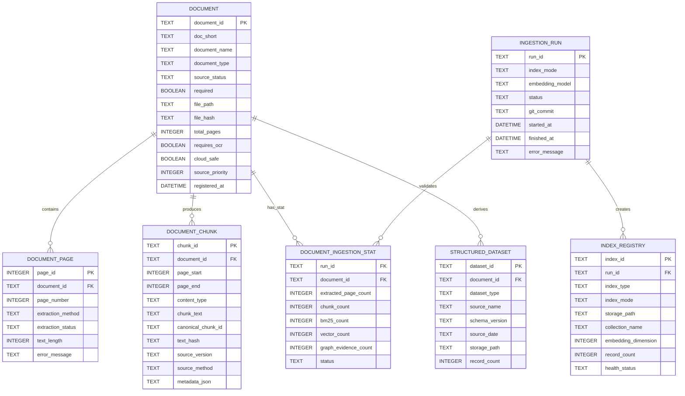
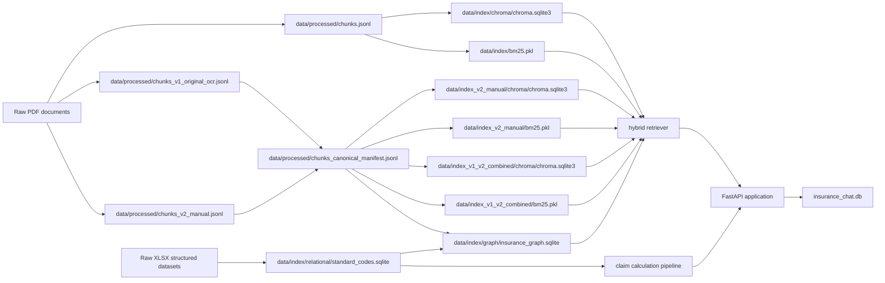

# 207. Project Environment and Database Overview

작성 기준일: 2026-06-09
기준 버전: `v1.0.5`
기준 저장소: `/srv/shared/projects/insurance-rag-chatbot`

## 1. 프로젝트 개발 환경

보험 문서 RAG 챗봇은 보험 약관, 심평원 자료, 실무가이드, 상담사례집, 비급여표준모델 등을 근거로 보상 업무 질의와 보험금 계산을 지원하는 웹 애플리케이션이다. 개발과 검증은 주로 NVIDIA DGX Spark에서 수행했고, 팀원들은 SSH와 Tailscale을 통해 원격 접속해 작업했다.

| 구분            | 내용                                     |
| --------------- | ---------------------------------------- |
| 개발·운영 장비 | NVIDIA DGX Spark (`aitopatom-255d`)    |
| 운영체제        | Ubuntu 24.04 LTS 계열                    |
| CPU 아키텍처    | ARM64 (`aarch64`)                      |
| CPU             | ARM Cortex 계열 20코어                   |
| 메모리          | 약 128GB급 통합 메모리                   |
| 저장장치        | NVMe 약 1TB급                            |
| GPU/가속 환경   | NVIDIA DGX Spark 기반 로컬 LLM 실행 환경 |

공용 운영본은 다음 경로를 기준으로 관리한다.

```text
/srv/shared/projects/insurance-rag-chatbot
```

팀원별 실험과 개발은 개인 워크스페이스에서 진행하고, 최종 반영은 공용 운영본과 GitHub `master` 브랜치를 기준으로 통합한다.

## 2. 주요 개발 도구와 기술 스택

프로젝트는 Python 백엔드, JavaScript 프론트엔드, 로컬 LLM 서빙, 검색 인덱스, GraphDB를 조합한 구조다.

| 영역        | 사용 기술                               | 역할                                           |
| ----------- | --------------------------------------- | ---------------------------------------------- |
| 백엔드      | FastAPI, Uvicorn                        | API 서버와 정적 웹앱 제공                      |
| 프론트엔드  | HTML, CSS, Vanilla JavaScript ES Module | 챗봇, 관리자, 보험금 계산 UI                   |
| 빌드        | Node.js, npm, esbuild                   | 프론트엔드 번들 생성                           |
| 테스트      | pytest, Playwright                      | 백엔드·프론트엔드 회귀 검증                   |
| DB          | SQLite, SQLAlchemy, aiosqlite           | 업무 DB, GraphDB, 표준코드 DB                  |
| 벡터 검색   | ChromaDB                                | 의미 기반 문서 검색                            |
| 키워드 검색 | BM25, Kiwi                              | 보험 용어·코드 기반 키워드 검색               |
| 임베딩      | BGE-M3                                  | 문서 청크 벡터화                               |
| GraphRAG    | SQLite GraphDB                          | 약관 조항, 판단 개념, 수가코드, 근거 경로 연결 |
| LLM 서빙    | SGLang, vLLM, Ollama                    | DGX 로컬 모델 실행                             |

초기에는 Streamlit UI도 사용했지만, 현재 정식 앱은 FastAPI가 SPA 웹 프론트엔드를 제공하는 구조다. Streamlit은 현재 기준으로 legacy 또는 보조 실험 UI에 가깝다.

## 3. LLM 실행 환경

프로젝트는 특정 모델 하나에 고정되지 않고 provider를 교체할 수 있도록 설계했다.

| Provider   | 용도                                   |
| ---------- | -------------------------------------- |
| SGLang     | 대형 로컬 LLM의 주 실행 경로           |
| vLLM       | 모델별 호환성 검증 및 고성능 서빙      |
| Ollama     | GGUF 모델과 안정 fallback 실행         |
| OpenAI API | 클라우드 모델 비교 및 제한적 보조 검증 |

운영 기준은 로컬 LLM이다. 금융권 보안 요구와 API 사용 비용을 고려해 외부 클라우드 LLM은 기본 운영 경로가 아니라 비교·보조 검증 경로로 제한한다.

주요 모델은 DGX에 로컬 파일로 내려받은 뒤 provider별 wrapper에서 선택·교체할 수 있게 했다. SGLang, vLLM, Ollama 서버를 운영 스크립트로 감싸고, 프론트엔드 모델 선택 UI와 DGX 바탕화면 실행기에서 현재 모델을 확인하거나 다른 모델로 전환할 수 있도록 구성했다.

| 모델 ID | Provider | 채택·가동 방식 | DGX 현재 상태 |
|---|---|---|---|
| `gpt-oss-20b` | SGLang | Harmony chat template을 적용한 OpenAI-compatible 서버로 연결 | `validated`, 주 검증 모델 중 하나 |
| `gpt-oss-120b` | SGLang | 로컬 파일은 존재하나 SGLang 기동을 시도한 결과 메모리 부족 발생 | 파일 staged, DGX Spark 메모리 부족으로 현재 실사용 불가 |
| `qwen3-30b-a3b-instruct-2507-fp8` | SGLang | Qwen3 instruct FP8 모델을 SGLang switch script로 기동 | 파일과 switch 경로 존재, `staged` 검증대상 |
| `qwen3-next-80b-a3b-instruct-fp8` | SGLang | Qwen3 Next instruct FP8 모델을 SGLang switch script로 기동 | 파일과 switch 경로 존재, `staged` 검증대상 |
| `qwen3-next-80b-a3b-thinking-fp8` | SGLang | Qwen3 Next thinking FP8 모델을 SGLang으로 기동하고 thinking 출력 필터링/토글 적용 | 파일과 switch 경로 존재, 추론 출력 필터링 패치 적용. 추론 모드 on은 fallback 가능성이 있어 계속 검증 필요 |
| `gemma-4-26b-a4b-nvfp4` | vLLM | Gemma 4 NVFP4 모델을 vLLM switch script로 기동 | vLLM 경로 `validated` |
| `gemma-4-31b-it-nvfp4` | vLLM | Gemma 4 31B IT NVFP4 모델을 vLLM switch script로 기동 | 파일과 switch 경로 존재, `staged` 검증대상 |
| `nemotron-3-nano-30b-a3b-nvfp4` | vLLM | Nemotron 3 Nano NVFP4 모델을 vLLM switch script로 기동 | 파일과 switch 경로 존재, `staged` 검증대상 |
| `exaone-4.0-32b-awq` | vLLM | EXAONE 4.0 32B AWQ 모델을 vLLM switch script로 기동 | 파일과 switch 경로 존재, `staged` 검증대상 |
| `llama-3.3-70b-instruct-q4-k-m` | Ollama | GGUF 파일을 Ollama 모델로 생성해 fallback/비교 경로로 연결 | Ollama 설치 확인. 한국어 품질과 출력 형식은 추가 평가 필요 |
| `exaone3.5:7.8b` | Ollama | Ollama fallback 모델로 연결 | Ollama 설치 확인. 대형 모델은 아니지만 안정 fallback으로 사용 |

## 4. OCR 개발 및 최종 결정

보험 문서에는 텍스트 PDF뿐 아니라 스캔본 PDF도 포함되어 있어 OCR이 필수였다. 특히 실무가이드와 상담사례집은 표, 병합 셀, 작은 글자, 다단 헤더가 많아 일반 OCR만으로는 검색 품질을 확보하기 어려웠다.

### 4.1 OCR 방식 비교

| 방식                     | 장점                                             | 한계                                        | 프로젝트 내 판단                                      |
| ------------------------ | ------------------------------------------------ | ------------------------------------------- | ----------------------------------------------------- |
| PDF 텍스트 직접 추출     | 빠르고 비용 없음                                 | 스캔본에는 적용 불가                        | 텍스트 PDF 기본 파싱에 사용                           |
| EasyOCR                  | 설치가 비교적 간단하고 무료                      | 한국어 보험 전문 문서와 표 구조에 약함      | 핵심 OCR 엔진으로는 부적합                            |
| PaddleOCR / PP-Structure | 레이아웃 영역 분리와 표 위치 탐지에 강점         | 병합 셀, 복잡한 표, 작은 글자 복원은 불안정 | 레이아웃 보조 또는 True Hybrid 선택 경로로 보존       |
| NAVER CLOVA OCR          | 한국어 인식과 native table 구조 복원 품질이 높음 | API 비용과 지연 가능성                      | 최종 기본 OCR 엔진으로 채택                           |
| Vision LLM 보정          | 그림 셀, 숫자 누락, 복잡한 표 보정에 강함        | 비용 발생, 전체 문서 일괄 적용에는 부담     | 고난도 표·숫자 후보정에 선택 적용                    |
| 수동 보정본 OCR          | 품질이 가장 중요한 문서에서 안정적               | 사람이 보정해야 함                          | 보정본 인덱스와 canonical manifest의 핵심 근거로 사용 |

### 4.2 최종 OCR 결정

현재 코드 기준 기본 OCR 실행 경로는 `CLOVA Native`다. `scripts/run_full_ocr.py`의 기본 엔진은 `clova_native`이며, `--true-hybrid` 플래그를 사용할 때만 PP-Structure 레이아웃과 CLOVA OCR을 결합한 True Hybrid 경로를 실행한다.

최종적으로 CLOVA Native를 기본값으로 둔 이유는 다음과 같다.

- 한국어 보험 문서의 본문 인식 품질이 높다.
- CLOVA native table 결과가 셀 단위 bbox와 row/column span 정보를 제공해 표 구조 복원에 유리하다.
- PP-Structure 레이아웃 오류가 뒤 단계로 전파되는 문제를 줄일 수 있다.
- True Hybrid보다 운영 경로가 단순하고 재실행·스킵 판단이 명확하다.
- 어려운 표와 숫자 셀은 Vision LLM 보정 또는 수동 보정본 인덱스로 보완할 수 있다.

즉, 현재 OCR 정책은 `CLOVA Native 기본 + True Hybrid 선택 실행 + Vision/수동 보정으로 고난도 표 보완`으로 정리할 수 있다.

## 5. 현재 개발 방법론

현재 정식 개발 흐름은 `Codex + DGX Spark + GitHub + 로컬 LLM + pytest/Playwright`를 중심으로 한다.

| 방법론                    | 설명                                                                     |
| ------------------------- | ------------------------------------------------------------------------ |
| Codex 중심 개발           | 요구사항 분석, 코드 수정, 테스트, 문서화, 릴리스 정리                    |
| DGX 메인 저장소 기준 개발 | `/srv/shared/projects/insurance-rag-chatbot`를 최종 통합 기준으로 사용 |
| GitHub 릴리스 관리        | 커밋, 태그, push로 버전 명시                                             |
| 자동 검증                 | pytest와 Playwright로 주요 기능 회귀 확인                                |
| 운영 wrapper              | DGX 바탕화면 실행기와 `/srv/ai-ops/bin` 스크립트로 앱 기동             |
| 실무자 승인 워크플로우    | 온톨로지 후보를 실무자가 승인·보류·거절 후 active manifest에 반영      |

### 5.1 과거 사용했으나 폐기한 방법론

다음 방식은 과거 사용 또는 검토 이력이 있으나 현재 정식 개발 방법론에서는 제외한다.

| 도구/방법론                     | 과거 활용 방식                                               | 현재 상태            | 폐기 사유                                         |
| ------------------------------- | ------------------------------------------------------------ | -------------------- | ------------------------------------------------- |
| Claude 기반 보조 개발/검토      | 설계 브레인스토밍, 코드 검토, 문서 초안 작성, 대안 비교      | 정식 방법론에서 제외 | 사용량 증가에 따른 이용료 부담                    |
| Discord bot 기반 개발/운영 연계 | 개발 진행 공유, 원격 명령/알림, 팀 협업 보조 인터페이스 실험 | 정식 방법론에서 제외 | 사용량 증가에 따른 이용료 부담 및 유지보수 복잡도 |

이 두 방법론은 초기 생산성 보조 수단으로는 유용했지만, 장기 운영 관점에서는 비용 부담이 커졌다. 현재는 DGX 로컬 실행 환경과 Codex 기반 개발 흐름으로 일원화하는 방향이 적합하다.

## 6. 프로젝트 데이터베이스 구축 개요

이 프로젝트의 데이터베이스는 하나의 통합 SQL DB가 아니다. 문서 검색, 구조화 판단, 보험금 계산, 앱 사용 기록의 목적이 서로 다르기 때문에 저장소를 분리했다.

| 구분               | 저장 위치                                       | 역할                                                            |
| ------------------ | ----------------------------------------------- | --------------------------------------------------------------- |
| 문서 청크 원천     | `data/processed/*.jsonl`                      | 약관·사례집·실무가이드·심평원 자료를 검색 가능한 단위로 저장 |
| 벡터 검색 인덱스   | `data/index*/chroma/chroma.sqlite3`           | 의미 기반 검색                                                  |
| 키워드 검색 인덱스 | `data/index*/bm25.pkl`                        | 코드, 조항, 보험 용어 기반 검색                                 |
| GraphDB            | `data/index/graph/insurance_graph.sqlite`     | 보험 개념, 조항, 판단 조건, 수가코드, 근거 경로 저장            |
| 비급여표준모델 DB  | `data/index/relational/standard_codes.sqlite` | EDI/비급여표준모델 기반 보험금 계산 판단                        |
| 앱 런타임 DB       | `insurance_chat.db`                           | 대화 세션, 메시지, 감사 로그 저장                               |

## 7. 문서 데이터화 방식

PDF 문서는 직접 SQL 테이블에 모두 넣지 않는다. 먼저 문서별로 텍스트와 표를 추출하고, 문서명·페이지·조항·표·코드 정보를 metadata로 보존한 청크를 만든다.

주요 청크 산출물은 다음과 같다.

| 파일                                               | 역할                                                   |
| -------------------------------------------------- | ------------------------------------------------------ |
| `data/processed/chunks.jsonl`                    | 기본 운영 인덱스용 청크                                |
| `data/processed/chunks_v1_original_ocr.jsonl`    | OCR 원본 포함 청크                                     |
| `data/processed/chunks_v2_manual.jsonl`          | 보정본 OCR 중심 청크                                   |
| `data/processed/chunks_v1_v2_combined.jsonl`     | 원본+보정본 통합 청크                                  |
| `data/processed/chunks_canonical_manifest.jsonl` | GraphDB와 VectorStore가 같은 근거를 참조하기 위한 기준 |

이렇게 만든 청크는 Chroma, BM25, GraphDB evidence에서 각각 재사용된다. 같은 원문 근거를 여러 검색 방식에서 공유하기 위해 canonical manifest를 둔 것이 핵심이다.

## 8. 검색 인덱스 구성

검색은 벡터 검색과 키워드 검색을 함께 사용한다.

- ChromaDB는 문장 의미가 비슷한 문서를 찾는다.
- BM25는 정확한 보험 용어, 수가코드, 조항 번호처럼 키워드가 중요한 검색에 강하다.
- 두 결과는 RRF 또는 Dynamic RRF 방식으로 합쳐지고, 필요 시 reranker로 재정렬된다.

운영 인덱스는 다음 세 가지 모드로 구분된다.

| 인덱스               | 설명                                                           |
| -------------------- | -------------------------------------------------------------- |
| 기본 운영 인덱스     | 텍스트 PDF 중심 기본 검색                                      |
| 보정본 OCR만         | 품질 보정된 OCR 문서를 우선 사용하는 검색                      |
| 원본+보정본 OCR 통합 | 검색 누락을 줄이기 위해 원본 OCR과 보정본을 함께 사용하는 검색 |

## 9. GraphDB 구축

GraphDB는 일반 벡터 검색만으로 표현하기 어려운 구조화 관계를 저장한다. 예를 들어 약관 조항, 판단 조건, 면책 사유, 필요 서류, 세대별 규칙, 수가코드, 비급여표준모델 항목을 노드와 엣지로 연결한다.

주요 테이블은 다음과 같다.

| 테이블                   | 의미                                                       |
| ------------------------ | ---------------------------------------------------------- |
| `graph_nodes`          | 보험 개념, 수가코드, 약관 조항, 판단 개념, 사례, 수술명 등 |
| `graph_aliases`        | 사용자 질의와 노드를 연결하기 위한 별칭                    |
| `graph_edges`          | 노드 간 관계                                               |
| `graph_evidence`       | 문서명, 페이지, 청크 ID 등 근거 위치                       |
| `graph_node_evidence`  | 노드와 문서 근거의 연결                                    |
| `graph_edge_evidence`  | 관계와 문서 근거의 연결                                    |
| `graph_build_manifest` | GraphDB 빌드 기준과 manifest 정보                          |

DGX 메인 저장소 기준 현재 GraphDB에는 약 54만 개의 노드, 4만 6천 개의 엣지, 2만 7천 개의 evidence가 적재되어 있다.

## 10. 비급여표준모델 DB 구축

비급여표준모델 XLSX는 `standard_codes.sqlite`의 `nonpay_standard` 테이블에 적재된다. 이 테이블은 보험금 계산에서 급여/비급여 분류, 면책/부책/추가확인 여부를 판단하는 핵심 기준이다.

주요 필드는 다음과 같다.

| 필드                                     | 활용                                   |
| ---------------------------------------- | -------------------------------------- |
| `std_cd`, `std_cd_nm`                | 청구 항목 코드와 명칭 매칭             |
| `ins_care_type_cd_nm`                  | 보험상 급여/비급여/특약 비급여 등 분류 |
| `pay_opn_cd_nm`                        | 면책, 부책, 추가확인 등 지급 판단      |
| `apply_start_date`, `apply_end_date` | 적용 기간 판단                         |
| `notes`, `remarks`                   | 예외 또는 추가 확인 사유 표시          |

DGX 기준 현재 `nonpay_standard`에는 527,679건이 적재되어 있다.

## 11. 앱 런타임 DB

`insurance_chat.db`는 지식 검색용 DB가 아니라 앱 사용 기록 저장소다.

| 테이블         | 역할                                         |
| -------------- | -------------------------------------------- |
| `sessions`   | 대화 세션                                    |
| `messages`   | 사용자/AI 메시지와 출처 payload              |
| `audit_logs` | 질의 이벤트, 모델, 경고 코드, 운영 진단 로그 |

이 DB는 운영 중 실제 사용자 질의와 모델 응답, 경고 코드, 사용 모델 기록을 추적하는 데 사용된다.

## 12. 향후 통합 Ingestion Registry 설계

현재 운영 DB에는 `DOCUMENT`, `DOCUMENT_PAGE`, `DOCUMENT_CHUNK`, `INGESTION_RUN`, `INDEX_REGISTRY` 같은 통합 ingestion registry 테이블이 실제로 존재하지 않는다. 다만 문서 적재 이력, 인덱스 빌드 이력, 파일 해시, 문서별 인덱싱 상태를 한곳에서 추적하려면 향후 별도 registry DB로 도입할 수 있다.

즉, 현재 구조는 이미 동작하는 목적별 저장소 조합이고, 통합 Ingestion Registry는 운영 진단성과 재빌드 추적성을 높이기 위한 다음 단계 설계안이다.

## 13. DGX 기준 자체 검토 결과

문서 작성 후 DGX 메인 저장소에서 다음 항목을 대조했다.

| 확인 항목        | 결과                                                                      |
| ---------------- | ------------------------------------------------------------------------- |
| 메인 저장소 HEAD | `v1.0.5` 태그, commit `654909236fcdbf5462d52d71046bb18666d684ec` 확인 |
| GraphDB 파일     | `data/index/graph/insurance_graph.sqlite` 존재                          |
| 표준코드 DB 파일 | `data/index/relational/standard_codes.sqlite` 존재                      |
| 앱 런타임 DB     | `insurance_chat.db` 존재                                                |
| GraphDB 테이블   | `graph_nodes`, `graph_edges`, `graph_evidence`, junction table 확인 |
| 표준코드 테이블  | `nonpay_standard` 확인                                                  |
| 런타임 테이블    | `sessions`, `messages`, `audit_logs` 확인                           |
| 청크 파일        | 기본 청크 5,781건, 보정본/canonical 청크 15,682건 확인                    |
| Chroma SQLite    | `collections`, `segments`, `embeddings`, `embedding_metadata`, FTS 테이블 확인 |
| LLM 모델 파일    | 주요 SGLang/vLLM 후보 모델 디렉터리와 `config.json`, tokenizer 파일 존재 확인 |

재검토 과정에서 Chroma 내부 스키마와 모델 검증 상태는 최초 문서 초안보다 더 엄밀한 표현이 필요하다고 판단해 본 문서에 반영했다. 특히 Chroma SQLite의 `embeddings` 테이블은 벡터 BLOB를 직접 저장하는 사용자 설계 테이블이 아니라 Chroma 내부 segment/embedding id 중심 테이블이며, 여러 대형 LLM은 파일과 전환 스크립트가 존재하더라도 `validated`가 아닌 `staged` 검증대상으로 구분해야 한다.

## 14. 구체 DB 구성도

아래 구성도는 현재 실제 운영 DB와 향후 통합 Ingestion Registry 설계안을 구분해 표현한다. `DOCUMENT`, `DOCUMENT_PAGE`, `DOCUMENT_CHUNK`, `INGESTION_RUN`, `INDEX_REGISTRY` 계열은 현재 실제 운영 테이블이 아니라 향후 적재 이력 관리를 위한 registry 설계안이다. 반면 `GRAPH_*`, `NONPAY_STANDARD`, `CHROMA_*`, `SESSIONS`, `MESSAGES`, `AUDIT_LOGS`는 현재 운영 구조를 설명하는 핵심 구성이다.

### 14.1 GraphDB 구성도



### 14.2 비급여표준모델 DB 구성도



### 14.3 Chroma VectorStore 구성도



현재 Chroma SQLite는 `embedding_fulltext_search` 및 관련 FTS 보조 테이블도 함께 가진다. 실제 벡터 저장 방식은 Chroma 내부 구현에 맡겨져 있으므로, 프로젝트 문서에서는 사용자 정의 SQL 테이블처럼 `BLOB vector`가 존재한다고 표현하지 않는다.

### 14.4 앱 런타임 DB 구성도



### 14.5 향후 통합 Ingestion Registry 구성도



## 15. 데이터 흐름도


