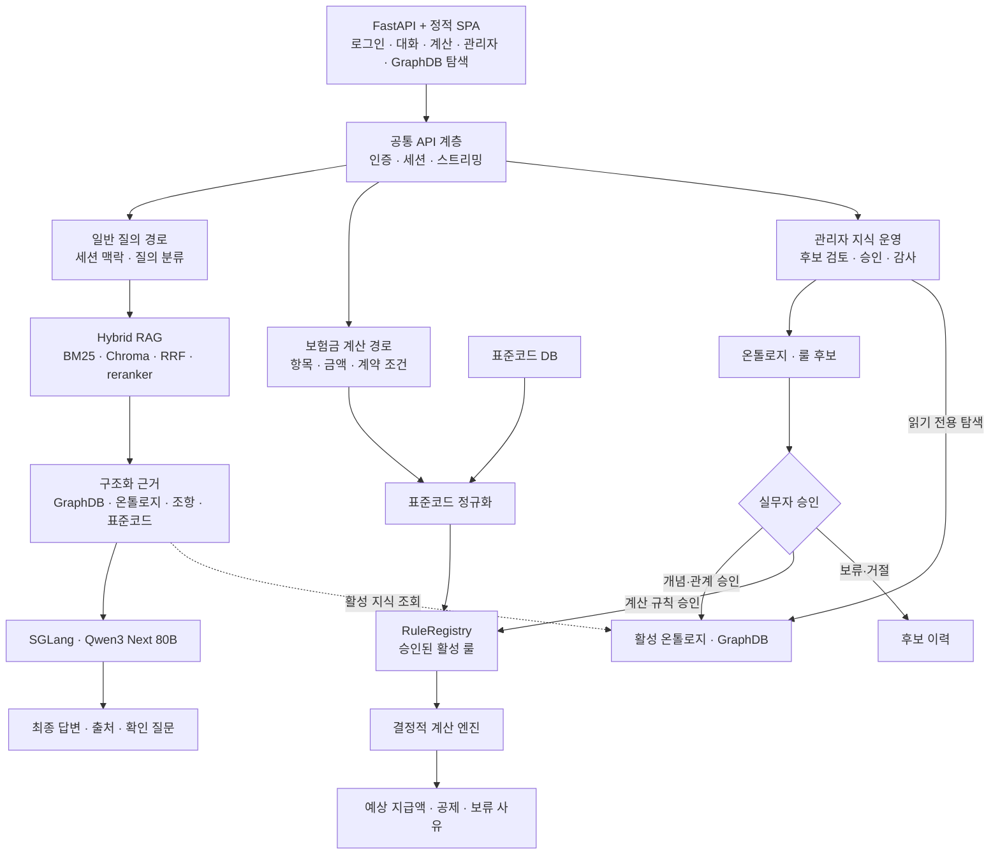

# README Mermaid System Architecture Implementation Plan

> **For agentic workers:** REQUIRED SUB-SKILL: Use superpowers:subagent-driven-development (recommended) or superpowers:executing-plans to implement this plan task-by-task. Steps use checkbox (`- [ ]`) syntax for tracking.

**Goal:** Replace the README system architecture ASCII block with a GitHub-renderable Mermaid diagram that separates general query, deterministic claim calculation, and administrator knowledge operations.

**Architecture:** Use one `flowchart TB` with a shared FastAPI + SPA entrypoint and three explicit processing branches. Show BM25·Chroma, GraphDB·ontology, standard-code DB, and RuleRegistry as shared knowledge sources while keeping Qwen answer generation separate from deterministic payout calculation.

**Tech Stack:** Markdown, Mermaid, markdownlint-cli2, Mermaid CLI, Git

## Global Constraints

- Preserve the remote `Fix formatting` commit `87f76e24b95051d53d9c27052fd3056d5c14c0da`.
- Modify only the system architecture visualization and the documents that specify this follow-up.
- Use GitHub default Mermaid syntax without custom classes, colors, themes, or external assets.
- Use `flowchart TB`.
- Keep the existing `주요 계층` table and the three workflow diagrams unchanged.
- Connect only the general-query path to SGLang·Qwen.
- Generate payout amounts only from the deterministic calculation engine.
- Keep administrator approval paths distinct for ontology/GraphDB and active calculation rules.
- Do not expose internal paths, credentials, or runtime data.

---

### Task 1: Replace the ASCII system architecture

**Files:**

- Modify: `README.md:149-175`
- Reference: `docs/superpowers/specs/2026-07-24-public-readme-redesign.md`

**Interfaces:**

- Consumes: the current `## 시스템 아키텍처` heading and the `### 주요 계층` table
- Produces: one Mermaid `flowchart TB` between those two existing sections

- [ ] **Step 1: Verify the baseline block**

Run:

```bash
sed -n '145,185p' README.md
rg -n '^## 시스템 아키텍처$|^```text$|^### 주요 계층$' README.md
```

Expected: the system architecture section contains one `text` fence followed by the unchanged `주요 계층` table.

- [ ] **Step 2: Replace the text fence with this exact Mermaid diagram**

````markdown

````

Do not change the adjacent workflow diagrams or `주요 계층` table.

- [ ] **Step 3: Check the exact diff**

Run:

```bash
git diff -- README.md
git diff --check
```

Expected: the ASCII block is deleted and the exact Mermaid block is added; no other README section changes.

### Task 2: Validate Mermaid and publish

**Files:**

- Modify: `README.md`
- Create: `docs/superpowers/plans/2026-07-24-readme-mermaid-system-architecture.md`
- Verify: `docs/superpowers/specs/2026-07-24-public-readme-redesign.md`

**Interfaces:**

- Consumes: the Mermaid system architecture from Task 1
- Produces: a validated documentation commit ready for `master`

- [ ] **Step 1: Lint the changed Markdown**

Run:

```bash
npm_config_cache=/tmp/npm-cache-readme-20260724 \
  npx --yes markdownlint-cli2@0.18.1 \
  --config /tmp/readme.markdownlint-cli2.jsonc \
  README.md \
  docs/superpowers/specs/2026-07-24-public-readme-redesign.md \
  docs/superpowers/plans/2026-07-24-readme-mermaid-system-architecture.md
```

Expected: `Summary: 0 error(s)`.

- [ ] **Step 2: Render the actual system architecture block**

Run:

```bash
perl -0777 -ne 'if (/## 시스템 아키텍처\s+```mermaid\n(.*?)\n```/s) { print $1 } else { exit 1 }' README.md \
  | PUPPETEER_EXECUTABLE_PATH="/Applications/Google Chrome.app/Contents/MacOS/Google Chrome" \
    npm_config_cache=/tmp/npm-cache-readme-20260724 \
    npx --yes @mermaid-js/mermaid-cli@11.12.0 \
    -i - -o /tmp/readme-system-architecture.svg
```

Expected: Mermaid CLI exits 0 and creates a non-empty `/tmp/readme-system-architecture.svg`.

- [ ] **Step 3: Run semantic checks**

Run:

```bash
rg -n '^## 시스템 아키텍처$|^flowchart TB$|일반 질의 경로|보험금 계산 경로|관리자 지식 운영|SGLang · Qwen3 Next 80B|결정적 계산 엔진' README.md
git diff --check
```

Expected: all required labels are present, the system architecture uses `flowchart TB`, and no whitespace error is reported.

- [ ] **Step 4: Commit the intended files**

Run:

```bash
git add README.md \
  docs/superpowers/plans/2026-07-24-readme-mermaid-system-architecture.md
git commit -m "docs(readme): render system architecture with Mermaid"
```

Expected: the implementation commit contains only the README and this implementation plan. The preceding design-spec commit remains a separate commit.

- [ ] **Step 5: Rebase only if remote master changed**

Run:

```bash
git ls-remote origin refs/heads/master
git rev-parse origin/master
```

Expected: both identify `87f76e24b95051d53d9c27052fd3056d5c14c0da`. If they differ, fetch and rebase the two documentation commits, then rerun Steps 1-3.

- [ ] **Step 6: Upload and verify**

Run:

```bash
git push origin HEAD:master
git ls-remote origin refs/heads/master
```

Expected: remote `master` equals the local implementation commit.
