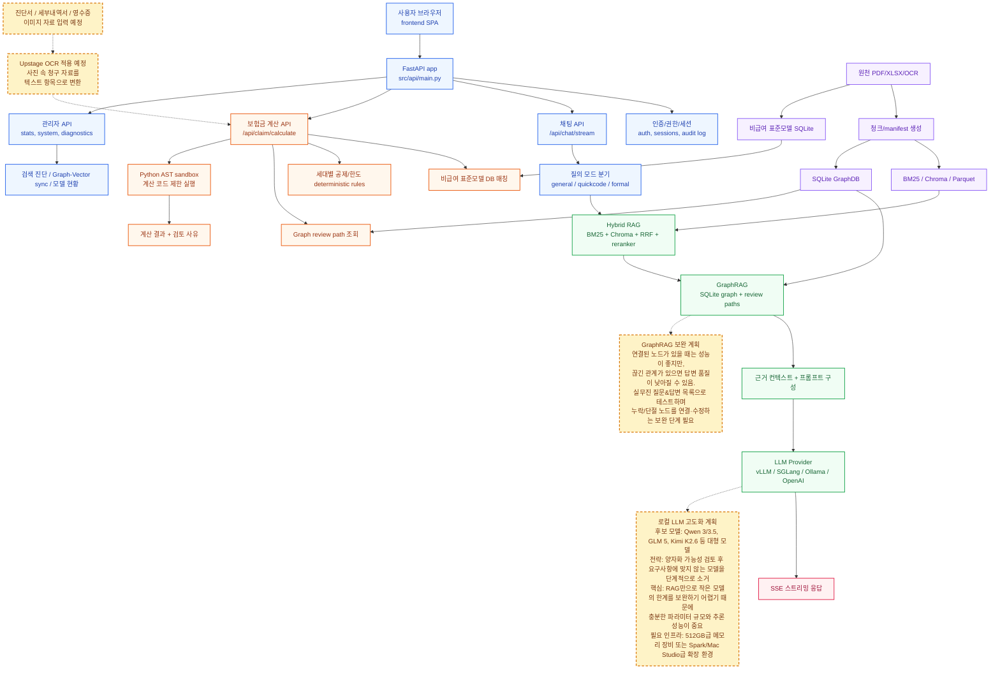

# 보험 약관 챗봇 아키텍처 설명서 (Mermaid 포함)

## 1) 아키텍처 개요

이 아키텍처는 `Frontend SPA`와 `FastAPI`를 중심으로, 문서 검색(`Hybrid RAG`)과 구조화 근거 조회(`GraphRAG`)를 결합해 답변을 생성하는 구조입니다.  
질문 처리 경로는 크게 아래 두 축으로 나뉩니다.

- 런타임 축: 사용자 질문 처리, 검색, 근거 구성, LLM 생성, SSE 응답
- 사전 구축 축: 원천 문서를 청크/인덱스/GraphDB/표준모델 DB로 가공

또한 보험금 계산 API는 일반 채팅과 분리된 계산 파이프라인을 가지며, 향후 이미지 기반 OCR 입력을 연결하도록 설계되어 있습니다.

## 2) Mermaid 아키텍처 코드

## 3) 전체 처리 흐름

질문 응답은 아래 순서로 진행됩니다.

1. 사용자 브라우저(`frontend SPA`)가 FastAPI 앱으로 요청을 전달합니다.
2. FastAPI는 요청을 채팅/보험금 계산/관리자/인증 API로 분기합니다.
3. 채팅 API는 질의 모드(`general`, `quickcode`, `formal`)를 결정합니다.
4. `Hybrid RAG`가 BM25 + Chroma 결과를 RRF와 reranker로 통합해 검색 근거를 구성합니다.
5. `GraphRAG`가 SQLite graph 기반 review path를 조회해 구조화 근거를 보강합니다.
6. 프롬프트를 구성해 `LLM Provider`를 호출합니다.
7. 응답은 `SSE 스트리밍`으로 프론트에 점진적으로 반환됩니다.

## 4) 영역별 역할

### 4-1. API/서비스 영역 (파란색)

- `FastAPI app`: 전체 진입점, 라우팅과 인증 연동의 허브
- `AUTH`: 로그인, 권한, 세션, 감사 로그
- `CHAT`: 일반 질의응답 API (`/api/chat/stream`)
- `CLAIM`: 보험금 계산 API (`/api/claim/calculate`)
- `ADMIN`: 통계/상태/진단 API
- `MODE`: 질의 유형에 맞는 처리 모드 선택

### 4-2. 답변 생성 영역 (초록색)

- `RAG`: 문서 근거 검색 통합 계층
- `GRAPH`: 구조화 근거와 review path 보강 계층
- `PROMPT`: 검색 근거 + 구조화 근거를 LLM 입력으로 조립
- `LLM`: 모델 실행 계층

### 4-3. 보험금 계산 영역 (주황색)

- `STD`: 비급여 표준모델 DB 매칭
- `DED`: 세대별 공제/한도 규칙 적용
- `CGRAPH`: 계산 검토용 그래프 경로 조회
- `SANDBOX`: 제한된 계산 코드 실행
- `CRES`: 계산 결과와 검토 사유 반환

### 4-4. 데이터 구축 영역 (보라색)

- `DATA`: 원천 문서 입력(PDF/XLSX/OCR)
- `CHUNK`: 청크/manifest 생성
- `IDX`: BM25/Chroma/Parquet 인덱스
- `GDB`: GraphRAG용 SQLite GraphDB
- `RDB`: 표준모델용 SQLite

## 5) OCR 확장 계획 (점선 노란색)

현재 계획된 OCR 흐름은 아래와 같습니다.

1. 진단서/세부내역서/영수증 이미지를 입력 받습니다.
2. `Upstage OCR`로 이미지 텍스트와 주요 항목을 구조화합니다.
3. 정제된 결과를 보험금 계산 API에 전달해 계산 근거로 사용합니다.

해당 노드는 실선이 아닌 점선으로 표현되어, 운영 반영 전의 예정 기능임을 나타냅니다.

## 6) GraphRAG 보완 계획 (점선 노란색)

현재 GraphRAG 특성은 다음과 같습니다.

- 장점: 노드 연결이 충분할 때는 높은 근거 품질
- 리스크: 연결이 끊긴 구간에서는 답변 품질 저하 가능

따라서 실무진 질문/답변 세트로 반복 검증하면서, 누락/단절 노드를 연결해 그래프 커버리지를 확장하는 보완 작업이 필요합니다.

## 7) LLM 고도화 계획 (점선 노란색)

핵심 방향은 아래 세 가지입니다.

1. 후보 모델군을 대형 모델 중심으로 구성
2. 요구사항 미충족 모델을 단계적으로 소거하는 검증 방식 적용
3. 로컬 LLM 성능 확보를 위한 하드웨어/메모리 인프라 확충

즉, RAG 품질 개선과 별개로 모델 자체의 추론 성능 확보가 병행되어야 안정적인 품질을 기대할 수 있습니다.

## 8) 운영 관점 체크포인트

- `ADMIN -> DIAG`로 검색 품질, Graph-Vector 동기 상태, 모델 상태를 지속 확인
- 인덱스 재구축(`DATA -> CHUNK -> IDX/GDB`) 후 API 응답 품질 회귀 테스트 수행
- OCR 연동 이후 계산 API 입력 검증 규칙(필수 항목, 형식, 신뢰도 기준) 명시

## 9) 한 줄 요약

이 구조는 `FastAPI`를 중심으로 `Hybrid RAG + GraphRAG + LLM`을 결합해 답변 신뢰도를 높이고, 별도 `보험금 계산 API`와 향후 `OCR` 연동으로 실무형 자동화 범위를 확장하는 아키텍처입니다.

