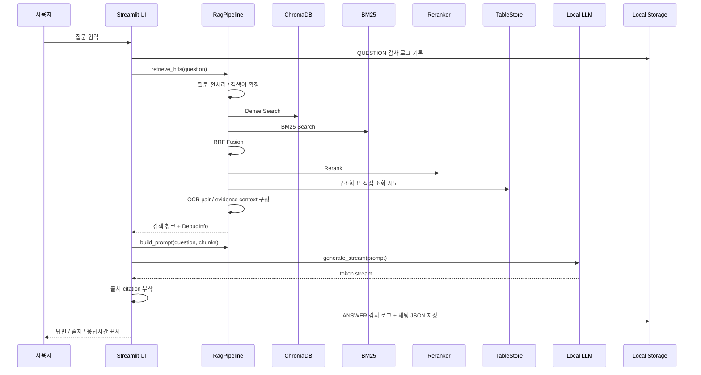
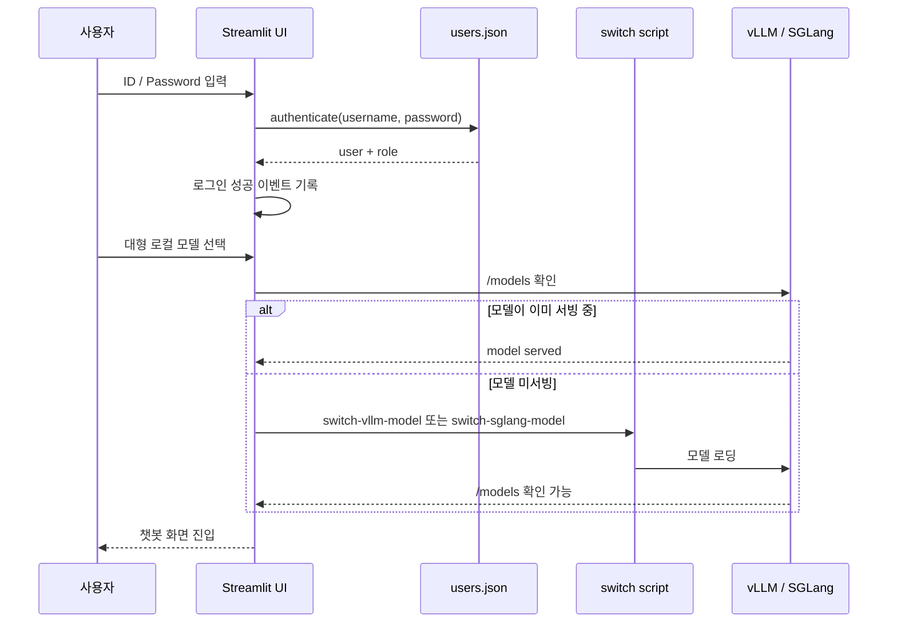

# 발표용 아키텍처 명세 - Streamlit + Local LLM 기준

기준 코드 위치: `/Users/dahyun/Desktop/arch/insurance-rag-chatbot`  
기준 커밋: `0e1b24d feat(ocr): integrate v1 v2 mapping workflow`

이 문서는 Graph DB 구축과 보험금 계산 로직이 들어가기 전 버전의 실제 코드 구조를 기준으로 작성한 발표용 아키텍처 명세다.

## 1. 기준 범위

### 포함할 내용

- Streamlit 기반 챗봇 UI
- 로그인 / 사용자 권한 / 관리자 페이지
- 채팅 저장 및 내보내기
- 문서 검색 RAG 파이프라인
- OCR 인덱스 모드
- BM25 + ChromaDB + BGE-M3 + RRF + Reranker
- 로컬 LLM 연동
  - vLLM: Gemma 계열
  - SGLang: GPT-OSS 계열
  - Ollama: 로컬 fallback 모델
- OpenAI Cloud 경로는 코드에 남아 있으나, 발표에서는 보조/옵션 또는 과거 검토 경로로 회색 점선 처리

### 제외할 내용

다음 내용은 이 기준 커밋 이후에 들어가거나 발표 목적에서 제외한다.

- Graph DB runtime
- 보험금 계산 workflow
- SPA Frontend / FastAPI Backend
- SPA claim calculation

확인한 제외 대상 커밋:

```text
9895024 feat(claim): add payout calculation workflow
46fc429 feat(graph): integrate graphdb rag runtime
b688160 fix(claim): guide llm planner amount mapping
21c0b89 feat(api): add spa frontend runtime
77c8d45 feat(api): add claim calculation to spa
```

## 2. 실제 코드 기준 주요 구성요소

| 영역 | 코드 위치 | 역할 |
|---|---|---|
| Streamlit App | `src/ui/streamlit_app.py` | 로그인, 챗봇 화면, 검색 모드, 모델 선택, 답변 스트리밍, 출처 표시 |
| 관리자 페이지 | `src/ui/admin_page.py` | 로그 조회, 통계, 사용자 관리, 시스템 상태, RAG 검색 진단 |
| 사용자 인증 | `src/auth/users.py` | `users.json` 기반 계정 저장, PBKDF2 비밀번호 해시, admin/employee role |
| 채팅 저장소 | `src/ui/chat_store.py` | 사용자별 채팅 JSON 저장, 목록 조회, 삭제, 복원 |
| 감사 로그 | `src/utils/logger.py` | `logs/chat_YYYY-MM-DD.jsonl` 이벤트 로그 저장 |
| RAG Pipeline | `src/rag/pipeline.py` | 검색, RRF, rerank, 구조화 컨텍스트, LLM 호출 |
| 퀵 코드 검색 | `src/rag/quick_code.py` | 시술/수술명 기반 코드 검색 전용 프롬프트 |
| 약관 정형 검색 | `src/rag/insurance_form.py` | 보상가능 여부, 조문 검색, 키워드 검색 폼 |
| 테이블 직접 조회 | `src/rag/table_store.py` | Parquet 기반 수술종수/장해 지급률 deterministic lookup |
| LLM Factory | `src/llm/factory.py` | vLLM, SGLang, Ollama, OpenAI provider 라우팅 |
| vLLM/SGLang client | `src/llm/openai_compatible_client.py` | OpenAI-compatible `/chat/completions` 호출 |
| Ollama client | `src/llm/ollama_client.py` | Ollama `/api/generate` 호출 |
| OpenAI client | `src/llm/openai_client.py` | Cloud OpenAI 호출. 발표에서는 보조/과거 검토 경로 |
| Vector Store | `src/retrieval/vector_store.py` | ChromaDB PersistentClient 기반 dense search |
| BM25 | `src/retrieval/bm25.py` | 키워드 검색 인덱스 |
| RRF | `src/retrieval/hybrid.py` | Dense/BM25 검색 결과 융합 |
| Reranker | `src/retrieval/reranker.py` | BGE reranker 기반 최종 재정렬 |
| 인덱스 모드 | `src/retrieval/index_mode.py` | `default`, `v2_only`, `v1_v2_combined` 경로 선택 |
| OCR pair mapping | `src/retrieval/pair_mapping.py` | v2 보정본 청크와 v1 원본 OCR 청크 대응 |
| 인제스트 | `scripts/ingest.py` | PDF/OCR 청킹, BM25/ChromaDB 인덱스 생성 |

## 3. 전체 아키텍처 Mermaid

아래 다이어그램은 실제 코드 구조를 기반으로 한다.  
실선은 현행 기준 커밋의 핵심 실행 경로이고, 회색 점선은 코드에 남아 있으나 발표에서 보조/이전 검토 경로로 표현할 영역이다.

```mermaid
flowchart LR
  %% =====================
  %% Users
  %% =====================
  subgraph USER["사용자 / 권한"]
    ADMIN[관리자]
    EMP[직원 / 일반 사용자]
  end

  %% =====================
  %% Streamlit UI
  %% =====================
  subgraph UI["Streamlit Web UI<br/>src/ui/streamlit_app.py"]
    LOGIN[로그인 화면<br/>users.json 인증]
    MODEL_SELECT[로그인 시 대형 로컬 모델 선택<br/>vLLM / SGLang]
    CHAT_PAGE[챗봇 페이지]
    SIDEBAR[사이드바<br/>모델 · OCR 인덱스 · Top-K · 온도]
    MODES[검색 모드 선택<br/>일반 질의 / 퀵 코드 / 약관 정형]
    SOURCES[출처 보기<br/>문서명 · 페이지 · PDF 미리보기]
    EXPORT[대화 내보내기<br/>TXT / CSV / JSON]
  end

  %% =====================
  %% Admin
  %% =====================
  subgraph ADMIN_UI["관리자 페이지<br/>src/ui/admin_page.py"]
    LOG_VIEW[로그 조회]
    STATS[사용 통계]
    USER_MGMT[사용자 관리]
    SYSTEM_STATUS[시스템 상태]
    RAG_DEBUG[RAG 검색 진단<br/>Dense / BM25 / RRF / Final]
  end

  %% =====================
  %% Auth / Local Persistence
  %% =====================
  subgraph LOCAL_STORE["로컬 저장소"]
    USERS[(users.json<br/>계정 / role / password hash)]
    CHAT_HISTORY[(data/chat_history<br/>사용자별 채팅 JSON)]
    LOGS[(logs/chat_YYYY-MM-DD.jsonl<br/>감사 로그)]
  end

  %% =====================
  %% RAG Service
  %% =====================
  subgraph RAG["RAG Pipeline<br/>src/rag/pipeline.py"]
    QUERY_EXPAND[질문 전처리 / 검색어 확장]
    DOC_FILTER[문서 필터 / 문서별 커버리지 보정]
    DENSE[Dense Search<br/>BGE-M3 + ChromaDB]
    BM25[BM25 Keyword Search]
    CODE_FILTER[코드 기반 필터 검색<br/>codes metadata]
    RRF[RRF Fusion]
    RERANK[Reranker<br/>BGE-reranker-v2-m3]
    STRUCTURED[구조화 컨텍스트<br/>수술종수 / 장해 지급률]
    OCR_PAIR[OCR 교차검증 컨텍스트<br/>v2 canonical ↔ v1 original]
    EVIDENCE[Strict Evidence Context<br/>출처 기반 경고]
    PROMPT[Prompt Builder<br/>system prompt + context]
    ANSWER[출처 포함 답변]
  end

  %% =====================
  %% Search Modes
  %% =====================
  subgraph MODE_HANDLERS["검색 모드별 처리"]
    GENERAL[일반 질의<br/>pipeline.answer / streaming]
    QUICK[퀵 코드 검색<br/>src/rag/quick_code.py]
    FORMAL[약관 정형 검색<br/>src/rag/insurance_form.py]
  end

  %% =====================
  %% Data / Index
  %% =====================
  subgraph INDEX["문서 / 인덱스 영역"]
    PDF[보험 문서 PDF<br/>심평원 · 약관 · 자사약관 · 표준약관]
    OCR_DOCS[OCR 대상 문서<br/>실무가이드 · 상담사례집]
    INGEST[Ingest / OCR / Chunking<br/>scripts/ingest.py]
    CHUNKS[(data/processed/chunks.jsonl)]
    CHROMA[(ChromaDB<br/>data/index/chroma)]
    BM25_PKL[(BM25 pkl<br/>data/index/bm25.pkl)]
    PARQUET[(Parquet Table Index<br/>surgery_grades / disability_rates)]
    PAIR_MAP[(data/mapping<br/>v1-v2 pair JSONL)]
    INDEX_MODE[OCR 인덱스 모드<br/>default / v2_only / v1_v2_combined]
  end

  %% =====================
  %% LLM Providers
  %% =====================
  subgraph LOCAL_LLM["로컬 LLM Provider"]
    LLM_FACTORY[LLM Factory<br/>src/llm/factory.py]
    VLLM[vLLM<br/>Gemma 4 26B NVFP4<br/>127.0.0.1:30001/v1]
    SGLANG[SGLang<br/>GPT-OSS 20B<br/>127.0.0.1:30000/v1]
    OLLAMA[Ollama fallback<br/>localhost:11434]
  end

  %% =====================
  %% Optional / Legacy Cloud
  %% =====================
  subgraph CLOUD_OPTION["옵션 / 이전 검토 경로"]
    OPENAI_CLIENT[OpenAIClient]
    OPENAI_API[OpenAI Chat Completions API]
    TOKEN_USAGE[OpenAI token usage 집계]
  end

  %% =====================
  %% Main Flow
  %% =====================
  ADMIN --> LOGIN
  EMP --> LOGIN
  LOGIN --> MODEL_SELECT
  MODEL_SELECT --> CHAT_PAGE
  CHAT_PAGE --> SIDEBAR
  CHAT_PAGE --> MODES
  ADMIN --> ADMIN_UI

  LOGIN --> USERS
  USER_MGMT --> USERS
  CHAT_PAGE --> CHAT_HISTORY
  EXPORT --> CHAT_HISTORY
  LOG_VIEW --> LOGS
  STATS --> LOGS
  CHAT_PAGE --> LOGS

  MODES --> GENERAL
  MODES --> QUICK
  MODES --> FORMAL

  GENERAL --> QUERY_EXPAND
  QUICK --> DOC_FILTER
  FORMAL --> DOC_FILTER
  QUERY_EXPAND --> DOC_FILTER
  DOC_FILTER --> DENSE
  DOC_FILTER --> BM25
  DOC_FILTER --> CODE_FILTER
  DENSE --> RRF
  BM25 --> RRF
  CODE_FILTER --> RRF
  RRF --> RERANK
  RERANK --> STRUCTURED
  STRUCTURED --> OCR_PAIR
  OCR_PAIR --> EVIDENCE
  EVIDENCE --> PROMPT
  PROMPT --> LLM_FACTORY

  LLM_FACTORY --> VLLM
  LLM_FACTORY --> SGLANG
  LLM_FACTORY --> OLLAMA
  VLLM --> ANSWER
  SGLANG --> ANSWER
  OLLAMA --> ANSWER
  ANSWER --> SOURCES
  ANSWER --> CHAT_PAGE
  ANSWER --> LOGS
  ANSWER --> CHAT_HISTORY

  RAG_DEBUG --> RAG
  SYSTEM_STATUS --> INDEX
  SYSTEM_STATUS --> LOCAL_LLM

  %% =====================
  %% Data Flow
  %% =====================
  PDF --> INGEST
  OCR_DOCS --> INGEST
  INGEST --> CHUNKS
  CHUNKS --> CHROMA
  CHUNKS --> BM25_PKL
  CHUNKS --> PARQUET
  CHUNKS --> PAIR_MAP
  INDEX_MODE --> CHROMA
  INDEX_MODE --> BM25_PKL

  CHROMA --> DENSE
  BM25_PKL --> BM25
  PARQUET --> STRUCTURED
  PAIR_MAP --> OCR_PAIR

  %% =====================
  %% Optional Cloud Flow
  %% =====================
  LLM_FACTORY -.옵션 / 이전 검토 경로.-> OPENAI_CLIENT
  OPENAI_CLIENT -.외부 API 호출.-> OPENAI_API
  OPENAI_API -.사용량 기록.-> TOKEN_USAGE
  TOKEN_USAGE -.관리자 통계에 표시 가능.-> STATS

  %% =====================
  %% Styles
  %% =====================
  classDef ui fill:#ffffff,stroke:#2563eb,stroke-width:2px,color:#111827;
  classDef admin fill:#ffffff,stroke:#7c3aed,stroke-width:2px,color:#111827;
  classDef rag fill:#ffffff,stroke:#16a34a,stroke-width:2px,color:#111827;
  classDef index fill:#ffffff,stroke:#0f766e,stroke-width:2px,color:#111827;
  classDef llm fill:#ffffff,stroke:#ea580c,stroke-width:2px,color:#111827;
  classDef store fill:#f8fafc,stroke:#64748b,stroke-width:2px,color:#111827;
  classDef optional fill:#f3f4f6,stroke:#9ca3af,stroke-width:2px,stroke-dasharray: 6 6,color:#6b7280;

  class USER,UI ui;
  class ADMIN_UI admin;
  class RAG,MODE_HANDLERS rag;
  class INDEX index;
  class LOCAL_LLM llm;
  class LOCAL_STORE store;
  class CLOUD_OPTION,OPENAI_CLIENT,OPENAI_API,TOKEN_USAGE optional;
```



## 4. 일반 질의 시퀀스



## 5. 로그인 및 모델 준비 흐름



## 6. 검색 모드별 아키텍처 해석

### 6.1 일반 질의

사용자가 자유 질문을 입력하면 `RagPipeline.retrieve_hits()`가 실행된다.

처리 순서:

```text
질문 입력
→ 검색어 확장
→ Dense Search
→ BM25 Search
→ 코드 필터 검색
→ RRF Fusion
→ Reranker
→ 구조화 컨텍스트 / OCR pair / evidence context 추가
→ LLM streaming 생성
→ 출처 citation 부착
```

### 6.2 퀵 코드 검색

코드 위치: `src/rag/quick_code.py`

목적:

- 시술명 또는 수술명으로 심평원 코드와 분류/점수 정보를 빠르게 찾는다.
- 보상 옵션을 켜면 약관 문서도 함께 검색한다.

기본 문서 필터:

```text
보상 옵션 OFF: 심평원
보상 옵션 ON: 심평원 + 약관
```

### 6.3 약관 정형 검색

코드 위치: `src/rag/insurance_form.py`

하위 모드:

```text
보상가능 여부 판정
약관 조문 검색
키워드/시술명 검색
```

특징:

- 약관 문서를 기본 필터로 사용한다.
- 보상가능 여부 판정에는 disclaimer가 자동 부착된다.
- 답변은 최종 판정이 아니라 검색 보조임을 명시한다.

## 7. 데이터/인덱스 구성

| 저장소 | 경로 | 역할 |
|---|---|---|
| 청크 JSONL | `data/processed/chunks.jsonl` | PDF/OCR 문서를 청킹한 원천 검색 단위 |
| ChromaDB | `data/index/chroma` | BGE-M3 dense vector 검색 |
| BM25 | `data/index/bm25.pkl` | 키워드 검색 |
| 수술종수 Parquet | `data/index/surgery_grades.parquet` | 수술명 → 1-3종/1-5종/신1-5종 직접 조회 |
| 장해율 Parquet | `data/index/disability_rates.parquet` | 장해 분류 → 지급률 직접 조회 |
| OCR pair mapping | `data/mapping/v1_v2_pairs_*.jsonl` | v2 보정본 청크와 v1 원본 OCR 대응 |
| 채팅 저장 | `data/chat_history/<user>` | 사용자별 대화 JSON 저장 |
| 감사 로그 | `logs/chat_YYYY-MM-DD.jsonl` | 앱 접근, 로그인, 질문, 답변, 내보내기, 관리자 이벤트 |
| 사용자 계정 | `users.json` | 계정, role, password hash |

## 8. LLM Provider 구성

| Provider | 코드 | 기본 모델/엔드포인트 | 발표 표현 |
|---|---|---|---|
| vLLM | `OpenAICompatibleClient(provider="vllm")` | `gemma-4-26b-a4b-nvfp4`, `127.0.0.1:30001/v1` | 현재 로컬 LLM 핵심 |
| SGLang | `OpenAICompatibleClient(provider="sglang")` | `gpt-oss-20b`, `127.0.0.1:30000/v1` | 현재 로컬 LLM 핵심 |
| Ollama | `OllamaClient` | `localhost:11434` | 로컬 fallback |
| OpenAI Cloud | `OpenAIClient` | `api.openai.com/v1` | 옵션/이전 검토 경로, 회색 점선 |

## 9. 관리자 기능

관리자 페이지는 Streamlit 내부 탭으로 구현되어 있다.

| 탭 | 기능 |
|---|---|
| 로그 조회 | JSONL 감사 로그 조회 및 CSV 다운로드 |
| 통계 | 최근 30일 질문/답변 수, 평균 응답 시간, 사용자별/모드별/모델별 통계 |
| 사용자 관리 | 사용자 추가, role 선택, 비밀번호 리셋 |
| 시스템 상태 | Chroma/BM25 존재 여부, LLM 후보, 임베딩 설정 확인 |
| 검색 진단 | 최근 질의의 Dense/BM25/RRF/Final 단계별 hit 표시 |

## 10. 디자인 지시

### 현재 구조

```text
Streamlit UI → RAG Pipeline → Local LLM → 답변/출처/로그 저장
```

표현:

- 실선
- 컬러 박스
- Streamlit UI는 파랑
- RAG는 초록
- 인덱스/데이터는 청록 또는 보라
- 로컬 LLM은 주황
- 관리자/운영은 보라

### 옵션/이전 검토 구조

```text
OpenAIClient → OpenAI Chat Completions API → token usage
```

표현:

- 회색 박스
- 점선 테두리
- 점선 화살표
- “옵션 / 이전 검토 경로” 라벨

### 명확히 제외할 구조

디자인에 넣지 않는다.

```text
Graph DB
보험금 계산 로직
FastAPI Backend
Frontend SPA
SPA claim calculation
```

## 11. 발표용 한 문장 요약

이 버전의 챗봇은 Streamlit 기반 UI에서 사용자 인증, 관리자 운영 기능, OCR 문서 검색, Hybrid RAG, 구조화 테이블 직접 조회, 로컬 LLM(vLLM/SGLang/Ollama) 생성을 하나의 앱 흐름으로 연결한 내부 보험 문서 RAG 시스템이다.

