# 최종 발표용 아키텍처 - Streamlit + Local LLM RAG

기준 코드: `/Users/dahyun/Desktop/arch/insurance-rag-chatbot`  
기준 커밋: `0e1b24d feat(ocr): integrate v1 v2 mapping workflow`

이 아키텍처는 Graph DB와 보험금 계산 로직이 들어가기 전 버전의 실제 코드 구조를 기준으로 작성했다.

## 최종 아키텍처 다이어그램

```mermaid
flowchart LR
  %% =====================
  %% User Layer
  %% =====================
  subgraph L1["1. 사용자 계층"]
    ADMIN["관리자"]
    USER["직원 / 일반 사용자"]
  end

  %% =====================
  %% Streamlit App Layer
  %% =====================
  subgraph L2["2. Streamlit 애플리케이션 계층"]
    LOGIN["로그인 / 권한 확인<br/>src/auth/users.py"]
    CHAT["챗봇 화면<br/>src/ui/streamlit_app.py"]
    ADMIN_PAGE["관리자 페이지<br/>src/ui/admin_page.py"]
    MODE_SELECT["검색 모드 선택<br/>일반 질의 / 퀵 코드 / 약관 정형"]
    MODEL_SELECT["LLM Provider 선택<br/>vLLM / SGLang / Ollama"]
    INDEX_SELECT["OCR 인덱스 선택<br/>default / v2_only / v1_v2_combined"]
    EXPORT["대화 저장 / 내보내기<br/>TXT / CSV / JSON"]
  end

  %% =====================
  %% Local Ops / Storage
  %% =====================
  subgraph L3["3. 로컬 운영 저장소"]
    USERS_JSON[("users.json<br/>계정 / role / password hash")]
    CHAT_JSON[("data/chat_history<br/>사용자별 대화 JSON")]
    AUDIT_LOG[("logs/chat_YYYY-MM-DD.jsonl<br/>감사 로그")]
  end

  %% =====================
  %% RAG Mode Handlers
  %% =====================
  subgraph L4["4. 질의 처리 모드"]
    GENERAL["일반 질의<br/>RagPipeline.answer / streaming"]
    QUICK["퀵 코드 검색<br/>src/rag/quick_code.py"]
    FORMAL["약관 정형 검색<br/>src/rag/insurance_form.py"]
  end

  %% =====================
  %% RAG Core
  %% =====================
  subgraph L5["5. RAG 검색/근거 구성 계층"]
    QUERY_PREP["질문 전처리 / 검색어 확장"]
    DOC_FILTER["문서 필터 / 문서별 커버리지 보정"]
    DENSE["Dense Search<br/>BGE-M3 Embedding + ChromaDB"]
    KEYWORD["BM25 Keyword Search"]
    CODE_SEARCH["코드 메타데이터 검색<br/>codes / linked_std_cds"]
    RRF["RRF Fusion<br/>Dense + BM25 융합"]
    RERANK["Reranker<br/>BAAI/bge-reranker-v2-m3"]
    TABLE_CONTEXT["구조화 테이블 컨텍스트<br/>수술종수 / 장해 지급률"]
    OCR_CONTEXT["OCR 교차검증 컨텍스트<br/>v2 보정본 ↔ v1 원본 OCR"]
    EVIDENCE["근거 강화 컨텍스트<br/>출처 기반 경고 / 문서 충돌 분리"]
    PROMPT["Prompt Builder<br/>System Prompt + 검색 근거"]
  end

  %% =====================
  %% Index / Data Layer
  %% =====================
  subgraph L6["6. 문서 / 인덱스 계층"]
    PDF["보험 문서 PDF<br/>심평원 · 실손 약관 · 자사 약관 · 표준약관"]
    OCR_PDF["OCR 대상 문서<br/>실무가이드 · 상담사례집"]
    INGEST["PDF/OCR 인제스트<br/>scripts/ingest.py"]
    CHUNKS[("JSONL Chunks<br/>data/processed/chunks.jsonl")]
    CHROMA[("ChromaDB<br/>data/index/chroma")]
    BM25_INDEX[("BM25 Index<br/>data/index/bm25.pkl")]
    PARQUET[("Parquet Table Index<br/>surgery_grades / disability_rates")]
    PAIR_MAP[("OCR Pair Mapping<br/>data/mapping/v1_v2_pairs_*.jsonl")]
  end

  %% =====================
  %% Local LLM Layer
  %% =====================
  subgraph L7["7. Local LLM 생성 계층"]
    LLM_FACTORY["LLM Factory<br/>src/llm/factory.py"]
    VLLM["vLLM Server<br/>Gemma 4 26B<br/>127.0.0.1:30001/v1"]
    SGLANG["SGLang Server<br/>GPT-OSS 20B<br/>127.0.0.1:30000/v1"]
    OLLAMA["Ollama Server<br/>Local fallback<br/>localhost:11434"]
    LOCAL_ANSWER["Streaming Answer<br/>출처 citation 부착"]
  end

  %% =====================
  %% Optional / Legacy Cloud Path
  %% =====================
  subgraph L8["옵션 / 이전 검토 경로"]
    OPENAI["OpenAI Cloud API<br/>현재 발표 핵심 경로 아님"]
    TOKEN["OpenAI Token Usage<br/>관리자 통계에 집계 가능"]
  end

  %% =====================
  %% Main UI Flow
  %% =====================
  ADMIN --> LOGIN
  USER --> LOGIN
  LOGIN --> USERS_JSON
  LOGIN --> CHAT
  ADMIN --> ADMIN_PAGE

  CHAT --> MODEL_SELECT
  CHAT --> INDEX_SELECT
  CHAT --> MODE_SELECT
  CHAT --> EXPORT
  EXPORT --> CHAT_JSON

  ADMIN_PAGE --> USERS_JSON
  ADMIN_PAGE --> AUDIT_LOG
  ADMIN_PAGE --> CHAT_JSON

  CHAT --> AUDIT_LOG
  CHAT --> CHAT_JSON

  %% =====================
  %% Mode Routing
  %% =====================
  MODE_SELECT --> GENERAL
  MODE_SELECT --> QUICK
  MODE_SELECT --> FORMAL

  GENERAL --> QUERY_PREP
  QUICK --> DOC_FILTER
  FORMAL --> DOC_FILTER
  QUERY_PREP --> DOC_FILTER

  %% =====================
  %% RAG Retrieval Flow
  %% =====================
  DOC_FILTER --> DENSE
  DOC_FILTER --> KEYWORD
  DOC_FILTER --> CODE_SEARCH
  DENSE --> RRF
  KEYWORD --> RRF
  CODE_SEARCH --> RRF
  RRF --> RERANK
  RERANK --> TABLE_CONTEXT
  TABLE_CONTEXT --> OCR_CONTEXT
  OCR_CONTEXT --> EVIDENCE
  EVIDENCE --> PROMPT

  %% =====================
  %% LLM Generation
  %% =====================
  MODEL_SELECT --> LLM_FACTORY
  PROMPT --> LLM_FACTORY
  LLM_FACTORY --> VLLM
  LLM_FACTORY --> SGLANG
  LLM_FACTORY --> OLLAMA
  VLLM --> LOCAL_ANSWER
  SGLANG --> LOCAL_ANSWER
  OLLAMA --> LOCAL_ANSWER
  LOCAL_ANSWER --> CHAT
  LOCAL_ANSWER --> AUDIT_LOG
  LOCAL_ANSWER --> CHAT_JSON

  %% =====================
  %% Data Build / Runtime Index Flow
  %% =====================
  PDF --> INGEST
  OCR_PDF --> INGEST
  INGEST --> CHUNKS
  CHUNKS --> CHROMA
  CHUNKS --> BM25_INDEX
  CHUNKS --> PARQUET
  CHUNKS --> PAIR_MAP

  INDEX_SELECT --> CHROMA
  INDEX_SELECT --> BM25_INDEX
  CHROMA --> DENSE
  BM25_INDEX --> KEYWORD
  PARQUET --> TABLE_CONTEXT
  PAIR_MAP --> OCR_CONTEXT

  %% =====================
  %% Optional Cloud
  %% =====================
  LLM_FACTORY -.옵션 / 이전 검토.-> OPENAI
  OPENAI -.사용량 집계.-> TOKEN
  TOKEN -.관리자 통계.-> ADMIN_PAGE

  %% =====================
  %% Styles
  %% =====================
  classDef user fill:#ffffff,stroke:#2563eb,stroke-width:2px,color:#111827;
  classDef ui fill:#eff6ff,stroke:#2563eb,stroke-width:2px,color:#111827;
  classDef store fill:#f8fafc,stroke:#64748b,stroke-width:2px,color:#111827;
  classDef mode fill:#f0fdf4,stroke:#16a34a,stroke-width:2px,color:#111827;
  classDef rag fill:#ffffff,stroke:#16a34a,stroke-width:2px,color:#111827;
  classDef data fill:#f5f3ff,stroke:#7c3aed,stroke-width:2px,color:#111827;
  classDef llm fill:#fff7ed,stroke:#ea580c,stroke-width:2px,color:#111827;
  classDef optional fill:#f3f4f6,stroke:#9ca3af,stroke-width:2px,stroke-dasharray:6 6,color:#6b7280;

  class ADMIN,USER,L1 user;
  class LOGIN,CHAT,ADMIN_PAGE,MODE_SELECT,MODEL_SELECT,INDEX_SELECT,EXPORT,L2 ui;
  class USERS_JSON,CHAT_JSON,AUDIT_LOG,L3 store;
  class GENERAL,QUICK,FORMAL,L4 mode;
  class QUERY_PREP,DOC_FILTER,DENSE,KEYWORD,CODE_SEARCH,RRF,RERANK,TABLE_CONTEXT,OCR_CONTEXT,EVIDENCE,PROMPT,L5 rag;
  class PDF,OCR_PDF,INGEST,CHUNKS,CHROMA,BM25_INDEX,PARQUET,PAIR_MAP,L6 data;
  class LLM_FACTORY,VLLM,SGLANG,OLLAMA,LOCAL_ANSWER,L7 llm;
  class OPENAI,TOKEN,L8 optional;
```



## 발표용 핵심 설명

이 버전의 시스템은 `Streamlit`을 중심으로 UI, 인증, 관리자 기능, RAG 검색, 로컬 LLM 생성을 하나의 애플리케이션 흐름으로 묶은 구조다.

사용자는 Streamlit 화면에서 로그인한 뒤 질문을 입력하고, 시스템은 ChromaDB dense search와 BM25 keyword search를 함께 수행한다. 검색 결과는 RRF로 융합되고, 필요하면 reranker로 재정렬된다. 이후 Parquet 기반 수술종수/장해율 직접 조회, OCR 원본-보정본 교차검증, 출처 기반 evidence context를 추가해 프롬프트를 구성한다.

답변 생성은 로컬 LLM을 우선 사용한다. 주요 경로는 `vLLM Gemma`, `SGLang GPT-OSS`, `Ollama fallback`이다. OpenAI Cloud 경로는 코드에 남아 있지만, 이 발표에서는 핵심 운영 경로가 아니라 옵션 또는 이전 검토 경로로 회색 점선 처리한다.

## 이 아키텍처에서 명확히 제외한 것

아래 내용은 발표 다이어그램에 포함하지 않는다.

```text
Graph DB
보험금 계산 로직
FastAPI Backend
Frontend SPA
SPA claim calculation
```

