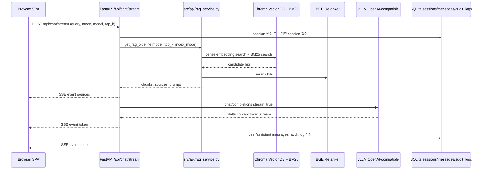

# FastAPI Frontend/RAG Runtime Structure Report

작성일: 2026-05-26
대상 브랜치: `feature/backend-week1`
대상 서버: DGX Spark `100.88.5.57`

## 1. 현재 실행 구조

이 프로젝트는 기존 Streamlit 화면에서 HTML/JavaScript SPA와 FastAPI 백엔드 구조로 전환되어 있다. 운영 기준 진입점은 FastAPI same-origin 방식이며, 보조적으로 정적 프론트 서버 `:3000`도 사용할 수 있다.

- 권장 접속 URL: `http://100.88.5.57:8000/login`
- FastAPI API/정적 파일 서버: `0.0.0.0:8000`
- 선택적 프론트 정적 서버: `0.0.0.0:3000`
- vLLM OpenAI-compatible 서버: `127.0.0.1:30001/v1`
- 현재 vLLM served model: `nemotron-3-nano-30b-a3b-nvfp4`
- SGLang 기본 포트: `127.0.0.1:30000/v1`이며 현재 기본 챗봇 경로는 vLLM을 사용한다.

## 2. 프론트엔드 구조

프론트엔드는 `frontend/index.html`을 루트로 하는 ES module SPA이다. FastAPI가 `frontend/`를 마운트하므로 `:8000/login`, `:8000/chat`, `:8000/admin` 같은 history route가 `index.html`로 fallback된다.

```text
frontend/
├── index.html                 # SPA root, /js/app.js 로드
├── html/
│   ├── login.html             # 로그인 및 모델 선택 화면
│   ├── chat.html              # 챗봇 화면
│   ├── admin.html             # 관리자 화면
│   └── components.html        # 공통 컴포넌트 조각
├── js/
│   ├── app.js                 # SPA 라우팅, 인증 상태 확인, 페이지 초기화
│   ├── config.js              # API base URL, endpoint 상수, storage key
│   ├── utils.js               # apiFetch, SSE parser, DOM/helper 함수
│   ├── pages/
│   │   ├── login.js           # 로그인 이벤트, 모델 선택 저장
│   │   ├── chat.js            # 채팅 UI, /api/chat/stream SSE 처리
│   │   └── admin.js           # 관리자 화면 초기화
│   └── modules/               # auth/session/sidebar/modal/admin/ui 등 기능 모듈
└── css/                       # base/chat/login/admin/components 스타일
```

### 프론트 API 경로 정책

- `:8000` same-origin 접속 시 `API_CONFIG.BASE_URL`은 `/api`이다.
- `:3000` 정적 서버 접속 시 브라우저의 현재 hostname을 사용해 `http://<hostname>:8000/api`를 호출한다.
- `window.__API_BASE_URL__`가 있으면 해당 값을 우선 사용한다.

이 정책은 `http://100.88.5.57:3000`으로 접속했을 때 API가 사용자의 로컬 PC `localhost:8000`으로 잘못 향하던 문제를 막는다.

## 3. FastAPI 백엔드 구조

FastAPI 진입점은 `src/api/main.py`이다.

```text
src/api/
├── main.py                    # FastAPI app 생성, CORS, middleware, router mount, frontend mount
├── settings.py                # API_* 환경변수 설정
├── security.py                # JWT/cookie/token/권한 정책
├── deps.py                    # current_user, require_permission, audit logging dependency
├── db.py                      # SQLite async engine/session/init
├── models.py                  # sessions/messages/audit_logs SQLAlchemy 모델
├── rag_service.py             # API 레이어용 RAG pipeline cache, prompt/context helper
├── routes/
│   ├── auth.py                # /api/auth/login, logout, me, refresh
│   ├── chat.py                # /api/chat/stream, quickcode, formal
│   ├── sessions.py            # /api/sessions CRUD/export
│   ├── admin.py               # /api/admin users/logs/stats
│   └── system.py              # /api/health, /api/system/models, /api/system/status
└── schemas/                   # pydantic request/response schema
```

`src/api/main.py`는 API router를 `/api` prefix로 등록하고, 마지막에 `frontend/`를 `/`로 mount한다. 확장자가 없는 SPA route는 `index.html`로 fallback된다.

## 4. 인증과 세션 흐름

1. 사용자가 `frontend/html/login.html`에서 로그인한다.
2. `frontend/js/app.js`가 `POST /api/auth/login`을 호출한다.
3. 백엔드는 HttpOnly `access_token`, `refresh_token` cookie를 발급한다.
4. 새로고침 또는 직접 URL 접근 시 프론트는 `GET /api/auth/me`로 실제 cookie 인증을 확인한다.
5. 채팅 기록은 `sessions`와 `messages` 테이블에 사용자별로 저장된다.

현재 프론트는 localStorage의 사용자 캐시만 믿지 않고 `/auth/me` 확인을 우선한다. 인증 실패 시 localStorage 사용자/토큰 캐시를 지우고 로그인 화면으로 보낸다.

## 5. 채팅/RAG 처리 흐름

채팅 화면의 핵심 호출은 `frontend/js/pages/chat.js`의 `streamChat()`이다.



### RAG 구성 요소

- Embedding: `src/retrieval/embedder.py`
- Dense store: `src/retrieval/vector_store.py` with ChromaDB
- Sparse store: `src/retrieval/bm25.py`
- Fusion/rerank: RRF + `src/retrieval/reranker.py`
- Prompt/context: `src/api/rag_service.py`, `src/llm/prompt.py`
- API streaming: `src/api/routes/chat.py`
- LLM client: `src/llm/openai_compatible_client.py`

## 6. DGX 운영 모델/인덱스 연결

운영 서버 `.env`는 git에 커밋하지 않는 private runtime 파일이다. 현재 DGX 서버에서는 다음 로컬 리소스가 필요하다.

```text
OFFLINE_MODE=true
HF_MODEL_DOWNLOAD=false
HF_HUB_OFFLINE=1
TRANSFORMERS_OFFLINE=1
EMBEDDING_MODEL=/srv/ai-ops/models/embedding/bge-m3
RERANKER_MODEL=/srv/ai-ops/models/reranker/bge-reranker-v2-m3
VLLM_BASE_URL=http://127.0.0.1:30001/v1
VLLM_DEFAULT_MODEL=nemotron-3-nano-30b-a3b-nvfp4
VLLM_CANDIDATE_MODELS=nemotron-3-nano-30b-a3b-nvfp4
```

인덱스는 `data/index/` 아래에 존재한다.

- BM25: `data/index/bm25_v2_manual.pkl`
- Chroma: `data/index/chroma_v2_manual/`
- 정형 테이블: `data/index/surgery_grades.parquet`, `data/index/disability_rates.parquet`

## 7. LLM 스트리밍 분기

`src/llm/openai_compatible_client.py`는 provider별 스트림 응답 형식 차이를 처리한다.

- SGLang/GPT-OSS: Harmony output의 `<|channel|>final<|message|>` 이후 final content만 방출한다.
- vLLM/Nemotron: OpenAI-compatible `delta.content`를 그대로 토큰으로 방출한다.
- 비스트리밍 응답에서 `message.content`가 `null`일 수 있으므로 `_extract_final_content()`는 `None`을 빈 문자열로 처리한다.

이 분리가 없으면 vLLM 스트림은 정상 응답을 내려도 프론트에 토큰이 표시되지 않는다.

## 8. 실행 명령

FastAPI same-origin 운영:

```bash
cd /srv/shared/workspaces/eundeo/insurance-rag-chatbot
.venv/bin/python -m uvicorn src.api.main:app --host 0.0.0.0 --port 8000
```

선택적 프론트 정적 서버:

```bash
cd /srv/shared/workspaces/eundeo/insurance-rag-chatbot
.venv/bin/python scripts/serve_frontend_spa.py --host 0.0.0.0 --port 3000
```

health check:

```bash
curl http://127.0.0.1:8000/api/health
curl http://100.88.5.57:8000/api/health
```

## 9. 검증 결과

2026-05-26 DGX 서버에서 다음을 확인했다.

- `http://100.88.5.57:8000/api/health` -> `200 {"status":"ok"}`
- `http://100.88.5.57:8000/login` -> `200 text/html`
- `/api/system/models` 기본 local model -> `vllm:nemotron-3-nano-30b-a3b-nvfp4`
- 임베딩 모델 로드 -> 1024차원 query embedding 생성
- reranker 로드 -> enabled true
- 라이브 `POST /api/chat/stream` smoke query 성공
  - 질문: `백내장 수술 실손 보상 가능한가요? 핵심만 간단히 답해주세요.`
  - sources event: 3개 반환
  - token event: 80개 token 수신
  - done event: session id 반환
  - error event: 0개
  - 답변 preview: `보상 가능하나, 고령자... 특정 조건이 충족돼야 하며... [출처: 상담사례집, p.248]`

## 10. 커밋 대상 변경 요약

- `frontend/index.html`: app module cache-busting query를 RAG/LLM fix 버전으로 갱신
- `frontend/js/app.js`: localStorage 사용자 캐시만으로 인증 통과하지 않고 `/auth/me` 확인 우선
- `frontend/js/config.js`: 3000 포트 접속 시 API host를 현재 hostname 기반으로 계산
- `src/llm/openai_compatible_client.py`: SGLang/vLLM 스트리밍 응답 형식 분기
- `tests/test_llm_factory.py`: 환경의 VLLM 기본값에 흔들리지 않도록 테스트 내 기본 모델 monkeypatch 추가
- `scripts/serve_frontend_spa.py`: SPA history fallback을 지원하는 선택적 정적 프론트 서버
